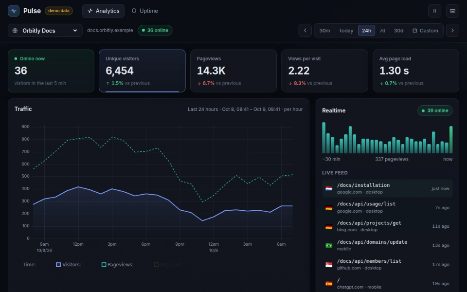
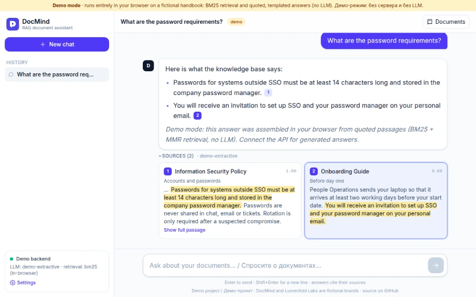

# sinnercode

[По-русски](#по-русски)

I have done commercial web development since 2019. Now I build web products end to end and work on existing systems. The public projects below cover APIs, integrations, Telegram bots and Mini Apps, and LLM features.

Open to contract work: a fixed-price project, hourly or monthly work, a seat on your team, or taking over an existing codebase. Telegram [@sinnercode](https://t.me/sinnercode) · [portfolio](https://sinnercode228.github.io/portfolio/?lang=en)

Recorded from the <a href="https://sinnercode228.github.io/pulse-analytics/">Pulse demo</a> on GitHub Pages. The traffic is synthetic.

## Experience

**2025 – now · Senior Full-Stack Developer · Independent / Contract**\
Full-cycle web products and work on existing systems: architecture, dashboards and admin panels, APIs and integrations, optimizing queries, job queues and large imports, CI/CD, monitoring, backup and restore, code review, refactoring and releases.

**2023 – 2025 · Full-Stack Developer · Independent projects and contracts**\
Services with subscriptions, payments and automation: a SaaS for links and contacts, a Telegram sales platform with automatic delivery of digital goods, a website analytics service. I designed the API and database, built the UI, deployed and supported them. Next.js, TypeScript, Node.js, Python, PostgreSQL, Redis, Nginx.

**2021 – 2023 · Full-Stack Developer · Contract development**\
Internal web apps for sales departments and service companies: a CRM for handling requests, a document portal with approvals, supplier catalog sync with price and stock updates. React, TypeScript, Node.js, PostgreSQL, Redis, Docker.

**2019 – 2021 · Web Developer · Freelance**\
Websites and online stores for small businesses: an auto parts store with CSV import, a site for a chain of repair shops with a cost calculator and requests sent to a CRM, WordPress sites with custom themes. JavaScript, PHP, WordPress, MySQL.

The commercial code from this work is private, so the public repositories below are standalone projects built on made-up data.

## Public projects

The demos run on GitHub Pages without a backend. The API is replaced by code in the browser.

**[Pulse](https://github.com/sinnercode228/pulse-analytics)** · TypeScript, Fastify, SQLite, React · [demo](https://sinnercode228.github.io/pulse-analytics/) · [write-up](notes/pulse-hyperloglog.md)\
Cookieless web analytics with uptime monitoring. Each rollup row stores a [HyperLogLog sketch](https://github.com/sinnercode228/pulse-analytics/blob/96645e153317f7bc35e5fc17bf4f76424d83c7c3/packages/core/src/hll.ts#L3-L7): an exact set up to 512 hashes, then 2048 registers. That is how unique visitors are merged across time buckets.

**[Relay](https://github.com/sinnercode228/integration-hub)** · Python, FastAPI, Redis, SQLite, React · [demo](https://sinnercode228.github.io/integration-hub/) · [write-up](notes/relay-redis-lease-queue.md)\
Takes webhooks from Tilda, amoCRM and Bitrix24 and delivers them to Telegram, Google Sheets, amoCRM and email. The [Redis queue is built on sorted sets](https://github.com/sinnercode228/integration-hub/blob/b0ae35c14d753930be6c89155cdc75d31b861ff6/backend/src/relay/queue/redis.py#L29-L47): a worker claims a job with a lease (120 seconds by default) in one Lua script, and if the worker dies, the job goes back to the queue when the lease runs out.

**[DocMind](https://github.com/sinnercode228/docmind-rag)** · Python, FastAPI, pgvector, React · [demo](https://sinnercode228.github.io/docmind-rag/) · [write-up](notes/docmind-sources-before-tokens.md)\
Answers questions over PDF, DOCX, HTML files and web pages with citations, and has a Telegram bot. [Sources go out over SSE before the model is called](https://github.com/sinnercode228/docmind-rag/blob/6d8b1b24fd2b3a06cbc685e1b0702e8243269cc4/backend/src/docmind/rag/service.py#L110-L111), so each `[n]` is clickable as soon as it streams in. The demo has no LLM: it searches with BM25 in the browser.

**[Zernolist](https://github.com/sinnercode228/tg-shop-miniapp)** · React, aiogram 3, FastAPI, SQLAlchemy · [demo](https://sinnercode228.github.io/tg-shop-miniapp/) · [write-up](notes/zernolist-stars-payments.md)\
A coffee and tea shop inside Telegram, with payment in Stars or on receipt. The server [prices every order from the catalog](https://github.com/sinnercode228/tg-shop-miniapp/blob/54cb076af58b99b8e693ff301d43ea20a9dc1d91/bot/tgshop/services/orders.py#L76-L100) and ignores client prices: a test sends `price: 1` and still gets the catalog subtotal.

**[FlowDesk](https://github.com/sinnercode228/flowdesk-crm)** · Next.js, Fastify, Prisma, PostgreSQL · [demo](https://sinnercode228.github.io/flowdesk-crm/) · [write-up](notes/flowdesk-refresh-rotation.md)\
A CRM with a deals kanban and roles. Refresh tokens rotate, and a reused one revokes every token from that login. A [conditional `updateMany` inside a transaction](https://github.com/sinnercode228/flowdesk-crm/blob/de0a2c21755f9f59060d9d6d07f55e0b3b1cd42b/server/src/modules/auth/auth.service.ts#L44-L51) stops two concurrent refreshes from both getting a new pair.

**[n8n-home-ai-workflows](https://github.com/sinnercode228/n8n-home-ai-workflows)** · n8n, Ollama, Qdrant, Docker Compose\
Four workflows: meeting notes to Notion via Claude, a family calendar digest, document Q&A on local models, an error handler. Code-node logic is built from ES modules, and the [tests run the `jsCode` stored in the workflow JSON](https://github.com/sinnercode228/n8n-home-ai-workflows/blob/d314e04e913c38c894f52360271582a54ccf68e0/tests/harness.mjs#L51). No live demo, and I haven't run the workflows against live Anthropic, Notion, Google or Telegram accounts.

Smaller demos are in [portfolio](https://github.com/sinnercode228/portfolio): a landing page with a cost calculator, an async scraper, a lead-collection bot and an Excel dashboard.

## Notes

Write-ups on how specific parts of these projects work. Each one quotes the code, links to the lines at a pinned commit, then says what the tests cover and where the code is still thin. Index: [notes/](notes/).

- [My Redis queue claimed jobs atomically and still handed the same job to two workers](notes/relay-queue-races.md): two races, a test that forces them on every run, and the fix
- [Relay's delivery queue on two Redis sorted sets with a 120-second lease](notes/relay-redis-lease-queue.md)
- [How FlowDesk rotates refresh tokens with a conditional UPDATE and a cross-tab lock](notes/flowdesk-refresh-rotation.md)
- [How Zernolist prices an order on the server and accepts each Telegram Stars charge once](notes/zernolist-stars-payments.md)
- [How DocMind sends sources before the first token and links [n] markers mid-stream](notes/docmind-sources-before-tokens.md)
- [How Pulse counts unique visitors with a daily salt and a sparse-to-dense HyperLogLog](notes/pulse-hyperloglog.md)

## Open issues

Bugs I filed against my own projects and haven't fixed yet:

- [Relay: an event is stored but never queued if enqueue fails](https://github.com/sinnercode228/integration-hub/issues/1)
- [DocMind: `docmind ask` finds nothing after `docmind ingest` with default settings](https://github.com/sinnercode228/docmind-rag/issues/1)

## Contact

Telegram [@sinnercode](https://t.me/sinnercode) · [portfolio](https://sinnercode228.github.io/portfolio/?lang=en)

---

## По-русски

Коммерческая веб-разработка с 2019 года. Сейчас занимаюсь разработкой веб-продуктов полного цикла и развитием существующих систем. В открытых проектах выше — API, интеграции, Telegram-боты и Mini Apps, функции на LLM. Беру проекты с фиксированной ценой, почасовую и помесячную работу, могу войти в вашу команду или разобраться в чужом коде.

- **2025 — сейчас.** Senior Full-Stack Developer, independent / contract. Полный цикл разработки веб-продуктов и развитие существующих систем.
- **2023–2025.** Full-Stack Developer, независимые проекты и контракты. Сервисы с подписками, платёжными интеграциями и автоматизацией.
- **2021–2023.** Full-Stack Developer, контрактная разработка. Внутренние веб-приложения для отделов продаж и сервисных компаний.
- **2019–2021.** Web Developer, фриланс. Сайты и интернет-магазины для малого бизнеса.

Коммерческий код из этой работы закрыт, поэтому открытые репозитории выше — самостоятельные проекты на выдуманных данных. README у них на английском; у всех, кроме Relay, есть русская версия или короткий пересказ по-русски.

Разборы того, как устроены отдельные части проектов, с кодом и ссылками на строки:

- [Очередь на Redis атомарно забирала задачи и всё равно отдавала одну и ту же двум воркерам](notes/relay-queue-races.ru.md): две гонки, тест, который ловит их при каждом запуске, и исправление
- [Очередь доставок Relay на двух sorted set в Redis с арендой задачи на 120 секунд](notes/relay-redis-lease-queue.ru.md)
- [Ротация refresh-токенов в FlowDesk через условный UPDATE и блокировку между вкладками](notes/flowdesk-refresh-rotation.ru.md)
- [Как Zernolist считает цену заказа на сервере и принимает каждый платёж в Telegram Stars один раз](notes/zernolist-stars-payments.ru.md)
- [Как DocMind отдаёт источники раньше первого токена и превращает [n] в ссылки на лету](notes/docmind-sources-before-tokens.ru.md)
- [Как Pulse считает посетителей через суточную соль и HyperLogLog](notes/pulse-hyperloglog.ru.md)

Написать: Telegram [@sinnercode](https://t.me/sinnercode), [портфолио](https://sinnercode228.github.io/portfolio/).
