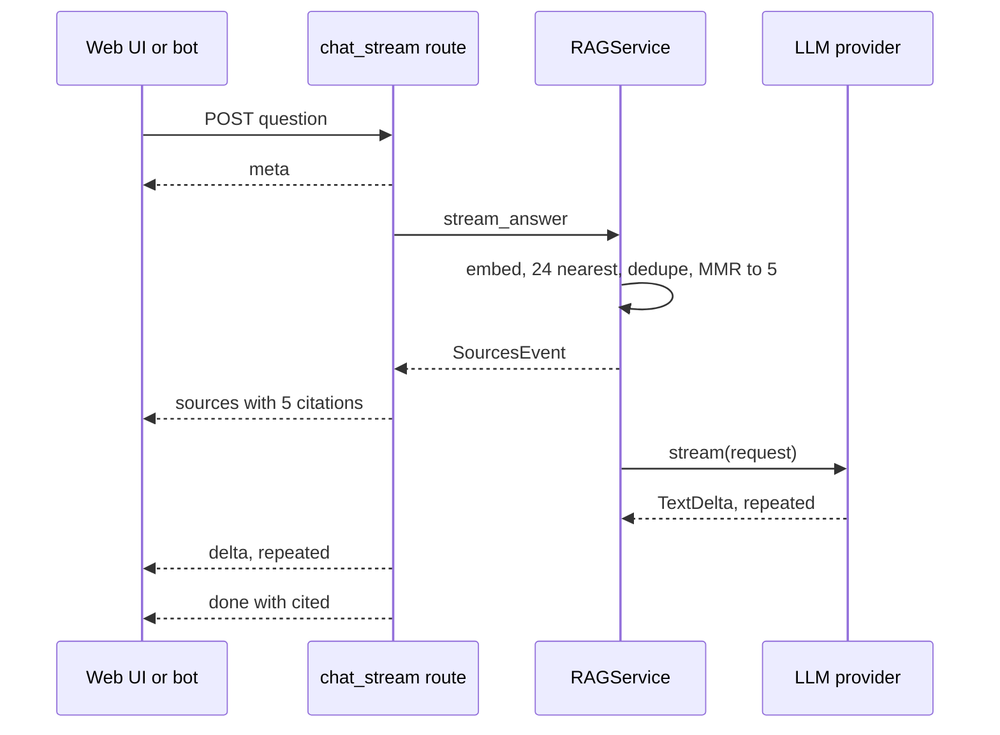

# How DocMind sends sources before the first token and links [n] markers mid-stream

**English** · [Русский](docmind-sources-before-tokens.ru.md)

Repository: [sinnercode228/docmind-rag](https://github.com/sinnercode228/docmind-rag) · Demo: [sinnercode228.github.io/docmind-rag](https://sinnercode228.github.io/docmind-rag/) · Code links point to commit [`6d8b1b2`](https://github.com/sinnercode228/docmind-rag/tree/6d8b1b24fd2b3a06cbc685e1b0702e8243269cc4)

DocMind answers questions over uploaded documents, and the model cites its sources inline as `[1]`, `[2]` while the text streams to the browser. If the list of sources came with the last event, every marker on screen would point at nothing until the stream ended, and the client could not tell a real `[3]` from a number the model made up. So the server finishes retrieval, sends the whole citation list as one SSE event, and only then calls the model.

## Five passages out of 24 candidates

`Retriever.retrieve` embeds the question, asks the vector store for `fetch_k` = 24 nearest chunks, drops anything under `min_score` = 0.05 and any chunk whose text repeats an earlier hit, and hands the rest to MMR, which keeps `top_k` = 5. These are configurable defaults ([`config.py#L59-L62`](https://github.com/sinnercode228/docmind-rag/blob/6d8b1b24fd2b3a06cbc685e1b0702e8243269cc4/backend/src/docmind/config.py#L59-L62)).

```python
        k = top_k or self.params.top_k
        vector = await self._embedder.embed_query(query)
        candidates = await self._store.search(
            tenant_id, vector, max(self.params.fetch_k, k), document_ids=document_ids
        )
        seen: set[str] = set()
        unique: list[ScoredChunk] = []
        for candidate in candidates:
            key = candidate.chunk.text.strip().lower()
            if candidate.score < self.params.min_score or key in seen:
                continue
            seen.add(key)
            unique.append(candidate)
        return mmr_select(unique, k, self.params.mmr_lambda)
```

[`backend/src/docmind/retrieval/retriever.py#L36-L49`](https://github.com/sinnercode228/docmind-rag/blob/6d8b1b24fd2b3a06cbc685e1b0702e8243269cc4/backend/src/docmind/retrieval/retriever.py#L36-L49)

In Docker the store is Postgres with pgvector: one `chunk_vectors` table with an HNSW index (`m` = 16, `ef_construction` = 64, `vector_cosine_ops`) ([`pgvector.py#L35-L41`](https://github.com/sinnercode228/docmind-rag/blob/6d8b1b24fd2b3a06cbc685e1b0702e8243269cc4/backend/src/docmind/vectorstore/pgvector.py#L35-L41)). The query filters by tenant, orders by `cosine_distance` and turns the distance back into a score with `1.0 - distance` ([`pgvector.py#L116-L135`](https://github.com/sinnercode228/docmind-rag/blob/6d8b1b24fd2b3a06cbc685e1b0702e8243269cc4/backend/src/docmind/vectorstore/pgvector.py#L116-L135)).

Each row comes back with its embedding, so MMR runs in Python on the rows from that one query, with no second round trip. `mmr_select` computes pairwise similarity as `matrix @ matrix.T` and at each step takes the candidate with the best `lambda * relevance - (1 - lambda) * redundancy`, where redundancy is the highest similarity to anything already picked ([`mmr.py#L25-L40`](https://github.com/sinnercode228/docmind-rag/blob/6d8b1b24fd2b3a06cbc685e1b0702e8243269cc4/backend/src/docmind/retrieval/mmr.py#L25-L40)). The dot product is a cosine because both embedders L2-normalise their output ([`hashing.py#L59`](https://github.com/sinnercode228/docmind-rag/blob/6d8b1b24fd2b3a06cbc685e1b0702e8243269cc4/backend/src/docmind/embeddings/hashing.py#L59), [`openai_compat.py#L55`](https://github.com/sinnercode228/docmind-rag/blob/6d8b1b24fd2b3a06cbc685e1b0702e8243269cc4/backend/src/docmind/embeddings/openai_compat.py#L55)). With lambda = 0.6, a candidate almost identical to one already chosen pays about 0.4 against a relevance term weighted at 0.6. Exact text duplicates never get this far, because the loop above has already dropped them.

## The order on the wire

`POST /v1/chat/stream` produces `meta → sources → delta… → done`. The order is fixed in `RAGService.stream_answer`: the citations are yielded before the request to the model is even built.

```python
        citations = await self.search(tenant_id, question, top_k=top_k, document_ids=document_ids)
        yield SourcesEvent(citations)
...
        parts: list[str] = []
        completion = Completion(stop_reason="end_turn", model=self._llm.name)
        async for event in self._llm.stream(request):
            if isinstance(event, TextDelta):
                parts.append(event.text)
                yield DeltaEvent(event.text)
            else:
                completion = event
        answer = "".join(parts)
```

[`backend/src/docmind/rag/service.py#L110-L133`](https://github.com/sinnercode228/docmind-rag/blob/6d8b1b24fd2b3a06cbc685e1b0702e8243269cc4/backend/src/docmind/rag/service.py#L110-L133)

An async generator in the route, `_chat_events`, turns these objects into `(event, payload)` pairs ([`routes_chat.py#L34-L86`](https://github.com/sinnercode228/docmind-rag/blob/6d8b1b24fd2b3a06cbc685e1b0702e8243269cc4/backend/src/docmind/api/routes_chat.py#L34-L86)), and `chat_stream` writes each pair as an SSE frame. Before it calls the service, it commits the conversation and the question and yields `meta`, so the client has the conversation id even if the model call fails later. On `DoneEvent` it sets a `cited` flag on each citation, saves the assistant message together with its sources and yields `done`. The non-streaming `POST /v1/chat` consumes the same generator and builds JSON from the events ([`routes_chat.py#L89-L109`](https://github.com/sinnercode228/docmind-rag/blob/6d8b1b24fd2b3a06cbc685e1b0702e8243269cc4/backend/src/docmind/api/routes_chat.py#L89-L109)), so both endpoints run the same retrieval, saving and `cited` code.



`chat_stream` checks a given `conversation_id` before the stream opens, so an unknown id gets a plain 404 ([`routes_chat.py#L121`](https://github.com/sinnercode228/docmind-rag/blob/6d8b1b24fd2b3a06cbc685e1b0702e8243269cc4/backend/src/docmind/api/routes_chat.py#L121)). After that the status is already 200, and a `DocMindError` becomes `event: error` inside the stream; any other exception is logged and sent as `internal_error` ([`routes_chat.py#L131-L135`](https://github.com/sinnercode228/docmind-rag/blob/6d8b1b24fd2b3a06cbc685e1b0702e8243269cc4/backend/src/docmind/api/routes_chat.py#L131-L135)).

The model has to wait for retrieval in any case. Sending the result first adds one JSON frame with five snippets ahead of the first token, inside the same response.

## Turning [n] into a button while the text grows

`HttpClient.chat` reads the body with `fetch` and a small SSE parser, because `EventSource` cannot send a POST body or an `X-API-Key` header ([`httpClient.ts#L69-L106`](https://github.com/sinnercode228/docmind-rag/blob/6d8b1b24fd2b3a06cbc685e1b0702e8243269cc4/frontend/src/api/httpClient.ts#L69-L106)). `useChat` puts `sources` on the reply message, appends each `delta` to its `content`, and on `done` replaces the content with the server's full answer and stores `cited` ([`useChat.ts#L69-L91`](https://github.com/sinnercode228/docmind-rag/blob/6d8b1b24fd2b3a06cbc685e1b0702e8243269cc4/frontend/src/state/useChat.ts#L69-L91)).

On every delta, `MessageView` renders `AnswerText` with the accumulated text and `available={citations.length}`. `AnswerText` splits the text into lines, runs one regex, `INLINE`, over each line, and for a `[n]` match it decides between a button and plain text:

```tsx
    if (match[1]) {
      const n = Number(token.slice(1, -1))
      out.push(
        n <= available ? (
          <button
            key={start}
            type="button"
            onClick={() => onCite?.(n)}
            className="mx-0.5 inline-flex h-5 min-w-5 items-center justify-center rounded-md bg-indigo-100 px-1 align-text-top text-[11px] font-semibold text-indigo-700 transition hover:bg-indigo-600 hover:text-white dark:bg-indigo-500/20 dark:text-indigo-200"
            aria-label={`Show source ${n}`}
          >
            {n}
          </button>
        ) : (
          token
        ),
      )
```

[`frontend/src/components/AnswerText.tsx#L52-L68`](https://github.com/sinnercode228/docmind-rag/blob/6d8b1b24fd2b3a06cbc685e1b0702e8243269cc4/frontend/src/components/AnswerText.tsx#L52-L68)

Since the whole accumulated text is parsed again on each delta, a marker split across two deltas needs no special case. If one delta ends in `[1` and the next starts with `]`, the first render shows a literal `[1` and the second shows a button. Clicking it marks the card as active and scrolls to the element with id `cite-<chunk_id>` ([`MessageView.tsx#L20-L24`](https://github.com/sinnercode228/docmind-rag/blob/6d8b1b24fd2b3a06cbc685e1b0702e8243269cc4/frontend/src/components/MessageView.tsx#L20-L24)).

The cards are on screen before the first token, but their number badges stay grey until `done`. Only then does the client know which sources the answer actually referenced, and those cards switch to a filled badge ([`CitationCard.tsx#L64-L68`](https://github.com/sinnercode228/docmind-rag/blob/6d8b1b24fd2b3a06cbc685e1b0702e8243269cc4/frontend/src/components/CitationCard.tsx#L64-L68)).

## A number with no source behind it

The system prompt asks the model to cite like `[1]` or `[2][3]` ([`prompt.py#L15-L16`](https://github.com/sinnercode228/docmind-rag/blob/6d8b1b24fd2b3a06cbc685e1b0702e8243269cc4/backend/src/docmind/rag/prompt.py#L15-L16)), and nothing stops it from writing `[7]` when there are five sources. The server does not touch the text. It only filters the numbers that go into `done.cited`, using `_CITE = re.compile(r"\[(\d{1,2})\]")` ([`service.py#L16`](https://github.com/sinnercode228/docmind-rag/blob/6d8b1b24fd2b3a06cbc685e1b0702e8243269cc4/backend/src/docmind/rag/service.py#L16)):

```python
def cited_indices(answer: str, available: int) -> list[int]:
    found = {int(m) for m in _CITE.findall(answer)}
    return sorted(i for i in found if 1 <= i <= available)
```

[`backend/src/docmind/rag/service.py#L42-L44`](https://github.com/sinnercode228/docmind-rag/blob/6d8b1b24fd2b3a06cbc685e1b0702e8243269cc4/backend/src/docmind/rag/service.py#L42-L44)

So `[7]` stays in the answer, is saved to the database as written, and is absent from `cited`. Nothing is logged and no error is raised. In the web UI `7 <= available` is false, so the marker renders as plain text and cannot be clicked. The Telegram bot is less strict: `markdown_to_telegram_html` makes every `[n]` bold, `[7]` included, and the list under the answer shows the cited sources, or the first three when nothing was cited ([`bot/service.py#L27-L38`](https://github.com/sinnercode228/docmind-rag/blob/6d8b1b24fd2b3a06cbc685e1b0702e8243269cc4/backend/src/docmind/bot/service.py#L27-L38)). The regex takes one or two digits. That covers any request, since the request schema caps `top_k` at 20 ([`schemas.py#L103`](https://github.com/sinnercode228/docmind-rag/blob/6d8b1b24fd2b3a06cbc685e1b0702e8243269cc4/backend/src/docmind/api/schemas.py#L103)). The server-wide `top_k` setting has no such cap.

`[0]` falls between the two checks. The server's lower bound drops it from `cited`. The client only checks `n <= available`, so `[0]` becomes a button; clicking it sets the active index to 0, no card has that index, and nothing scrolls.

## The demo has no model at all

The Pages build has no backend. `DemoClient` implements the same `DocMindClient` interface as `HttpClient` and yields the same `meta`, `sources`, `delta`…, `done` sequence ([`demoClient.ts#L198-L212`](https://github.com/sinnercode228/docmind-rag/blob/6d8b1b24fd2b3a06cbc685e1b0702e8243269cc4/frontend/src/demo/demoClient.ts#L198-L212)), so `useChat` and the components above run unchanged. The knowledge base is a handbook I wrote for a company that does not exist, cut into chunks by the backend's own splitter and bundled as `kb.json`.

Retrieval in the browser is BM25 with k1 = 1.4 and b = 0.75 over stemmed terms, with each chunk's heading indexed together with its text ([`bm25.ts#L28-L46`](https://github.com/sinnercode228/docmind-rag/blob/6d8b1b24fd2b3a06cbc685e1b0702e8243269cc4/frontend/src/lib/bm25.ts#L28-L46)). The top 16 hits go through MMR with Jaccard similarity of term sets in place of embeddings, lambda = 0.7, down to 4 ([`demoClient.ts#L161-L174`](https://github.com/sinnercode228/docmind-rag/blob/6d8b1b24fd2b3a06cbc685e1b0702e8243269cc4/frontend/src/demo/demoClient.ts#L161-L174), [`bm25.ts#L104-L125`](https://github.com/sinnercode228/docmind-rag/blob/6d8b1b24fd2b3a06cbc685e1b0702e8243269cc4/frontend/src/lib/bm25.ts#L104-L125)). Scores are divided by the top hit's score, so the first card always reads 1.00.

The answer is a template ([`demoClient.ts#L176-L196`](https://github.com/sinnercode228/docmind-rag/blob/6d8b1b24fd2b3a06cbc685e1b0702e8243269cc4/frontend/src/demo/demoClient.ts#L176-L196)). For each source scoring at least 0.35 it takes the highlighted sentence and appends `[n]`. A later point must cover at least 75% as many question terms as the first one, and there are three points at most. Every marker comes from a real citation index, so the demo cannot produce an out-of-range number. The answer is streamed in whitespace-separated pieces (`/\S+\s*/g`) with 14 ms between them, or none under `prefers-reduced-motion` ([`demoClient.ts#L72-L74`](https://github.com/sinnercode228/docmind-rag/blob/6d8b1b24fd2b3a06cbc685e1b0702e8243269cc4/frontend/src/demo/demoClient.ts#L72-L74)). A marker therefore never arrives in two parts in the demo; that can happen only with a real model provider.

## What the tests check

- `backend/tests/test_api.py::TestChat::test_streaming_chat_and_history`: `meta` first, `sources` second, `done` last, more than three `delta` events, and the deltas joined equal `done.answer`.
- `TestChat::test_json_chat_with_citations`: `cited` is not empty, and the first cited source's highlight covers the sentence with "carried over". `test_empty_knowledge_base`: no documents, empty citation list, a "could not find" answer.
- `backend/tests/test_retrieval.py::TestMMR::test_prefers_diverse_results`: a near-duplicate loses to a different chunk at lambda = 0.5 and wins at 1.0. `test_retriever_dedupes_and_thresholds`: identical texts in two documents come back once.
- `frontend/src/lib/sse.test.ts`: a message split between chunks, CRLF, multi-line `data`, a final message with no blank line.
- `frontend/src/demo/demoClient.test.ts`: the same event order on the browser path, and `does not pad answers with loosely related sentences`.
- `frontend/src/App.test.tsx`: the demo flow end to end, including a click on `Show source 1`.

The backend suite runs on the in-memory store, and `pgvector.py` has no test. No test passes an out-of-range number to `cited_indices`, and `AnswerText` has no component test, so the plain-text fallback and the split marker are untested.

## Where citations can still go wrong

- `cited` only means the number appears in the text and is in range; nothing checks that the passage supports the sentence. The highlighted sentence in a card is picked against the question, not the answer ([`service.py#L61`](https://github.com/sinnercode228/docmind-rag/blob/6d8b1b24fd2b3a06cbc685e1b0702e8243269cc4/backend/src/docmind/rag/service.py#L61)), so with a real model it can differ from the one the model used.
- None of the three citation regexes (server, web client, bot) accepts `[1, 2]` or `[1-3]`. A model that cites only in that form gets `cited: []`, grey badges everywhere and markers that cannot be clicked.
- Card ids (`cite-<chunk_id>`) are not scoped to a message. When two answers in a conversation retrieved the same chunk, `getElementById` returns the earlier answer's card and the page scrolls there; the active ring still lands on the right card.
- The source list is fixed before the model starts, and retrieval uses the raw question ([`service.py#L110`](https://github.com/sinnercode228/docmind-rag/blob/6d8b1b24fd2b3a06cbc685e1b0702e8243269cc4/backend/src/docmind/rag/service.py#L110)). History goes to the model only, so a follow-up like "and for managers?" is searched on those words alone.
- With the defaults `vector_store = "memory"` and `memory_store_path = None` ([`config.py#L31-L33`](https://github.com/sinnercode228/docmind-rag/blob/6d8b1b24fd2b3a06cbc685e1b0702e8243269cc4/backend/src/docmind/config.py#L31-L33)), vectors are lost on restart while documents stay `ready` in SQLite. The stream keeps its order, but `sources` is empty and the model gets `(no relevant passages were found)` ([`prompt.py#L53-L54`](https://github.com/sinnercode228/docmind-rag/blob/6d8b1b24fd2b3a06cbc685e1b0702e8243269cc4/backend/src/docmind/rag/prompt.py#L53-L54)). This is [issue #1](https://github.com/sinnercode228/docmind-rag/issues/1).

Code: [github.com/sinnercode228/docmind-rag](https://github.com/sinnercode228/docmind-rag)
