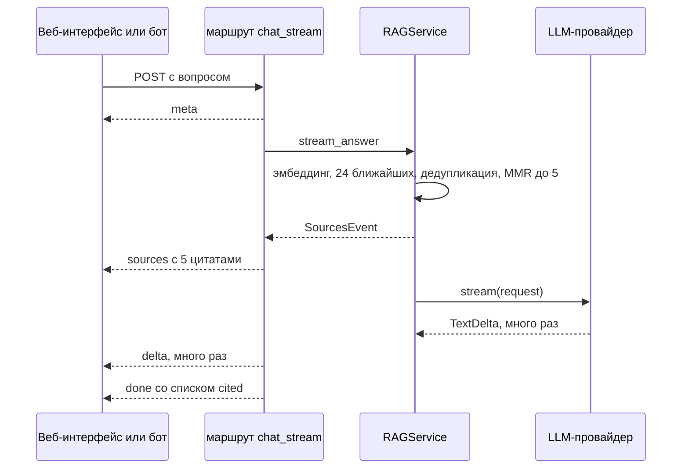

# Как DocMind отдаёт источники раньше первого токена и превращает [n] в ссылки на лету

[English](docmind-sources-before-tokens.md) · **Русский**

Репозиторий: [sinnercode228/docmind-rag](https://github.com/sinnercode228/docmind-rag) · Демо: [sinnercode228.github.io/docmind-rag](https://sinnercode228.github.io/docmind-rag/) · Ссылки на код ведут на коммит [`6d8b1b2`](https://github.com/sinnercode228/docmind-rag/tree/6d8b1b24fd2b3a06cbc685e1b0702e8243269cc4)

DocMind отвечает на вопросы по загруженным документам, а модель ставит ссылки на источники прямо в тексте, `[1]`, `[2]`, пока ответ идёт в браузер потоком. Если бы список источников приходил последним событием, все маркеры на экране до конца стрима указывали бы в пустоту, и клиент не смог бы отличить настоящий `[3]` от номера, который модель придумала. Поэтому сервер сначала заканчивает поиск, отправляет весь список цитат одним SSE-событием и только потом вызывает модель.

## Пять фрагментов из 24 кандидатов

`Retriever.retrieve` строит эмбеддинг вопроса, берёт из векторного хранилища `fetch_k` = 24 ближайших чанка, отбрасывает всё, что ниже `min_score` = 0.05, и чанки с уже встречавшимся текстом, а остальное отдаёт в MMR, который оставляет `top_k` = 5. Это значения по умолчанию, их можно поменять в настройках ([`config.py#L59-L62`](https://github.com/sinnercode228/docmind-rag/blob/6d8b1b24fd2b3a06cbc685e1b0702e8243269cc4/backend/src/docmind/config.py#L59-L62)).

```python
        k = top_k or self.params.top_k
        vector = await self._embedder.embed_query(query)
        candidates = await self._store.search(
            tenant_id, vector, max(self.params.fetch_k, k), document_ids=document_ids
        )
        seen: set[str] = set()
        unique: list[ScoredChunk] = []
        for candidate in candidates:
            key = candidate.chunk.text.strip().lower()
            if candidate.score < self.params.min_score or key in seen:
                continue
            seen.add(key)
            unique.append(candidate)
        return mmr_select(unique, k, self.params.mmr_lambda)
```

[`backend/src/docmind/retrieval/retriever.py#L36-L49`](https://github.com/sinnercode228/docmind-rag/blob/6d8b1b24fd2b3a06cbc685e1b0702e8243269cc4/backend/src/docmind/retrieval/retriever.py#L36-L49)

В Docker хранилище — Postgres с pgvector: одна таблица `chunk_vectors` с HNSW-индексом (`m` = 16, `ef_construction` = 64, `vector_cosine_ops`) ([`pgvector.py#L35-L41`](https://github.com/sinnercode228/docmind-rag/blob/6d8b1b24fd2b3a06cbc685e1b0702e8243269cc4/backend/src/docmind/vectorstore/pgvector.py#L35-L41)). Запрос фильтрует по тенанту, сортирует по `cosine_distance` и переводит расстояние обратно в оценку как `1.0 - distance` ([`pgvector.py#L116-L135`](https://github.com/sinnercode228/docmind-rag/blob/6d8b1b24fd2b3a06cbc685e1b0702e8243269cc4/backend/src/docmind/vectorstore/pgvector.py#L116-L135)).

Каждая строка приходит вместе со своим эмбеддингом, поэтому MMR считается в Python на строках из этого же запроса, второй раз в базу ходить не нужно. `mmr_select` получает попарное сходство как `matrix @ matrix.T` и на каждом шаге берёт кандидата с лучшим значением `lambda * relevance - (1 - lambda) * redundancy`, где redundancy — максимальное сходство с уже выбранными ([`mmr.py#L25-L40`](https://github.com/sinnercode228/docmind-rag/blob/6d8b1b24fd2b3a06cbc685e1b0702e8243269cc4/backend/src/docmind/retrieval/mmr.py#L25-L40)). Скалярное произведение здесь равно косинусу, потому что оба эмбеддера нормируют векторы по L2 ([`hashing.py#L59`](https://github.com/sinnercode228/docmind-rag/blob/6d8b1b24fd2b3a06cbc685e1b0702e8243269cc4/backend/src/docmind/embeddings/hashing.py#L59), [`openai_compat.py#L55`](https://github.com/sinnercode228/docmind-rag/blob/6d8b1b24fd2b3a06cbc685e1b0702e8243269cc4/backend/src/docmind/embeddings/openai_compat.py#L55)). При lambda = 0.6 кандидат, почти совпадающий с уже выбранным, получает штраф около 0.4 при весе релевантности 0.6. Точные дубликаты текста сюда не доходят: их уже отбросил цикл выше.

## Порядок событий в потоке

`POST /v1/chat/stream` отдаёт `meta → sources → delta… → done`. Порядок задан в `RAGService.stream_answer`: цитаты уходят раньше, чем вообще собирается запрос к модели.

```python
        citations = await self.search(tenant_id, question, top_k=top_k, document_ids=document_ids)
        yield SourcesEvent(citations)
...
        parts: list[str] = []
        completion = Completion(stop_reason="end_turn", model=self._llm.name)
        async for event in self._llm.stream(request):
            if isinstance(event, TextDelta):
                parts.append(event.text)
                yield DeltaEvent(event.text)
            else:
                completion = event
        answer = "".join(parts)
```

[`backend/src/docmind/rag/service.py#L110-L133`](https://github.com/sinnercode228/docmind-rag/blob/6d8b1b24fd2b3a06cbc685e1b0702e8243269cc4/backend/src/docmind/rag/service.py#L110-L133)

Асинхронный генератор в маршруте, `_chat_events`, превращает эти объекты в пары `(event, payload)` ([`routes_chat.py#L34-L86`](https://github.com/sinnercode228/docmind-rag/blob/6d8b1b24fd2b3a06cbc685e1b0702e8243269cc4/backend/src/docmind/api/routes_chat.py#L34-L86)), а `chat_stream` пишет каждую пару как SSE-кадр. До вызова сервиса генератор коммитит беседу и вопрос и отдаёт `meta`, так что идентификатор беседы остаётся у клиента, даже если вызов модели потом упадёт. На `DoneEvent` он проставляет каждой цитате флаг `cited`, сохраняет ответ вместе с источниками и отдаёт `done`. Непотоковый `POST /v1/chat` читает тот же генератор и собирает JSON из событий ([`routes_chat.py#L89-L109`](https://github.com/sinnercode228/docmind-rag/blob/6d8b1b24fd2b3a06cbc685e1b0702e8243269cc4/backend/src/docmind/api/routes_chat.py#L89-L109)), поэтому у обоих эндпоинтов один и тот же код поиска, сохранения и `cited`.



`chat_stream` проверяет переданный `conversation_id` до открытия потока, и на несуществующий id приходит обычный 404 ([`routes_chat.py#L121`](https://github.com/sinnercode228/docmind-rag/blob/6d8b1b24fd2b3a06cbc685e1b0702e8243269cc4/backend/src/docmind/api/routes_chat.py#L121)). После этого статус 200 уже отправлен, и `DocMindError` превращается в `event: error` внутри потока, а любое другое исключение пишется в лог и уходит как `internal_error` ([`routes_chat.py#L131-L135`](https://github.com/sinnercode228/docmind-rag/blob/6d8b1b24fd2b3a06cbc685e1b0702e8243269cc4/backend/src/docmind/api/routes_chat.py#L131-L135)).

Модель в любом случае ждёт результатов поиска. Если отдать их сразу, перед первым токеном в том же ответе появляется один JSON-кадр с пятью фрагментами.

## Как [n] становится кнопкой, пока текст растёт

`HttpClient.chat` читает тело ответа через `fetch` и небольшой SSE-парсер, потому что `EventSource` не умеет отправлять тело POST-запроса и заголовок `X-API-Key` ([`httpClient.ts#L69-L106`](https://github.com/sinnercode228/docmind-rag/blob/6d8b1b24fd2b3a06cbc685e1b0702e8243269cc4/frontend/src/api/httpClient.ts#L69-L106)). `useChat` кладёт `sources` в сообщение-ответ, дописывает каждый `delta` в `content`, а на `done` заменяет текст полным ответом сервера и сохраняет `cited` ([`useChat.ts#L69-L91`](https://github.com/sinnercode228/docmind-rag/blob/6d8b1b24fd2b3a06cbc685e1b0702e8243269cc4/frontend/src/state/useChat.ts#L69-L91)).

На каждый delta `MessageView` заново рендерит `AnswerText` с накопленным текстом и `available={citations.length}`. `AnswerText` делит текст на строки, прогоняет по каждой одно регулярное выражение, `INLINE`, и для совпадения `[n]` выбирает между кнопкой и обычным текстом:

```tsx
    if (match[1]) {
      const n = Number(token.slice(1, -1))
      out.push(
        n <= available ? (
          <button
            key={start}
            type="button"
            onClick={() => onCite?.(n)}
            className="mx-0.5 inline-flex h-5 min-w-5 items-center justify-center rounded-md bg-indigo-100 px-1 align-text-top text-[11px] font-semibold text-indigo-700 transition hover:bg-indigo-600 hover:text-white dark:bg-indigo-500/20 dark:text-indigo-200"
            aria-label={`Show source ${n}`}
          >
            {n}
          </button>
        ) : (
          token
        ),
      )
```

[`frontend/src/components/AnswerText.tsx#L52-L68`](https://github.com/sinnercode228/docmind-rag/blob/6d8b1b24fd2b3a06cbc685e1b0702e8243269cc4/frontend/src/components/AnswerText.tsx#L52-L68)

Весь накопленный текст разбирается заново на каждом delta, поэтому маркер, разрезанный между двумя delta, не требует отдельной обработки. Если один delta кончается на `[1`, а следующий начинается с `]`, первый рендер покажет буквальное `[1`, а второй — кнопку. Клик делает карточку активной и прокручивает страницу к элементу с id `cite-<chunk_id>` ([`MessageView.tsx#L20-L24`](https://github.com/sinnercode228/docmind-rag/blob/6d8b1b24fd2b3a06cbc685e1b0702e8243269cc4/frontend/src/components/MessageView.tsx#L20-L24)).

Карточки появляются на экране раньше первого токена, но номера на них остаются серыми до `done`. Только тогда клиент знает, на какие источники ответ действительно сослался, и у этих карточек номер становится залитым ([`CitationCard.tsx#L64-L68`](https://github.com/sinnercode228/docmind-rag/blob/6d8b1b24fd2b3a06cbc685e1b0702e8243269cc4/frontend/src/components/CitationCard.tsx#L64-L68)).

## Номер, за которым нет источника

Системный промпт просит модель ссылаться в виде `[1]` или `[2][3]` ([`prompt.py#L15-L16`](https://github.com/sinnercode228/docmind-rag/blob/6d8b1b24fd2b3a06cbc685e1b0702e8243269cc4/backend/src/docmind/rag/prompt.py#L15-L16)), но ничто не мешает ей написать `[7]`, когда источников пять. Сервер текст не трогает. Он только фильтрует номера, которые попадают в `done.cited`, через `_CITE = re.compile(r"\[(\d{1,2})\]")` ([`service.py#L16`](https://github.com/sinnercode228/docmind-rag/blob/6d8b1b24fd2b3a06cbc685e1b0702e8243269cc4/backend/src/docmind/rag/service.py#L16)):

```python
def cited_indices(answer: str, available: int) -> list[int]:
    found = {int(m) for m in _CITE.findall(answer)}
    return sorted(i for i in found if 1 <= i <= available)
```

[`backend/src/docmind/rag/service.py#L42-L44`](https://github.com/sinnercode228/docmind-rag/blob/6d8b1b24fd2b3a06cbc685e1b0702e8243269cc4/backend/src/docmind/rag/service.py#L42-L44)

Так что `[7]` остаётся в ответе, сохраняется в базу как есть и не попадает в `cited`. Ничего не логируется, ошибки нет. В веб-интерфейсе `7 <= available` ложно, маркер выводится обычным текстом, и нажать на него нельзя. Telegram-бот менее строг: `markdown_to_telegram_html` делает жирным каждый `[n]`, включая `[7]`, а список под ответом показывает процитированные источники или первые три, если не процитировано ничего ([`bot/service.py#L27-L38`](https://github.com/sinnercode228/docmind-rag/blob/6d8b1b24fd2b3a06cbc685e1b0702e8243269cc4/backend/src/docmind/bot/service.py#L27-L38)). Регулярка берёт одну или две цифры. Для любого запроса этого хватает: схема запроса ограничивает `top_k` двадцатью ([`schemas.py#L103`](https://github.com/sinnercode228/docmind-rag/blob/6d8b1b24fd2b3a06cbc685e1b0702e8243269cc4/backend/src/docmind/api/schemas.py#L103)). У серверной настройки `top_k` такого ограничения нет.

`[0]` проскакивает между двумя проверками. Нижняя граница на сервере убирает его из `cited`. Клиент проверяет только `n <= available`, так что `[0]` становится кнопкой; клик выставляет активный индекс 0, карточки с таким индексом нет, и ничего не прокручивается.

## Демо обходится без модели

У сборки для Pages нет бэкенда. `DemoClient` реализует тот же интерфейс `DocMindClient`, что и `HttpClient`, и отдаёт ту же последовательность `meta`, `sources`, `delta`…, `done` ([`demoClient.ts#L198-L212`](https://github.com/sinnercode228/docmind-rag/blob/6d8b1b24fd2b3a06cbc685e1b0702e8243269cc4/frontend/src/demo/demoClient.ts#L198-L212)), поэтому `useChat` и компоненты выше работают без изменений. База знаний — справочник, который я написал для несуществующей компании. Его нарезал тот же сплиттер, что работает на бэкенде, и он лежит в бандле как `kb.json`.

Поиск в браузере — BM25 с k1 = 1.4 и b = 0.75 по стеммированным термам, заголовок чанка индексируется вместе с текстом ([`bm25.ts#L28-L46`](https://github.com/sinnercode228/docmind-rag/blob/6d8b1b24fd2b3a06cbc685e1b0702e8243269cc4/frontend/src/lib/bm25.ts#L28-L46)). Верхние 16 результатов проходят через MMR, где вместо эмбеддингов используется коэффициент Жаккара по множествам термов, lambda = 0.7, и остаётся 4 ([`demoClient.ts#L161-L174`](https://github.com/sinnercode228/docmind-rag/blob/6d8b1b24fd2b3a06cbc685e1b0702e8243269cc4/frontend/src/demo/demoClient.ts#L161-L174), [`bm25.ts#L104-L125`](https://github.com/sinnercode228/docmind-rag/blob/6d8b1b24fd2b3a06cbc685e1b0702e8243269cc4/frontend/src/lib/bm25.ts#L104-L125)). Оценки делятся на оценку лучшего результата, поэтому у первой карточки всегда 1.00.

Ответ собирается по шаблону ([`demoClient.ts#L176-L196`](https://github.com/sinnercode228/docmind-rag/blob/6d8b1b24fd2b3a06cbc685e1b0702e8243269cc4/frontend/src/demo/demoClient.ts#L176-L196)). Для каждого источника с оценкой от 0.35 берётся подсвеченное предложение, и к нему дописывается `[n]`. Каждый следующий пункт должен совпадать с вопросом хотя бы по 75% от числа терминов, совпавших у первого, а пунктов не больше трёх. Все маркеры берутся из настоящих индексов цитат, так что номер вне диапазона в демо появиться не может. Ответ идёт кусками по пробелам (`/\S+\s*/g`) с паузой 14 мс, а при `prefers-reduced-motion` без паузы ([`demoClient.ts#L72-L74`](https://github.com/sinnercode228/docmind-rag/blob/6d8b1b24fd2b3a06cbc685e1b0702e8243269cc4/frontend/src/demo/demoClient.ts#L72-L74)). Поэтому в демо маркер никогда не приходит по частям; это может случиться только с настоящей моделью.

## Что проверяют тесты

- `backend/tests/test_api.py::TestChat::test_streaming_chat_and_history`: `meta` первым, `sources` вторым, `done` последним, больше трёх `delta`, и склеенные delta совпадают с `done.answer`.
- `TestChat::test_json_chat_with_citations`: `cited` не пуст, и подсветка первого процитированного источника накрывает предложение с «carried over». `test_empty_knowledge_base`: без документов список цитат пуст, а в ответе «could not find».
- `backend/tests/test_retrieval.py::TestMMR::test_prefers_diverse_results`: почти-дубликат проигрывает другому чанку при lambda = 0.5 и выигрывает при 1.0. `test_retriever_dedupes_and_thresholds`: одинаковые тексты из двух документов возвращаются один раз.
- `frontend/src/lib/sse.test.ts`: сообщение, разрезанное между чанками, CRLF, многострочный `data`, последнее сообщение без пустой строки.
- `frontend/src/demo/demoClient.test.ts`: тот же порядок событий в браузерном пути и `does not pad answers with loosely related sentences`.
- `frontend/src/App.test.tsx`: сценарий демо целиком, включая клик по `Show source 1`.

Бэкенд-тесты работают на хранилище в памяти, у `pgvector.py` тестов нет. Ни один тест не передаёт в `cited_indices` номер вне диапазона, а компонентного теста у `AnswerText` нет, так что вывод номера обычным текстом и разрезанный маркер тестами не покрыты.

## Где ссылки ещё могут подвести

- `cited` означает только, что номер есть в тексте и попадает в диапазон; подтверждает ли фрагмент фразу, никто не проверяет. Подсвеченное предложение в карточке выбирается по вопросу, а не по ответу ([`service.py#L61`](https://github.com/sinnercode228/docmind-rag/blob/6d8b1b24fd2b3a06cbc685e1b0702e8243269cc4/backend/src/docmind/rag/service.py#L61)), поэтому с настоящей моделью оно может не совпасть с тем, на которое модель опиралась.
- Ни одна из трёх регулярок для ссылок (сервер, веб-клиент, бот) не принимает `[1, 2]` или `[1-3]`. Если модель ссылается только так, получается `cited: []`, все номера серые, а маркеры не кликаются.
- Идентификаторы карточек (`cite-<chunk_id>`) не привязаны к сообщению. Если два ответа в одной беседе нашли один и тот же чанк, `getElementById` вернёт карточку из более раннего ответа и страница прокрутится туда; активная рамка при этом появится на правильной карточке.
- Список источников фиксируется до старта модели, а поиск идёт по вопросу как есть ([`service.py#L110`](https://github.com/sinnercode228/docmind-rag/blob/6d8b1b24fd2b3a06cbc685e1b0702e8243269cc4/backend/src/docmind/rag/service.py#L110)). История уходит только в модель, поэтому уточнение вроде «а для менеджеров?» ищется только по этим словам.
- По умолчанию `vector_store = "memory"` и `memory_store_path = None` ([`config.py#L31-L33`](https://github.com/sinnercode228/docmind-rag/blob/6d8b1b24fd2b3a06cbc685e1b0702e8243269cc4/backend/src/docmind/config.py#L31-L33)): после перезапуска векторы теряются, а документы в SQLite остаются `ready`. Порядок событий сохраняется, но `sources` приходит пустым, и модель получает `(no relevant passages were found)` ([`prompt.py#L53-L54`](https://github.com/sinnercode228/docmind-rag/blob/6d8b1b24fd2b3a06cbc685e1b0702e8243269cc4/backend/src/docmind/rag/prompt.py#L53-L54)). Это [issue #1](https://github.com/sinnercode228/docmind-rag/issues/1).

Код: [github.com/sinnercode228/docmind-rag](https://github.com/sinnercode228/docmind-rag)
