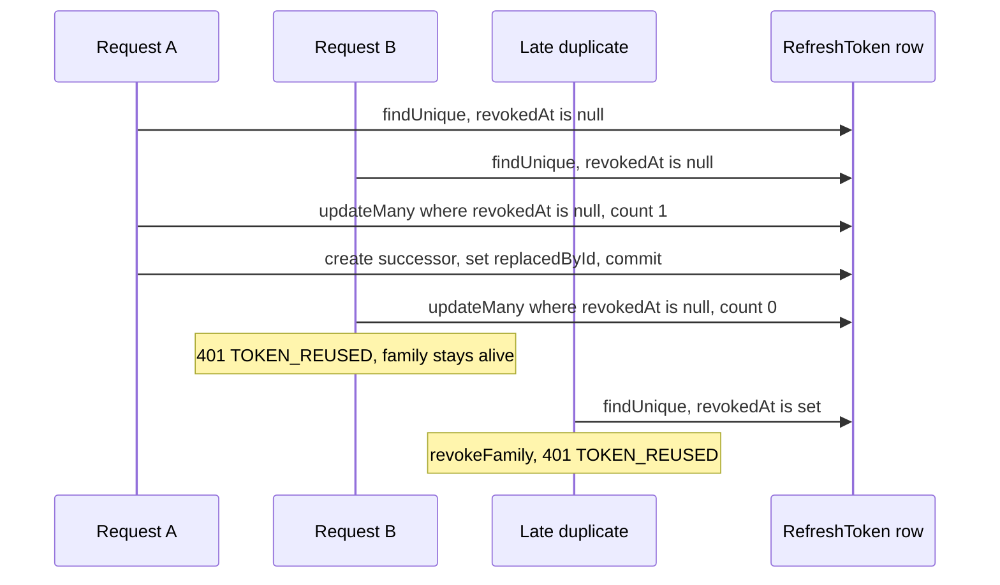

# How FlowDesk rotates refresh tokens with a conditional UPDATE and a cross-tab lock

**English** · [Русский](flowdesk-refresh-rotation.ru.md)

Repository: [sinnercode228/flowdesk-crm](https://github.com/sinnercode228/flowdesk-crm) · Demo: [sinnercode228.github.io/flowdesk-crm](https://sinnercode228.github.io/flowdesk-crm/) · Code links point to commit [`de0a2c2`](https://github.com/sinnercode228/flowdesk-crm/tree/de0a2c21755f9f59060d9d6d07f55e0b3b1cd42b)

FlowDesk refresh tokens are single-use. `POST /api/auth/refresh` revokes the token it receives and returns a new pair, and when a revoked token comes back, the server revokes every token issued since that login. That catches a copied token, but the server cannot tell a thief from its own client sending the same token twice. Four dashboard requests that hit an expired access token together, or two browser tabs on one session, are enough to trip that rule, so both the server and the client guard against duplicates.

FlowDesk is a demo CRM and its data is generated, but the auth code and its tests are real.

## What the database keeps

The access token is an HS256 JWT that lives 15 minutes (`JWT_ACCESS_TTL`, 900 seconds by default). The refresh token is not a JWT. `generateRefreshToken()` returns 32 random bytes in base64url, and only the SHA-256 hex digest goes into the database, into the unique column `tokenHash` ([`tokens.ts#L56-L59`](https://github.com/sinnercode228/flowdesk-crm/blob/de0a2c21755f9f59060d9d6d07f55e0b3b1cd42b/server/src/lib/tokens.ts#L56-L59)). With 256 random bits there is nothing to brute-force, so a fast hash is enough, and a dump of the table gives nobody a usable token.

Besides the hash, the `RefreshToken` row has `familyId`, `expiresAt` (7 days, `REFRESH_TOKEN_TTL_DAYS`), `revokedAt` and `replacedById` ([`schema.prisma#L30-L45`](https://github.com/sinnercode228/flowdesk-crm/blob/de0a2c21755f9f59060d9d6d07f55e0b3b1cd42b/server/prisma/schema.prisma#L30-L45)). `login()` starts a family with `randomUUID()` ([`auth.service.ts#L23`](https://github.com/sinnercode228/flowdesk-crm/blob/de0a2c21755f9f59060d9d6d07f55e0b3b1cd42b/server/src/modules/auth/auth.service.ts#L23)), and every rotation copies `familyId` into the new row, so a family is one login plus everything rotated from it. `replacedById` links a row to its successor; the code writes it but never reads it. Logout revokes the whole family too ([`auth.service.ts#L62-L68`](https://github.com/sinnercode228/flowdesk-crm/blob/de0a2c21755f9f59060d9d6d07f55e0b3b1cd42b/server/src/modules/auth/auth.service.ts#L62-L68)). The same user's other logins are other families and keep working.

## Two ways to get `TOKEN_REUSED`

```ts
    if (stored.revokedAt) {
      await this.revokeFamily(stored.familyId, now);
      throw unauthorized('Refresh token reuse detected, please log in again', 'TOKEN_REUSED');
    }
    if (stored.expiresAt <= now) throw unauthorized('Refresh token expired', 'TOKEN_EXPIRED');

    return this.prisma.$transaction(async (tx) => {
      // Conditional update guards against two concurrent refreshes with the same token.
      const { count } = await tx.refreshToken.updateMany({
        where: { id: stored.id, revokedAt: null },
        data: { revokedAt: now },
      });
      if (count !== 1)
        throw unauthorized('Refresh token reuse detected, please log in again', 'TOKEN_REUSED');
```

[`server/src/modules/auth/auth.service.ts#L38-L51`](https://github.com/sinnercode228/flowdesk-crm/blob/de0a2c21755f9f59060d9d6d07f55e0b3b1cd42b/server/src/modules/auth/auth.service.ts#L38-L51)

`refresh()` finds the row by hash first. If it is already revoked, someone has used this token before, so `revokeFamily` sets `revokedAt` on every live row with that `familyId` and the caller gets `401 TOKEN_REUSED`. That includes the newest token of the family: whoever holds it, the real client or the copy, has to log in again.

The second check exists because the first one reads before it writes. Two requests carrying the same live token can both pass `findUnique` with `revokedAt = null`, and without a guard each would issue its own pair and fork the family into two valid chains. So the transaction revokes the row with `updateMany` filtered on `revokedAt: null` and looks at `count`. Prisma 6.19.3, the version pinned in `server/package.json`, sends this as one statement; logged on SQLite it is `UPDATE ... SET revokedAt = ? WHERE (id = ? AND revokedAt IS NULL)`. Only one request can move the column off null. On PostgreSQL at the default READ COMMITTED level, the second `UPDATE` waits on the row lock, re-checks its `WHERE` after the first transaction commits and matches nothing. The loser sees `count === 0` and throws before `issueSession` runs. The winner creates the successor row in the same transaction and points `replacedById` at it ([`auth.service.ts#L53-L57`](https://github.com/sinnercode228/flowdesk-crm/blob/de0a2c21755f9f59060d9d6d07f55e0b3b1cd42b/server/src/modules/auth/auth.service.ts#L53-L57)).

The two branches end differently:



A duplicate that read the row before the winner committed only loses the race. One that arrives a moment later revokes the family, including the pair the winner has just received. The guard keeps the family from forking but does not make duplicates harmless, so the client has to avoid sending them.

## One refresh per tab, then a second tab

Inside one tab this has been handled since the first commit: `ApiClient` keeps the refresh in flight in `this.refreshing` and assigns it with `??=`, so concurrent 401s wait on one promise ([`client.ts#L91-L94`](https://github.com/sinnercode228/flowdesk-crm/blob/de0a2c21755f9f59060d9d6d07f55e0b3b1cd42b/web/src/lib/api/client.ts#L91-L94)). The dashboard needs it: `useAnalytics` sends four requests through one `Promise.all` ([`queries.ts#L58-L63`](https://github.com/sinnercode228/flowdesk-crm/blob/de0a2c21755f9f59060d9d6d07f55e0b3b1cd42b/web/src/hooks/queries.ts#L58-L63)), and with an expired access token all four come back 401.

That promise belongs to one `ApiClient`, and every tab creates its own. [Issue #1](https://github.com/sinnercode228/flowdesk-crm/issues/1) describes what followed. `SessionStore` read `flowdesk.session.v1` from localStorage once and served the cached pair after that. Tab A got a 401, rotated refresh token R1 into R2 and wrote R2 to storage. Tab B still had R1 in memory, sent it on its own 401 and hit the revoked-row branch, so the server revoked the family, R2 included. B then called `session.set(null)`, which removed the key from localStorage. A still had R2 in memory, but the server had revoked it with the family, so A was logged out on its next refresh.

## What PR #2 changed in the client

In [PR #2](https://github.com/sinnercode228/flowdesk-crm/pull/2), `request()` remembers which access token it sent:

```ts
    const rejected = this.session.get()?.accessToken;
    let res = await send();
    if (res.status === 401 && !options.anonymous && rejected) {
      if (await this.refresh(rejected)) res = await send();
      else this.session.set(null);
    }
```

[`web/src/lib/api/client.ts#L58-L63`](https://github.com/sinnercode228/flowdesk-crm/blob/de0a2c21755f9f59060d9d6d07f55e0b3b1cd42b/web/src/lib/api/client.ts#L58-L63)

and `refresh(rejected)` decides, under a lock, whether a refresh is still needed:

```ts
    const rotate = async () => {
      const current = this.session.reload();
      if (!current) return false;
      if (current.accessToken !== rejected) return true;
      const res = await this.transport({
        method: 'POST',
        path: '/auth/refresh',
        body: { refreshToken: current.refreshToken },
        headers: {},
      });
      if (res.status !== 200) return false;
      this.session.set(res.body as AuthSession);
      return true;
    };
    const locks = typeof navigator === 'undefined' ? undefined : navigator.locks;
    const run = async () =>
      locks ? await locks.request('flowdesk.auth.refresh', rotate) : rotate();
```

[`web/src/lib/api/client.ts#L74-L90`](https://github.com/sinnercode228/flowdesk-crm/blob/de0a2c21755f9f59060d9d6d07f55e0b3b1cd42b/web/src/lib/api/client.ts#L74-L90)

`rotate` starts with `this.session.reload()`, which drops the in-memory copy and reads localStorage again. An empty key means another tab logged out, and the request fails. An access token that differs from `rejected` means another tab, or an earlier refresh in this tab, has already rotated: `rotate` returns `true` without a network call, and `request()` resends with the stored token. Only when storage still holds the rejected token does the tab refresh, with the refresh token it has just read.

Re-reading alone leaves a window. Two tabs whose 401s arrive together would both read R1 and both send it. `navigator.locks.request('flowdesk.auth.refresh', rotate)` takes a Web Locks lock shared by every tab of the origin and holds it until `rotate` resolves, which is after `session.set` has written R2. Tab B's callback starts only then, its `reload()` returns A's new access token, and B retries without a refresh. The server sees one refresh per expiry, however many tabs are open.

The last piece keeps the cached pair from going stale between refreshes:

```ts
    if (typeof window === 'undefined') return;
    window.addEventListener('storage', (event) => {
      if (event.key !== null && event.key !== KEY) return;
      const session = this.reload();
      for (const listener of this.listeners) listener(session);
    });
  }

  /** Re-reads storage, discarding the in-memory copy. */
  reload(): StoredSession | null {
    this.cached = undefined;
    return this.get();
  }
```

[`web/src/lib/api/session-store.ts#L26-L38`](https://github.com/sinnercode228/flowdesk-crm/blob/de0a2c21755f9f59060d9d6d07f55e0b3b1cd42b/web/src/lib/api/session-store.ts#L26-L38)

The browser fires `storage` in the other same-origin tabs when a key changes, and `event.key` is `null` after `localStorage.clear()`. Subscribers get the new value; `AuthProvider` updates the user and clears the TanStack Query cache when the session is gone ([`use-auth.tsx#L33-L36`](https://github.com/sinnercode228/flowdesk-crm/blob/de0a2c21755f9f59060d9d6d07f55e0b3b1cd42b/web/src/hooks/use-auth.tsx#L33-L36)). A logout in one tab now reaches the others right away instead of on their next 401.

## What the tests check

[`server/test/auth.test.ts`](https://github.com/sinnercode228/flowdesk-crm/blob/de0a2c21755f9f59060d9d6d07f55e0b3b1cd42b/server/test/auth.test.ts#L96-L152) runs against a real Fastify instance. "issues a new pair and invalidates the used refresh token" rotates once, calls `/auth/me` with the new access token, replays the old refresh token and expects `TOKEN_REUSED`, then checks that the newest refresh token is rejected too. "keeps other sessions alive when one family is revoked" logs in twice, logs out once and expects the other session to still refresh. Two more cases cover an unknown and an expired token. The in-browser demo router repeats the reuse chain in "rotates refresh tokens and detects reuse" ([`server.test.ts#L52-L70`](https://github.com/sinnercode228/flowdesk-crm/blob/de0a2c21755f9f59060d9d6d07f55e0b3b1cd42b/web/src/lib/demo/server.test.ts#L52-L70)).

On the client, [`client.test.ts`](https://github.com/sinnercode228/flowdesk-crm/blob/de0a2c21755f9f59060d9d6d07f55e0b3b1cd42b/web/src/lib/api/client.test.ts#L42-L98) has "refreshes an expired access token once and retries the request": two requests with an expired token, one call to `/auth/refresh`. PR #2 added "picks up a refresh done by another tab instead of reusing the rotated token". It builds two `ApiClient`s with separate `SessionStore`s over one in-memory `Storage`, moves the clock 20 minutes, lets tab A refresh, and expects tab B's request to succeed with one refresh in the transport log and the same refresh token in both tabs. Twenty minutes later tab A refreshes again, which would fail if B had replayed R1. "drops the cached session when another tab changes it" dispatches a `StorageEvent` by hand.

Two things are not tested. The server tests send refreshes one after another, so the conditional update never loses in CI. The lock path never runs either: the web tests use jsdom 27.4, where `navigator.locks` is `undefined`, and the two-tab test calls A and B in sequence, so it covers reload-and-compare only.

## Where it can still break

- Without `navigator.locks`, which browsers expose only in secure contexts (HTTPS or localhost), 401s that arrive together still race. Both tabs send R1, the loser's `rotate` returns `false`, and `request()` calls `session.set(null)` on the shared key. If that lands after the winner has stored R2, the `storage` event logs the winning tab out too.
- Any non-200 answer to the refresh clears the session, including status 0, which `createHttpTransport` returns on a network error ([`transport.ts#L43-L47`](https://github.com/sinnercode228/flowdesk-crm/blob/de0a2c21755f9f59060d9d6d07f55e0b3b1cd42b/web/src/lib/api/transport.ts#L43-L47)). The fetch has no timeout or `AbortSignal` either, so a stalled refresh keeps the lock and the other tabs wait behind it.
- Which reuse branch a duplicate hits depends on timing, and no comment in the code says the difference is intended.
- In the Pages demo every tab runs its own copy of the API. `createDemoServer` loads `flowdesk.demo-db.v1` once ([`server.ts#L116`](https://github.com/sinnercode228/flowdesk-crm/blob/de0a2c21755f9f59060d9d6d07f55e0b3b1cd42b/web/src/lib/demo/server.ts#L116)) and never reads it again. B's router accepts A's new access token, since the demo checks only `sub` and `exp`, but it has never seen R2. If B is the next tab to refresh, it gets `401 Invalid refresh token` and clears the shared session for both tabs.
- Tokens live in localStorage, where any script on the page can read them; the refresh token belongs in an httpOnly cookie. Revoked rows are never deleted: the only `deleteMany` on `RefreshToken` is in the seed ([`seed.ts#L27`](https://github.com/sinnercode228/flowdesk-crm/blob/de0a2c21755f9f59060d9d6d07f55e0b3b1cd42b/server/src/db/seed.ts#L27)).

Code: [github.com/sinnercode228/flowdesk-crm](https://github.com/sinnercode228/flowdesk-crm)
