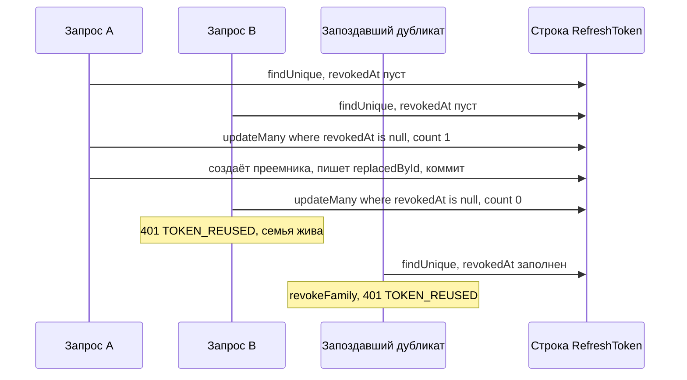

# Ротация refresh-токенов в FlowDesk через условный UPDATE и блокировку между вкладками

[English](flowdesk-refresh-rotation.md) · **Русский**

Репозиторий: [sinnercode228/flowdesk-crm](https://github.com/sinnercode228/flowdesk-crm) · Демо: [sinnercode228.github.io/flowdesk-crm](https://sinnercode228.github.io/flowdesk-crm/) · Ссылки на код ведут на коммит [`de0a2c2`](https://github.com/sinnercode228/flowdesk-crm/tree/de0a2c21755f9f59060d9d6d07f55e0b3b1cd42b)

Refresh-токены во FlowDesk одноразовые. `POST /api/auth/refresh` отзывает полученный токен и выдаёт новую пару, а если отозванный токен приходит снова, сервер отзывает все токены, выданные с того же логина. Так ловится скопированный токен, но отличить вора от собственного клиента, который отправил токен дважды, сервер не может. Четырёх запросов дашборда, упёршихся в истёкший access-токен, или двух вкладок с одной сессией хватает, чтобы сработало это правило, поэтому от дубликатов защищаются и сервер, и клиент.

FlowDesk — демо-CRM, данные в нём сгенерированы, а код авторизации и тесты к нему настоящие.

## Что лежит в базе

Access-токен — JWT на HS256, живёт 15 минут (`JWT_ACCESS_TTL`, по умолчанию 900 секунд). Refresh-токен — не JWT. `generateRefreshToken()` возвращает 32 случайных байта в base64url, а в базу попадает только SHA-256 в hex, в колонку `tokenHash` с `@unique` ([`tokens.ts#L56-L59`](https://github.com/sinnercode228/flowdesk-crm/blob/de0a2c21755f9f59060d9d6d07f55e0b3b1cd42b/server/src/lib/tokens.ts#L56-L59)). Перебирать 256 случайных бит бессмысленно, поэтому быстрого хэша достаточно, а дамп таблицы рабочих токенов не даёт.

Кроме хэша, в строке `RefreshToken` есть `familyId`, `expiresAt` (7 дней, `REFRESH_TOKEN_TTL_DAYS`), `revokedAt` и `replacedById` ([`schema.prisma#L30-L45`](https://github.com/sinnercode228/flowdesk-crm/blob/de0a2c21755f9f59060d9d6d07f55e0b3b1cd42b/server/prisma/schema.prisma#L30-L45)). `login()` заводит семью через `randomUUID()` ([`auth.service.ts#L23`](https://github.com/sinnercode228/flowdesk-crm/blob/de0a2c21755f9f59060d9d6d07f55e0b3b1cd42b/server/src/modules/auth/auth.service.ts#L23)), каждая ротация копирует `familyId` в новую строку, так что семья — это один логин и всё, что из него выросло ротациями. `replacedById` указывает на преемника; код его пишет, но нигде не читает. Logout тоже отзывает всю семью ([`auth.service.ts#L62-L68`](https://github.com/sinnercode228/flowdesk-crm/blob/de0a2c21755f9f59060d9d6d07f55e0b3b1cd42b/server/src/modules/auth/auth.service.ts#L62-L68)). Другие логины того же пользователя — другие семьи, их это не задевает.

## Два пути к `TOKEN_REUSED`

```ts
    if (stored.revokedAt) {
      await this.revokeFamily(stored.familyId, now);
      throw unauthorized('Refresh token reuse detected, please log in again', 'TOKEN_REUSED');
    }
    if (stored.expiresAt <= now) throw unauthorized('Refresh token expired', 'TOKEN_EXPIRED');

    return this.prisma.$transaction(async (tx) => {
      // Conditional update guards against two concurrent refreshes with the same token.
      const { count } = await tx.refreshToken.updateMany({
        where: { id: stored.id, revokedAt: null },
        data: { revokedAt: now },
      });
      if (count !== 1)
        throw unauthorized('Refresh token reuse detected, please log in again', 'TOKEN_REUSED');
```

[`server/src/modules/auth/auth.service.ts#L38-L51`](https://github.com/sinnercode228/flowdesk-crm/blob/de0a2c21755f9f59060d9d6d07f55e0b3b1cd42b/server/src/modules/auth/auth.service.ts#L38-L51)

`refresh()` сначала ищет строку по хэшу. Если она уже отозвана, этим токеном кто-то пользовался, и `revokeFamily` проставляет `revokedAt` всем живым строкам с тем же `familyId`, а в ответ уходит `401 TOKEN_REUSED`. Под отзыв попадает и самый свежий токен семьи: кто бы его ни держал, настоящий клиент или копия, войти придётся заново.

Вторая проверка нужна, потому что первая читает до записи. Два запроса с одним живым токеном могут оба пройти `findUnique` с `revokedAt = null`, и без защиты каждый выпустил бы свою пару: семья разветвилась бы на две рабочие цепочки. Поэтому транзакция отзывает строку через `updateMany` с условием `revokedAt: null` и смотрит на `count`. Prisma 6.19.3 (версия зафиксирована в `server/package.json`) отправляет это одним запросом; в логе на SQLite он выглядит как `UPDATE ... SET revokedAt = ? WHERE (id = ? AND revokedAt IS NULL)`. Заполнить `revokedAt` может только один из запросов. В PostgreSQL на уровне изоляции по умолчанию, READ COMMITTED, второй `UPDATE` ждёт блокировку строки, после коммита первой транзакции перепроверяет `WHERE` и ничего не находит. Проигравший видит `count === 0` и бросает ошибку раньше, чем выполнится `issueSession`. Победитель в той же транзакции создаёт строку-преемника и записывает её id в `replacedById` ([`auth.service.ts#L53-L57`](https://github.com/sinnercode228/flowdesk-crm/blob/de0a2c21755f9f59060d9d6d07f55e0b3b1cd42b/server/src/modules/auth/auth.service.ts#L53-L57)).

Заканчиваются эти две ветки по-разному:



Дубликат, который прочитал строку до коммита победителя, просто проигрывает гонку. Тот, что пришёл чуть позже, отзывает семью вместе с парой, которую победитель только что получил. Защита на сервере не даёт семье разветвиться, но безвредными дубликаты не делает, так что клиент не должен их отправлять.

## Один refresh на вкладку, потом вторая вкладка

Внутри одной вкладки это решено с первого коммита: `ApiClient` держит текущий refresh в `this.refreshing` и присваивает его через `??=`, так что параллельные 401 ждут один промис ([`client.ts#L91-L94`](https://github.com/sinnercode228/flowdesk-crm/blob/de0a2c21755f9f59060d9d6d07f55e0b3b1cd42b/web/src/lib/api/client.ts#L91-L94)). Это нужно дашборду: `useAnalytics` отправляет четыре запроса через один `Promise.all` ([`queries.ts#L58-L63`](https://github.com/sinnercode228/flowdesk-crm/blob/de0a2c21755f9f59060d9d6d07f55e0b3b1cd42b/web/src/hooks/queries.ts#L58-L63)), и с истёкшим access-токеном все четыре возвращают 401.

Но промис принадлежит одному `ApiClient`, а у каждой вкладки он свой. Что из этого выходило, описано в [issue #1](https://github.com/sinnercode228/flowdesk-crm/issues/1). `SessionStore` один раз читал `flowdesk.session.v1` из localStorage и дальше отдавал пару из памяти. Вкладка A получала 401, меняла refresh-токен R1 на R2 и записывала R2 в storage. Вкладка B всё ещё держала в памяти R1, отправляла его на своём 401 и попадала в ветку с отозванной строкой: сервер отзывал семью вместе с R2. Затем B вызывала `session.set(null)`, и ключ из localStorage удалялся. В памяти A ещё лежал R2, но сервер уже отозвал его вместе с семьёй, так что на следующем refresh из сессии вылетала и A.

## Что поменял PR #2 в клиенте

В [PR #2](https://github.com/sinnercode228/flowdesk-crm/pull/2) `request()` запоминает, с каким access-токеном ушёл запрос:

```ts
    const rejected = this.session.get()?.accessToken;
    let res = await send();
    if (res.status === 401 && !options.anonymous && rejected) {
      if (await this.refresh(rejected)) res = await send();
      else this.session.set(null);
    }
```

[`web/src/lib/api/client.ts#L58-L63`](https://github.com/sinnercode228/flowdesk-crm/blob/de0a2c21755f9f59060d9d6d07f55e0b3b1cd42b/web/src/lib/api/client.ts#L58-L63)

а `refresh(rejected)` под блокировкой решает, нужен ли ещё refresh:

```ts
    const rotate = async () => {
      const current = this.session.reload();
      if (!current) return false;
      if (current.accessToken !== rejected) return true;
      const res = await this.transport({
        method: 'POST',
        path: '/auth/refresh',
        body: { refreshToken: current.refreshToken },
        headers: {},
      });
      if (res.status !== 200) return false;
      this.session.set(res.body as AuthSession);
      return true;
    };
    const locks = typeof navigator === 'undefined' ? undefined : navigator.locks;
    const run = async () =>
      locks ? await locks.request('flowdesk.auth.refresh', rotate) : rotate();
```

[`web/src/lib/api/client.ts#L74-L90`](https://github.com/sinnercode228/flowdesk-crm/blob/de0a2c21755f9f59060d9d6d07f55e0b3b1cd42b/web/src/lib/api/client.ts#L74-L90)

`rotate` начинается с `this.session.reload()`: копия в памяти выбрасывается, localStorage читается заново. Пустой ключ значит, что другая вкладка вышла, и запрос завершается ошибкой. Если access-токен в storage отличается от `rejected`, ротацию уже сделала другая вкладка или более ранний refresh в этой же: `rotate` возвращает `true` без сетевого вызова, и `request()` повторяет запрос с токеном из storage. Только если в storage всё ещё лежит отклонённый токен, вкладка идёт на refresh, причём с refresh-токеном, который только что прочитала.

Одного перечитывания мало. Две вкладки, получившие 401 одновременно, обе прочитали бы R1 и обе его отправили. `navigator.locks.request('flowdesk.auth.refresh', rotate)` берёт блокировку Web Locks, общую для всех вкладок origin, и держит её, пока `rotate` не завершится, то есть пока `session.set` не запишет R2. Колбэк вкладки B стартует только после этого, её `reload()` возвращает новый access-токен A, и B повторяет запрос без refresh. Сколько бы вкладок ни было открыто, на одно истечение access-токена сервер получает один refresh.

Последняя часть следит, чтобы кэш не устаревал между refresh:

```ts
    if (typeof window === 'undefined') return;
    window.addEventListener('storage', (event) => {
      if (event.key !== null && event.key !== KEY) return;
      const session = this.reload();
      for (const listener of this.listeners) listener(session);
    });
  }

  /** Re-reads storage, discarding the in-memory copy. */
  reload(): StoredSession | null {
    this.cached = undefined;
    return this.get();
  }
```

[`web/src/lib/api/session-store.ts#L26-L38`](https://github.com/sinnercode228/flowdesk-crm/blob/de0a2c21755f9f59060d9d6d07f55e0b3b1cd42b/web/src/lib/api/session-store.ts#L26-L38)

Событие `storage` браузер отправляет в остальные вкладки того же origin, когда меняется ключ, а после `localStorage.clear()` у события `key` равен `null`. Подписчики получают новое значение; `AuthProvider` обновляет пользователя и очищает кэш TanStack Query, если сессии больше нет ([`use-auth.tsx#L33-L36`](https://github.com/sinnercode228/flowdesk-crm/blob/de0a2c21755f9f59060d9d6d07f55e0b3b1cd42b/web/src/hooks/use-auth.tsx#L33-L36)). Выход в одной вкладке теперь сразу доходит до остальных, а не на их следующем 401.

## Что проверяют тесты

[`server/test/auth.test.ts`](https://github.com/sinnercode228/flowdesk-crm/blob/de0a2c21755f9f59060d9d6d07f55e0b3b1cd42b/server/test/auth.test.ts#L96-L152) работает с настоящим инстансом Fastify. Тест «issues a new pair and invalidates the used refresh token» делает одну ротацию, вызывает `/auth/me` с новым access-токеном, повторяет старый refresh-токен и ждёт `TOKEN_REUSED`, а затем проверяет, что самый новый refresh-токен тоже отклоняется. «keeps other sessions alive when one family is revoked» логинится дважды, выходит из одной сессии и ждёт, что вторая по-прежнему обновляется. Ещё два случая — неизвестный и просроченный токен. Демо-роутер в браузере проходит ту же цепочку с повтором в «rotates refresh tokens and detects reuse» ([`server.test.ts#L52-L70`](https://github.com/sinnercode228/flowdesk-crm/blob/de0a2c21755f9f59060d9d6d07f55e0b3b1cd42b/web/src/lib/demo/server.test.ts#L52-L70)).

На клиенте в [`client.test.ts`](https://github.com/sinnercode228/flowdesk-crm/blob/de0a2c21755f9f59060d9d6d07f55e0b3b1cd42b/web/src/lib/api/client.test.ts#L42-L98) есть «refreshes an expired access token once and retries the request»: два запроса с истёкшим токеном, один вызов `/auth/refresh`. PR #2 добавил «picks up a refresh done by another tab instead of reusing the rotated token». Тест создаёт два `ApiClient` с отдельными `SessionStore` поверх одного `Storage` в памяти, сдвигает часы на 20 минут, даёт вкладке A сделать refresh и ждёт, что запрос вкладки B пройдёт, в логе транспорта окажется один refresh, а refresh-токен в обеих вкладках совпадёт. Ещё через 20 минут вкладка A снова делает refresh; если бы B повторила R1, этот шаг упал бы. «drops the cached session when another tab changes it» отправляет `StorageEvent` вручную.

Двух вещей тесты не проверяют. Серверные тесты шлют refresh по очереди, так что в CI условное обновление ни разу не проигрывает. Ветка с блокировкой тоже не выполняется: веб-тесты идут в jsdom 27.4, где `navigator.locks` равен `undefined`, а тест с двумя вкладками вызывает A и B последовательно и проверяет только перечитывание и сравнение.

## Где это ещё может сломаться

- Без `navigator.locks` (Web Locks браузеры дают только в защищённом контексте, то есть на HTTPS или localhost) при одновременных 401 по-прежнему возможна гонка. Обе вкладки отправляют R1, `rotate` проигравшей возвращает `false`, и `request()` вызывает `session.set(null)` на общем ключе. Если это происходит после того, как победитель записал R2, событие `storage` выкидывает из сессии и победившую вкладку.
- Любой ответ на refresh, кроме 200, стирает сессию, включая статус 0, который `createHttpTransport` возвращает при сетевой ошибке ([`transport.ts#L43-L47`](https://github.com/sinnercode228/flowdesk-crm/blob/de0a2c21755f9f59060d9d6d07f55e0b3b1cd42b/web/src/lib/api/transport.ts#L43-L47)). Таймаута или `AbortSignal` у fetch тоже нет, так что зависший refresh держит блокировку, а остальные вкладки ждут за ним.
- В какую ветку повтора попадёт дубликат, зависит от тайминга, и в коде нет комментария о том, задумана ли эта разница.
- В демо на Pages у каждой вкладки своя копия API. `createDemoServer` читает `flowdesk.demo-db.v1` один раз ([`server.ts#L116`](https://github.com/sinnercode228/flowdesk-crm/blob/de0a2c21755f9f59060d9d6d07f55e0b3b1cd42b/web/src/lib/demo/server.ts#L116)) и больше к нему не возвращается. Роутер B принимает новый access-токен A, потому что демо проверяет только `sub` и `exp`, но R2 он никогда не видел. Если следующий refresh делает B, она получает `401 Invalid refresh token` и стирает общую сессию для обеих вкладок.
- Токены лежат в localStorage, где их может прочитать любой скрипт на странице; refresh-токену место в httpOnly-cookie. Отозванные строки никто не удаляет: единственный `deleteMany` по `RefreshToken` — в сиде ([`seed.ts#L27`](https://github.com/sinnercode228/flowdesk-crm/blob/de0a2c21755f9f59060d9d6d07f55e0b3b1cd42b/server/src/db/seed.ts#L27)).

Код: [github.com/sinnercode228/flowdesk-crm](https://github.com/sinnercode228/flowdesk-crm)
