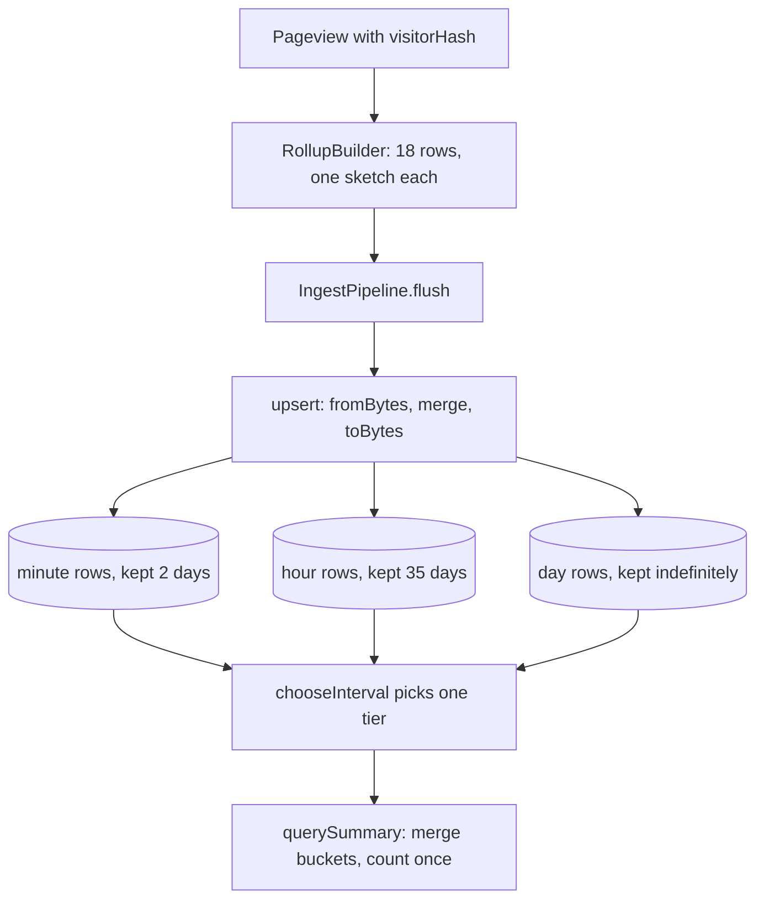

# How Pulse counts unique visitors with a daily salt and a sparse-to-dense HyperLogLog

**English** · [Русский](pulse-hyperloglog.ru.md)

Repository: [sinnercode228/pulse-analytics](https://github.com/sinnercode228/pulse-analytics) · Demo: [sinnercode228.github.io/pulse-analytics](https://sinnercode228.github.io/pulse-analytics/) · Code links point to commit [`96645e1`](https://github.com/sinnercode228/pulse-analytics/tree/96645e153317f7bc35e5fc17bf4f76424d83c7c3)

Pulse sets no cookies and its tracker writes nothing to the browser, so the server has to decide on its own that two pageviews came from the same person. It also stores no raw pageviews: each one is folded into minute, hour and day rollup rows and then dropped. Visitor counts in those rows cannot be added up, because someone seen in two different hours is still one visitor for the day. That is what the HyperLogLog sketch in every row is for: sketches are merged first and counted after.

## A visitor id from a daily salt

`POST /api/event` hands `req.ip`, the `User-Agent` header and the salt for the current UTC day to `toPageview`, which calls `visitorId` ([`ingest.ts#L10-L16`](https://github.com/sinnercode228/pulse-analytics/blob/96645e153317f7bc35e5fc17bf4f76424d83c7c3/server/src/routes/ingest.ts#L10-L16)):

```ts
/** Anonymous visitor id: hash(daily salt, site, IP, UA). Nothing reversible is stored. */
export function visitorId(salt: string, siteId: string, ip: string, userAgent: string): string {
  const input = `${salt}|${siteId}|${ip}|${userAgent}`;
  return hash32(input, 1).toString(36) + hash32(input, 2).toString(36);
}
```

[`server/src/ingest/parse.ts#L52-L56`](https://github.com/sinnercode228/pulse-analytics/blob/96645e153317f7bc35e5fc17bf4f76424d83c7c3/server/src/ingest/parse.ts#L52-L56)

`hash32` is MurmurHash3 x86_32 over UTF-16 code units, written with `Math.imul` so that Node and the browser produce the same bits ([`hash.ts#L6-L28`](https://github.com/sinnercode228/pulse-analytics/blob/96645e153317f7bc35e5fc17bf4f76424d83c7c3/packages/core/src/hash.ts#L6-L28)). Seeds 1 and 2 give two 32-bit values; the id is both in base36, up to 14 characters.

`SaltStore.forTime` ([`salt.ts#L14-L29`](https://github.com/sinnercode228/pulse-analytics/blob/96645e153317f7bc35e5fc17bf4f76424d83c7c3/server/src/ingest/salt.ts#L14-L29)) numbers days as `Math.floor(ts / DAY)`, so they are UTC days. The first request of a day stores `randomBytes(16)` as hex and runs `DELETE FROM salts WHERE day < ?` with `day - 1`. That keeps today's and yesterday's salt, although the class comment says yesterday's is deleted. The salt lives in SQLite, so a restart at noon does not change anyone's id.

The id itself never reaches the database. `RollupBuilder.add` hashes it once more with seed 0, `const visitorHash = hash32(event.visitorId);` ([`rollup.ts#L80`](https://github.com/sinnercode228/pulse-analytics/blob/96645e153317f7bc35e5fc17bf4f76424d83c7c3/packages/core/src/rollup.ts#L80)), and only that 32-bit number goes into a sketch. No table has a column for the IP or the User-Agent. The id string stays in memory for the 5-minute "online now" window ([`active.ts#L8-L28`](https://github.com/sinnercode228/pulse-analytics/blob/96645e153317f7bc35e5fc17bf4f76424d83c7c3/packages/core/src/active.ts#L8-L28)).

## Up to 512 hashes the sketch is a plain set

[`hll.ts#L3-L10`](https://github.com/sinnercode228/pulse-analytics/blob/96645e153317f7bc35e5fc17bf4f76424d83c7c3/packages/core/src/hll.ts#L3-L10) sets `HLL_PRECISION = 11`, so `M = 2048` registers, and `SPARSE_MAX = M / 4`, which is 512. The 512 comes from size: serialized, a sparse sketch is one tag byte plus 4 bytes per hash, so at 512 hashes it is 2,049 bytes, the same as a dense one (tag byte plus 2,048 one-byte registers). The next hash converts it:

```ts
  addHash(hash: number): this {
    const h = hash >>> 0;
    if (this.sparse) {
      this.sparse.add(h);
      if (this.sparse.size > SPARSE_MAX) this.toDense();
    } else {
      applyHash(this.registers!, h);
    }
    return this;
  }
```

[`packages/core/src/hll.ts#L42-L51`](https://github.com/sinnercode228/pulse-analytics/blob/96645e153317f7bc35e5fc17bf4f76424d83c7c3/packages/core/src/hll.ts#L42-L51)

`toDense` replays the stored hashes into a `Uint8Array(M)`. `applyHash` takes the top 11 bits as the register index; the rank is `Math.clz32` of the other 21 bits plus one, or `MAX_RANK` (22) when they are all zero ([L135-L140](https://github.com/sinnercode228/pulse-analytics/blob/96645e153317f7bc35e5fc17bf4f76424d83c7c3/packages/core/src/hll.ts#L135-L140)). A register keeps the largest rank it has seen.

Neither mode depends on input order. The sparse side is a set, the dense side is a per-register max, and `merge` only meets a dense argument that has already seen more than 512 distinct hashes ([L53-L63](https://github.com/sinnercode228/pulse-analytics/blob/96645e153317f7bc35e5fc17bf4f76424d83c7c3/packages/core/src/hll.ts#L53-L63)). So a sketch is dense exactly when its input had more than 512 distinct hashes, and its count depends on that set, not on how it was batched.

## Reading a number back

```ts
  count(): number {
    if (this.sparse) return this.sparse.size;
    const regs = this.registers!;
    let sum = 0;
    let zeros = 0;
    for (let i = 0; i < M; i++) {
      const r = regs[i]!;
      sum += POW2_NEG[r]!;
      if (r === 0) zeros++;
    }
    let estimate = (ALPHA * M * M) / sum;
    if (estimate <= 2.5 * M && zeros > 0) estimate = M * Math.log(M / zeros);
    return Math.round(estimate);
  }
```

[`packages/core/src/hll.ts#L65-L78`](https://github.com/sinnercode228/pulse-analytics/blob/96645e153317f7bc35e5fc17bf4f76424d83c7c3/packages/core/src/hll.ts#L65-L78)

Sparse: `Set.size`, exact except for 32-bit hash collisions; with n visitors the expected number of colliding pairs is about n²/2³³, roughly 0.00003 at n = 512. Dense: the raw estimate α·m²/Σ2⁻ʳ with α = 0.7213/(1 + 1.079/m) ≈ 0.7209. While that estimate is at most 2.5·m = 5,120 and some register is still zero, the code uses linear counting, m·ln(m/zeros), instead.

## Serialization, and where sketches merge

`toBytes` writes `[0, u32le...]` for a sparse sketch and `[1, registers...]` for a dense one ([L90-L107](https://github.com/sinnercode228/pulse-analytics/blob/96645e153317f7bc35e5fc17bf4f76424d83c7c3/packages/core/src/hll.ts#L90-L107)) into the `visitors BLOB` column of `rollups`. `fromBytes` throws `RangeError` on a wrong tag or length ([L109-L125](https://github.com/sinnercode228/pulse-analytics/blob/96645e153317f7bc35e5fc17bf4f76424d83c7c3/packages/core/src/hll.ts#L109-L125)). The sparse payload is unsorted, so equal sets can serialize differently; the code only compares counts.



The first merge is in memory. A pageview bumps `total` and five dimensions (page, referrer, country, device, browser) in each of three tiers, 18 rows, adding `visitorHash` to each row's sketch ([`rollup.ts#L79-L111`](https://github.com/sinnercode228/pulse-analytics/blob/96645e153317f7bc35e5fc17bf4f76424d83c7c3/packages/core/src/rollup.ts#L79-L111)). Pageviews that hit the same row before the next flush share a sketch.

The second is on flush: every 2 s by default, as soon as 5,000 rows are buffered, and before every stats query ([`pipeline.ts#L45-L51`](https://github.com/sinnercode228/pulse-analytics/blob/96645e153317f7bc35e5fc17bf4f76424d83c7c3/server/src/ingest/pipeline.ts#L45-L51), [`#L95`](https://github.com/sinnercode228/pulse-analytics/blob/96645e153317f7bc35e5fc17bf4f76424d83c7c3/server/src/ingest/pipeline.ts#L95), [`stats/service.ts#L36`](https://github.com/sinnercode228/pulse-analytics/blob/96645e153317f7bc35e5fc17bf4f76424d83c7c3/server/src/stats/service.ts#L36)). `SqliteRollupRepository.upsert` reads each stored row, rebuilds its sketch with `Hll.fromBytes` inside `toRow` ([L27-L37](https://github.com/sinnercode228/pulse-analytics/blob/96645e153317f7bc35e5fc17bf4f76424d83c7c3/server/src/db/rollup-repo.ts#L27-L37)), merges and writes back, in one transaction:

```ts
  upsert(rows: readonly RollupRow[]): void {
    if (rows.length === 0) return;
    transaction(this.db, () => {
      for (const row of rows) {
        const existing = this.select.get(
          row.siteId,
          row.granularity,
          row.dimension,
          row.bucket,
          row.value,
        ) as DbRow | undefined;
        const merged = existing ? mergeRow(toRow(existing), row) : row;
        this.write.run(
...
          merged.visitors.toBytes(),
...
        );
      }
    });
  }
```

[`server/src/db/rollup-repo.ts#L68-L93`](https://github.com/sinnercode228/pulse-analytics/blob/96645e153317f7bc35e5fc17bf4f76424d83c7c3/server/src/db/rollup-repo.ts#L68-L93)

The third is at query time. `querySummary` scans the `total` rows of one tier in the window, merges each into a fresh `emptyRow` and calls `count()` once ([`query.ts#L126-L145`](https://github.com/sinnercode228/pulse-analytics/blob/96645e153317f7bc35e5fc17bf4f76424d83c7c3/packages/core/src/query.ts#L126-L145)); timeseries and breakdowns do the same per bucket and per value. The fresh accumulator matters for `MemoryRollupStore`, the demo's store, whose `scan` yields its own row objects.

Tiers are not built from each other. Each pageview writes its minute, hour and day rows straight from the event, and a query reads one tier, picked by `chooseInterval` ([`query.ts#L61-L71`](https://github.com/sinnercode228/pulse-analytics/blob/96645e153317f7bc35e5fc17bf4f76424d83c7c3/packages/core/src/query.ts#L61-L71)). Day rows could not come from hour rows anyway: hour buckets are aligned to UTC, while a day bucket starts at local midnight in the site's time zone ([`time.ts#L66-L75`](https://github.com/sinnercode228/pulse-analytics/blob/96645e153317f7bc35e5fc17bf4f76424d83c7c3/packages/core/src/time.ts#L66-L75)). In Asia/Kolkata that is 18:30 UTC, where no hour bucket starts.

## How far off the counts are

The comment on `HLL_PRECISION` says ~2.3%, the textbook 1.04/√2048 ≈ 2.30%. Traffic in Pulse is synthetic anyway, so I measured on generated ids: 50 sets per size, hashed by `addString`, the same seed-0 `hash32` that `RollupBuilder` uses. From the repo root:

```bash
npx tsx -e '
import { Hll } from "./packages/core/src/index.ts";
for (const n of [512, 513, 1000, 5000, 10000, 100000]) {
  let sq = 0, sum = 0, worst = 0;
  for (let t = 0; t < 50; t++) {
    const h = new Hll();
    for (let i = 0; i < n; i++) h.addString(`${t}:${i}`);
    const e = (h.count() - n) / n;
    sq += e * e; sum += e; worst = Math.max(worst, Math.abs(e));
  }
  const pct = (x) => (100 * x).toFixed(2) + "%";
  console.log(n, pct(Math.sqrt(sq / 50)), pct(sum / 50), pct(worst));
}'
```

| distinct ids | rms error | mean error | worst of 50 |
| -----------: | --------: | ---------: | ----------: |
|          512 |     0.00% |      0.00% |       0.00% |
|          513 |     1.54% |     −0.16% |       4.09% |
|        1,000 |     1.78% |     −0.25% |       4.90% |
|        5,000 |     3.27% |     +2.04% |       7.88% |
|       10,000 |     1.98% |     +0.07% |       5.96% |
|      100,000 |     2.36% |     −0.10% |       6.93% |

The output is deterministic. At 513 the count goes from exact to about 1.5% rms in one step: the 513th hash moves it from `Set.size` to linear counting. The 5,000 row sits just under the 5,120 handover, which has no bias correction, and its error is the largest in the table and skewed upward, +2.04% on average.

That row explains a borderline test. The fixed set in `hll.test.ts`, `set5000-0` to `set5000-4999`, estimates 5,216, +4.32% against a 5% bound. Of my 50 sets of 5,000, 5 miss 5%, and 1 of 50 sets of 20,000 does. The test cannot flake because its input never changes, but 5% at 5,000 is not something this estimator guarantees.

## Tests from `hash32` up to `POST /api/event`

[`packages/core/test/hll.test.ts`](https://github.com/sinnercode228/pulse-analytics/blob/96645e153317f7bc35e5fc17bf4f76424d83c7c3/packages/core/test/hll.test.ts) has 11 tests:

- "is deterministic and seed-sensitive" checks that `hash32` returns the same value twice and that seeds 1 and 2 give different values.
- "spreads keys evenly across the top bits" sorts 16,000 ids into 16 buckets by the top 4 bits and requires each to stay less than 150 away from 1,000. The register index is the top 11 bits, so this is a coarse check that registers fill evenly.
- "is exact while sparse" adds 300 ids twice and expects 300 and `isSparse`.
- "switches to dense registers and stays within 3% at 100k", then "estimates %i distinct values within 5%" for 1,000, 5,000 and 20,000.
- "merges as a set union (overlapping visitors are not double counted)": two sets of 4,000 sharing 2,000 must give 6,000 within 4%. "merge is commutative across sparse/dense modes" merges 50 and 10,000 ids in both orders.
- "round-trips through bytes in both modes" and "rejects corrupted payloads" cover the format.

Further up the stack:

- [`rollup.test.ts#L64-L83`](https://github.com/sinnercode228/pulse-analytics/blob/96645e153317f7bc35e5fc17bf4f76424d83c7c3/packages/core/test/rollup.test.ts#L64-L83), "produces identical aggregates whether events arrive in one batch or many".
- [`query.test.ts#L66-L72`](https://github.com/sinnercode228/pulse-analytics/blob/96645e153317f7bc35e5fc17bf4f76424d83c7c3/packages/core/test/query.test.ts#L66-L72), "summary de-duplicates visitors across buckets": 3 visitors an hour, one of them (`loyal`) in every hour, so 24 hours must give 49, not 72.
- [`rollup-repo.test.ts#L32-L48`](https://github.com/sinnercode228/pulse-analytics/blob/96645e153317f7bc35e5fc17bf4f76424d83c7c3/server/test/rollup-repo.test.ts#L32-L48), "answers queries exactly like the in-memory store": two days of synthetic events go to SQLite in batches of 1,500 and to `MemoryRollupStore` in one batch, and summary, timeseries and two breakdowns must be `toEqual`. Exact equality from an estimator is fair here because of the order independence above. The next test writes {a, b}, then {b, c}, and expects 3 visitors.
- [`api.test.ts#L57-L100`](https://github.com/sinnercode228/pulse-analytics/blob/96645e153317f7bc35e5fc17bf4f76424d83c7c3/server/test/api.test.ts#L57-L100) goes through `POST /api/event`: three pageviews from 1.1.1.1 with one User-Agent and one from 2.2.2.2 with another must give `visitors: 2`.

Not covered: `SaltStore` and `visitorId` have no direct test, and no test sits on the 512/513 boundary.

## Trade-offs and gaps

- A new salt every UTC day means a new id every day, so "Unique visitors" over a week is closer to visitor-days than to people. A visitor active on both sides of midnight UTC counts twice in any range that spans it; for a site outside UTC that includes a single local day.
- Today's and yesterday's salts are in the same file as the sketches. For those two days, anyone holding the file can test a guessed IP and User-Agent against a sparse sketch. After the salt is deleted, that takes 16 unknown random bytes.
- `TRUST_PROXY` is on by default ([`config.ts#L28`](https://github.com/sinnercode228/pulse-analytics/blob/96645e153317f7bc35e5fc17bf4f76424d83c7c3/server/src/config.ts#L28)). Without a proxy that overwrites `X-Forwarded-For`, a client can claim a new IP, and so a new visitor id, per request.
- There is no bias correction at the 5,120 handover, where HLL++ uses an empirical table, and no large-range correction for 32-bit hashes, which would matter only near 2³²/30, about 143 million hashes in one row.
- A dense row is 2,049 bytes, and every flush reads, parses, merges and re-serializes each touched row in JavaScript, one `SELECT` and one `INSERT OR REPLACE` per row. For real traffic this upsert is the first thing I would rewrite.

Code: [github.com/sinnercode228/pulse-analytics](https://github.com/sinnercode228/pulse-analytics)
