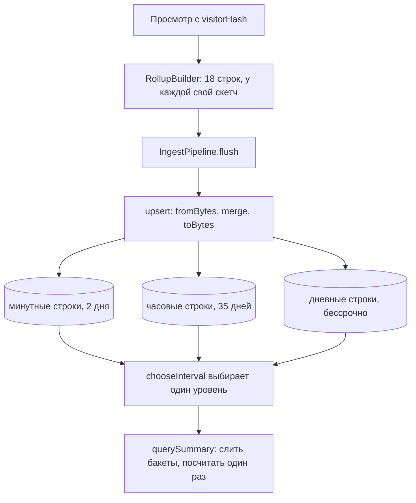

# Как Pulse считает посетителей через суточную соль и HyperLogLog

[English](pulse-hyperloglog.md) · **Русский**

Репозиторий: [sinnercode228/pulse-analytics](https://github.com/sinnercode228/pulse-analytics) · Демо: [sinnercode228.github.io/pulse-analytics](https://sinnercode228.github.io/pulse-analytics/) · Ссылки на код ведут на коммит [`96645e1`](https://github.com/sinnercode228/pulse-analytics/tree/96645e153317f7bc35e5fc17bf4f76424d83c7c3)

Pulse не ставит cookies, и трекер ничего не пишет в браузер, поэтому сервер сам решает, что два просмотра сделал один человек. Сырые просмотры в базу тоже не пишутся: каждый раскладывается по минутным, часовым и дневным строкам роллапов и выбрасывается. Посетителей в таких строках нельзя просто сложить: человек, который заходил в два разных часа, за день остаётся одним посетителем. Для этого в каждой строке лежит HyperLogLog-скетч: скетчи сначала сливаются и только потом считаются.

## Id посетителя из суточной соли

`POST /api/event` передаёт `req.ip`, заголовок `User-Agent` и соль текущих UTC-суток в `toPageview`, а тот вызывает `visitorId` ([`ingest.ts#L10-L16`](https://github.com/sinnercode228/pulse-analytics/blob/96645e153317f7bc35e5fc17bf4f76424d83c7c3/server/src/routes/ingest.ts#L10-L16)):

```ts
/** Anonymous visitor id: hash(daily salt, site, IP, UA). Nothing reversible is stored. */
export function visitorId(salt: string, siteId: string, ip: string, userAgent: string): string {
  const input = `${salt}|${siteId}|${ip}|${userAgent}`;
  return hash32(input, 1).toString(36) + hash32(input, 2).toString(36);
}
```

[`server/src/ingest/parse.ts#L52-L56`](https://github.com/sinnercode228/pulse-analytics/blob/96645e153317f7bc35e5fc17bf4f76424d83c7c3/server/src/ingest/parse.ts#L52-L56)

`hash32` — это MurmurHash3 x86_32 по кодовым единицам UTF-16, написанный на `Math.imul`, поэтому Node и браузер получают одни и те же биты ([`hash.ts#L6-L28`](https://github.com/sinnercode228/pulse-analytics/blob/96645e153317f7bc35e5fc17bf4f76424d83c7c3/packages/core/src/hash.ts#L6-L28)). Seed 1 и 2 дают два 32-битных числа; id — оба числа в base36, до 14 символов.

`SaltStore.forTime` ([`salt.ts#L14-L29`](https://github.com/sinnercode228/pulse-analytics/blob/96645e153317f7bc35e5fc17bf4f76424d83c7c3/server/src/ingest/salt.ts#L14-L29)) нумерует дни как `Math.floor(ts / DAY)`, то есть по UTC. Первый запрос за сутки сохраняет `randomBytes(16)` в hex и выполняет `DELETE FROM salts WHERE day < ?` с `day - 1`. Сегодняшняя и вчерашняя соль при этом остаются, хотя комментарий над классом говорит, что вчерашняя удаляется. Соль лежит в SQLite, так что перезапуск в полдень ничьих id не меняет.

Сам id до базы не доходит. `RollupBuilder.add` хэширует его ещё раз, с seed 0: `const visitorHash = hash32(event.visitorId);` ([`rollup.ts#L80`](https://github.com/sinnercode228/pulse-analytics/blob/96645e153317f7bc35e5fc17bf4f76424d83c7c3/packages/core/src/rollup.ts#L80)), и в скетч попадает только это 32-битное число. Колонок для IP или User-Agent нет ни в одной таблице. Строка id остаётся только в памяти, в пятиминутном окне счётчика «онлайн сейчас» ([`active.ts#L8-L28`](https://github.com/sinnercode228/pulse-analytics/blob/96645e153317f7bc35e5fc17bf4f76424d83c7c3/packages/core/src/active.ts#L8-L28)).

## До 512 хэшей скетч — обычное множество

[`hll.ts#L3-L10`](https://github.com/sinnercode228/pulse-analytics/blob/96645e153317f7bc35e5fc17bf4f76424d83c7c3/packages/core/src/hll.ts#L3-L10) задаёт `HLL_PRECISION = 11`, то есть `M = 2048` регистров, и `SPARSE_MAX = M / 4`, это 512. Граница выбрана по размеру: в сериализованном виде разреженный скетч занимает байт тега плюс 4 байта на хэш, и при 512 хэшах это 2 049 байт, ровно как у плотного (байт тега и 2 048 однобайтовых регистров). Следующий хэш переводит скетч в плотный режим:

```ts
  addHash(hash: number): this {
    const h = hash >>> 0;
    if (this.sparse) {
      this.sparse.add(h);
      if (this.sparse.size > SPARSE_MAX) this.toDense();
    } else {
      applyHash(this.registers!, h);
    }
    return this;
  }
```

[`packages/core/src/hll.ts#L42-L51`](https://github.com/sinnercode228/pulse-analytics/blob/96645e153317f7bc35e5fc17bf4f76424d83c7c3/packages/core/src/hll.ts#L42-L51)

`toDense` раскладывает сохранённые хэши по регистрам нового `Uint8Array(M)`. `applyHash` берёт старшие 11 бит как номер регистра; ранг — `Math.clz32` от оставшихся 21 бита плюс один или `MAX_RANK` (22), если все они нулевые ([L135-L140](https://github.com/sinnercode228/pulse-analytics/blob/96645e153317f7bc35e5fc17bf4f76424d83c7c3/packages/core/src/hll.ts#L135-L140)). Регистр хранит наибольший ранг, который ему встречался.

Ни один из режимов не зависит от порядка, в котором приходят хэши. Разреженный — это множество, плотный — максимум по каждому регистру, а плотный аргумент в `merge` бывает только у скетча, который уже видел больше 512 различных хэшей ([L53-L63](https://github.com/sinnercode228/pulse-analytics/blob/96645e153317f7bc35e5fc17bf4f76424d83c7c3/packages/core/src/hll.ts#L53-L63)). Значит, скетч плотный ровно тогда, когда на входе было больше 512 различных хэшей, и его оценка зависит от этого множества, а не от того, какими пачками оно пришло.

## Как из скетча получается число

```ts
  count(): number {
    if (this.sparse) return this.sparse.size;
    const regs = this.registers!;
    let sum = 0;
    let zeros = 0;
    for (let i = 0; i < M; i++) {
      const r = regs[i]!;
      sum += POW2_NEG[r]!;
      if (r === 0) zeros++;
    }
    let estimate = (ALPHA * M * M) / sum;
    if (estimate <= 2.5 * M && zeros > 0) estimate = M * Math.log(M / zeros);
    return Math.round(estimate);
  }
```

[`packages/core/src/hll.ts#L65-L78`](https://github.com/sinnercode228/pulse-analytics/blob/96645e153317f7bc35e5fc17bf4f76424d83c7c3/packages/core/src/hll.ts#L65-L78)

В разреженном режиме ответ — `Set.size`, точный, если не считать коллизий 32-битного хэша; при n посетителях ожидаемое число совпавших пар около n²/2³³, примерно 0,00003 при n = 512. В плотном — сырая оценка α·m²/Σ2⁻ʳ, где α = 0,7213/(1 + 1,079/m) ≈ 0,7209. Пока эта оценка не больше 2,5·m = 5 120 и хотя бы один регистр пуст, код берёт вместо неё линейный счёт, m·ln(m/zeros).

## Сериализация и три места, где сливаются скетчи

`toBytes` пишет `[0, u32le...]` для разреженного скетча и `[1, registers...]` для плотного ([L90-L107](https://github.com/sinnercode228/pulse-analytics/blob/96645e153317f7bc35e5fc17bf4f76424d83c7c3/packages/core/src/hll.ts#L90-L107)), и это уходит в колонку `visitors BLOB` таблицы `rollups`. `fromBytes` бросает `RangeError` при неверном теге или длине ([L109-L125](https://github.com/sinnercode228/pulse-analytics/blob/96645e153317f7bc35e5fc17bf4f76424d83c7c3/packages/core/src/hll.ts#L109-L125)). Содержимое разреженного скетча не сортируется, поэтому одинаковые множества могут дать разные байты; код сравнивает только оценки.



Первое слияние происходит в памяти. Просмотр обновляет `total` и пять срезов (страница, источник, страна, устройство, браузер) на каждом из трёх уровней, всего 18 строк, и добавляет `visitorHash` в скетч каждой из них ([`rollup.ts#L79-L111`](https://github.com/sinnercode228/pulse-analytics/blob/96645e153317f7bc35e5fc17bf4f76424d83c7c3/packages/core/src/rollup.ts#L79-L111)). Просмотры, попавшие в одну строку до следующего flush, делят один скетч.

Второе — при flush: по умолчанию раз в 2 с, сразу при 5 000 строк в буфере и перед каждым запросом статистики ([`pipeline.ts#L45-L51`](https://github.com/sinnercode228/pulse-analytics/blob/96645e153317f7bc35e5fc17bf4f76424d83c7c3/server/src/ingest/pipeline.ts#L45-L51), [`#L95`](https://github.com/sinnercode228/pulse-analytics/blob/96645e153317f7bc35e5fc17bf4f76424d83c7c3/server/src/ingest/pipeline.ts#L95), [`stats/service.ts#L36`](https://github.com/sinnercode228/pulse-analytics/blob/96645e153317f7bc35e5fc17bf4f76424d83c7c3/server/src/stats/service.ts#L36)). `SqliteRollupRepository.upsert` читает каждую сохранённую строку, восстанавливает её скетч через `Hll.fromBytes` внутри `toRow` ([L27-L37](https://github.com/sinnercode228/pulse-analytics/blob/96645e153317f7bc35e5fc17bf4f76424d83c7c3/server/src/db/rollup-repo.ts#L27-L37)), сливает и записывает обратно, всё в одной транзакции:

```ts
  upsert(rows: readonly RollupRow[]): void {
    if (rows.length === 0) return;
    transaction(this.db, () => {
      for (const row of rows) {
        const existing = this.select.get(
          row.siteId,
          row.granularity,
          row.dimension,
          row.bucket,
          row.value,
        ) as DbRow | undefined;
        const merged = existing ? mergeRow(toRow(existing), row) : row;
        this.write.run(
...
          merged.visitors.toBytes(),
...
        );
      }
    });
  }
```

[`server/src/db/rollup-repo.ts#L68-L93`](https://github.com/sinnercode228/pulse-analytics/blob/96645e153317f7bc35e5fc17bf4f76424d83c7c3/server/src/db/rollup-repo.ts#L68-L93)

Третье — при запросе. `querySummary` проходит по строкам `total` одного уровня внутри окна, сливает каждую в свежий `emptyRow` и вызывает `count()` один раз ([`query.ts#L126-L145`](https://github.com/sinnercode228/pulse-analytics/blob/96645e153317f7bc35e5fc17bf4f76424d83c7c3/packages/core/src/query.ts#L126-L145)); временной ряд и разбивки делают то же по бакетам и по значениям. Свежий аккумулятор нужен из-за `MemoryRollupStore`, хранилища демо: его `scan` отдаёт собственные объекты строк.

Уровни не строятся друг из друга. Каждый просмотр пишет минутную, часовую и дневную строки прямо из события, а запрос читает один уровень, который выбирает `chooseInterval` ([`query.ts#L61-L71`](https://github.com/sinnercode228/pulse-analytics/blob/96645e153317f7bc35e5fc17bf4f76424d83c7c3/packages/core/src/query.ts#L61-L71)). Собрать дневные строки из часовых всё равно не получилось бы: часовые бакеты выровнены по UTC, а дневной начинается в местную полночь часового пояса сайта ([`time.ts#L66-L75`](https://github.com/sinnercode228/pulse-analytics/blob/96645e153317f7bc35e5fc17bf4f76424d83c7c3/packages/core/src/time.ts#L66-L75)). В Asia/Kolkata это 18:30 UTC, и ни один часовой бакет в это время не начинается.

## Насколько ошибается оценка

Комментарий у `HLL_PRECISION` говорит ~2,3 %, это учебная стандартная ошибка 1,04/√2048 ≈ 2,30 %. Трафик в Pulse всё равно синтетический, поэтому и замерял я на сгенерированных id: 50 наборов на каждый размер, через `addString`, то есть тот же `hash32` с seed 0, что и в `RollupBuilder`. Из корня репозитория:

```bash
npx tsx -e '
import { Hll } from "./packages/core/src/index.ts";
for (const n of [512, 513, 1000, 5000, 10000, 100000]) {
  let sq = 0, sum = 0, worst = 0;
  for (let t = 0; t < 50; t++) {
    const h = new Hll();
    for (let i = 0; i < n; i++) h.addString(`${t}:${i}`);
    const e = (h.count() - n) / n;
    sq += e * e; sum += e; worst = Math.max(worst, Math.abs(e));
  }
  const pct = (x) => (100 * x).toFixed(2) + "%";
  console.log(n, pct(Math.sqrt(sq / 50)), pct(sum / 50), pct(worst));
}'
```

| различных id | rms-ошибка | средняя ошибка | худшая из 50 |
| -----------: | ---------: | -------------: | -----------: |
|          512 |     0,00 % |         0,00 % |       0,00 % |
|          513 |     1,54 % |        −0,16 % |       4,09 % |
|        1 000 |     1,78 % |        −0,25 % |       4,90 % |
|        5 000 |     3,27 % |        +2,04 % |       7,88 % |
|       10 000 |     1,98 % |        +0,07 % |       5,96 % |
|      100 000 |     2,36 % |        −0,10 % |       6,93 % |

Вывод детерминирован. На 513 оценка за один шаг перестаёт быть точной и получает около 1,5 % rms: 513-й хэш переводит скетч с `Set.size` на линейный счёт. Строка 5 000 лежит чуть ниже стыка на 5 120, где нет коррекции смещения; ошибка здесь самая большая в таблице и смещена вверх, в среднем +2,04 %.

Эта же строка объясняет пограничный тест. Фиксированный набор в `hll.test.ts`, от `set5000-0` до `set5000-4999`, оценивается в 5 216, то есть +4,32 % при допуске 5 %. Из моих 50 наборов по 5 000 допуск нарушают 5, из 50 наборов по 20 000 — один. Случайно упасть тест не может, его вход не меняется, но 5 % на 5 000 этот оценщик не гарантирует.

## Тесты от `hash32` до `POST /api/event`

В [`packages/core/test/hll.test.ts`](https://github.com/sinnercode228/pulse-analytics/blob/96645e153317f7bc35e5fc17bf4f76424d83c7c3/packages/core/test/hll.test.ts) 11 тестов:

- «is deterministic and seed-sensitive» проверяет, что `hash32` дважды возвращает одно и то же значение, а seed 1 и 2 дают разные.
- «spreads keys evenly across the top bits» раскладывает 16 000 id по 16 корзинам по старшим 4 битам и требует, чтобы каждая корзина отличалась от 1 000 меньше чем на 150. Номер регистра — старшие 11 бит, так что это грубая проверка того, что регистры заполняются равномерно.
- «is exact while sparse» добавляет 300 id дважды и ждёт 300 и `isSparse`.
- «switches to dense registers and stays within 3% at 100k», затем «estimates %i distinct values within 5%» для 1 000, 5 000 и 20 000.
- «merges as a set union (overlapping visitors are not double counted)»: два набора по 4 000 с общими 2 000 должны дать 6 000 с точностью 4 %. «merge is commutative across sparse/dense modes» сливает 50 и 10 000 id в обоих порядках.
- «round-trips through bytes in both modes» и «rejects corrupted payloads» проверяют формат.

Выше по стеку:

- [`rollup.test.ts#L64-L83`](https://github.com/sinnercode228/pulse-analytics/blob/96645e153317f7bc35e5fc17bf4f76424d83c7c3/packages/core/test/rollup.test.ts#L64-L83), «produces identical aggregates whether events arrive in one batch or many».
- [`query.test.ts#L66-L72`](https://github.com/sinnercode228/pulse-analytics/blob/96645e153317f7bc35e5fc17bf4f76424d83c7c3/packages/core/test/query.test.ts#L66-L72), «summary de-duplicates visitors across buckets»: 3 посетителя в час, один из них (`loyal`) в каждом часе, поэтому за 24 часа должно выйти 49, а не 72.
- [`rollup-repo.test.ts#L32-L48`](https://github.com/sinnercode228/pulse-analytics/blob/96645e153317f7bc35e5fc17bf4f76424d83c7c3/server/test/rollup-repo.test.ts#L32-L48), «answers queries exactly like the in-memory store»: два дня синтетических событий пишутся в SQLite пачками по 1 500 и в `MemoryRollupStore` одной пачкой, после чего сводка, временной ряд и две разбивки сравниваются через `toEqual`. Требовать точного равенства от вероятностной оценки здесь можно, потому что она не зависит от порядка, как показано выше. Следующий тест пишет {a, b}, потом {b, c} и ждёт 3 посетителя.
- [`api.test.ts#L57-L100`](https://github.com/sinnercode228/pulse-analytics/blob/96645e153317f7bc35e5fc17bf4f76424d83c7c3/server/test/api.test.ts#L57-L100) идёт через `POST /api/event`: три просмотра с 1.1.1.1 с одним User-Agent и один с 2.2.2.2 с другим должны дать `visitors: 2`.

Не покрыто: у `SaltStore` и `visitorId` нет прямых тестов, и ни один тест не стоит на границе 512/513.

## Компромиссы и пробелы

- Новая соль каждые UTC-сутки означает новый id каждый день, поэтому «Unique visitors» за неделю ближе к числу посетитель-дней, чем к числу людей. Посетитель, активный по обе стороны полуночи UTC, считается дважды в любом окне, которое её захватывает; для сайта не в UTC это касается и одного местного дня.
- Сегодняшняя и вчерашняя соль лежат в том же файле, что и скетчи. Эти два дня тот, у кого есть файл, может проверить догадку об IP и User-Agent по разреженному скетчу. После удаления соли для этого нужны 16 неизвестных случайных байт.
- `TRUST_PROXY` по умолчанию включён ([`config.ts#L28`](https://github.com/sinnercode228/pulse-analytics/blob/96645e153317f7bc35e5fc17bf4f76424d83c7c3/server/src/config.ts#L28)). Без прокси, который перезаписывает `X-Forwarded-For`, клиент может в каждом запросе назвать новый IP, а значит, получить новый id посетителя.
- Нет коррекции смещения на стыке 5 120 (в HLL++ там эмпирическая таблица) и нет коррекции для больших значений; с 32-битным хэшем она понадобилась бы только около 2³²/30, примерно 143 миллионов хэшей в одной строке.
- Плотная строка занимает 2 049 байт, и каждый flush читает, разбирает, сливает и заново сериализует каждую затронутую строку в JavaScript, по одному `SELECT` и одному `INSERT OR REPLACE` на строку. Для реального трафика этот upsert я бы переписал первым.

Код: [github.com/sinnercode228/pulse-analytics](https://github.com/sinnercode228/pulse-analytics)
