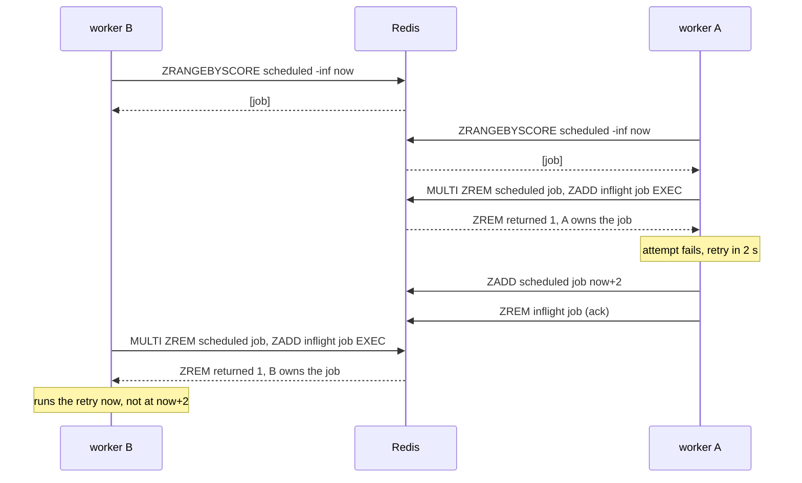

# My Redis queue claimed jobs atomically and still handed the same job to two workers

**English** · [Русский](relay-queue-races.ru.md)

Repository: [sinnercode228/integration-hub](https://github.com/sinnercode228/integration-hub) · Code links point to commit [`01dc632`](https://github.com/sinnercode228/integration-hub/tree/01dc6324195eb894dbc3f84437f6afc607381e3e) (before the fix) and [`b0ae35c`](https://github.com/sinnercode228/integration-hub/tree/b0ae35c14d753930be6c89155cdc75d31b861ff6) (the fix)

Two worker processes on one Redis could take the same job, although every claim in Relay's queue ran inside `MULTI`. The queue module's docstring promised the opposite:

```python
Claiming uses ``MULTI``: ``ZREM scheduled`` + ``ZADD inflight`` run atomically and a worker
only processes a job when *its own* ``ZREM`` removed it, so several worker processes can
share one Redis without double-processing.
```

[`queue/redis.py#L9-L11`](https://github.com/sinnercode228/integration-hub/blob/01dc6324195eb894dbc3f84437f6afc607381e3e/backend/src/relay/queue/redis.py#L9-L11)

The last clause was wrong. `MULTI` made the write atomic, but the decision to write came from a read one round trip earlier. Nothing re-checked that read when the transaction ran. Two tests now make the old queue hand one job to two workers on every run. With one Lua script per operation, both pass.

Relay takes a webhook from Tilda, amoCRM or Bitrix24, answers `202` and leaves every delivery to a worker. With the Redis backend, the worker takes jobs from two sorted sets: `scheduled`, scored by due time, and `inflight`, scored by lease deadline. Relay is a demo project with made-up leads; the code and tests are real.

## Read in one round trip, claim in the next

```python
    async def reserve(self, *, limit: int, lease_seconds: float) -> list[Job]:
        now = self._clock()
        members: list[Any] = await self._redis.zrangebyscore(
            self._scheduled, "-inf", now, start=0, num=limit
        )
        claimed: list[Job] = []
        for member in members:
            async with self._redis.pipeline(transaction=True) as pipe:
                pipe.zrem(self._scheduled, member)
                pipe.zadd(self._inflight, {member: now + lease_seconds})
                removed, _ = await pipe.execute()
            if removed:
                claimed.append(Job.decode(member))
        return claimed
```

[`queue/redis.py#L43-L56`](https://github.com/sinnercode228/integration-hub/blob/01dc6324195eb894dbc3f84437f6afc607381e3e/backend/src/relay/queue/redis.py#L43-L56)

`ZRANGEBYSCORE` returns the due members. Then each member gets its own transaction: remove it from `scheduled`, add it to `inflight` with the lease deadline as its score. The `removed` check does stop two workers that race for the same member at the same moment, because only one `ZREM` can return 1. It says nothing about what happened to the member between the read and the `MULTI`. `ZREM` removes a member whatever its current score is. To `ZREM`, a job that was due at read time and a job due two seconds from now look the same.

## A retry claimed before its backoff

When an attempt fails, the worker reschedules the job and then acks it. `enqueue` is a plain `ZADD` into `scheduled`, so a retry is the same member with a later score:

```python
        if delivery.status is DeliveryStatus.RETRYING:
            assert attempt.retry_in_seconds is not None
            await self.queue.enqueue(job, delay=attempt.retry_in_seconds)
        elif delivery.status is DeliveryStatus.DEAD:
            await self.queue.dead_letter(job, delivery.last_error or "failed")
        await self.queue.ack(job)
```

[`worker.py#L189-L194`](https://github.com/sinnercode228/integration-hub/blob/b0ae35c14d753930be6c89155cdc75d31b861ff6/backend/src/relay/worker.py#L189-L194)

Put two workers on one Redis and let A run its whole cycle between B's read and B's `MULTI`:



By the time B's transaction runs, its read is stale. The member is back in `scheduled` with a future score, so B's `ZREM` returns 1 and B takes that as a fair claim. The 2-second backoff is skipped. Any other delay is lost the same way, including one taken from an HTTP `Retry-After` header or Telegram's `retry_after`. The job goes back to a destination that has just asked Relay to wait.

## A fresh lease taken back

`requeue_expired` had the same shape: read expired members from `inflight` in one round trip, then for each one `MULTI { ZREM inflight; ZADD scheduled NX }` ([`queue/redis.py#L61-L71`](https://github.com/sinnercode228/integration-hub/blob/01dc6324195eb894dbc3f84437f6afc607381e3e/backend/src/relay/queue/redis.py#L61-L71)). Here the outcome is worse.

1. Worker x holds the job and dies. Its lease runs out.
2. Worker B reads the expired member.
3. Worker C requeues the same member and claims it with a fresh 120-second lease. C starts sending.
4. B's transaction runs. Its `ZREM` removes C's new lease and returns 1, and `ZADD NX` makes the job due again.
5. A fourth worker d reserves the job while C is still sending it.

The same delivery now goes out twice in parallel. C's lease was there to prevent exactly that, and it is gone.

## Forcing the interleaving without sleeps

Both races need the other worker to land in a gap of one network round trip. Sleeps and threads would hit that gap only sometimes. I wanted a test that hits it every time, so the test file wraps one client's `execute_command`:

```python
class AfterFirstRoundTrip:
    """Runs ``action`` once, right after the client's next command returns."""

    def __init__(self, client: Any, action: Callable[[], Awaitable[None]]) -> None:
        self._execute = client.execute_command
        self._action = action
        self.fired = False
        client.execute_command = self._wrapped

    async def _wrapped(self, *args: Any, **kwargs: Any) -> Any:
        result = await self._execute(*args, **kwargs)
        if not self.fired:
            self.fired = True
            await self._action()
        return result
```

[`tests/test_queue_races.py#L31-L45`](https://github.com/sinnercode228/integration-hub/blob/b0ae35c14d753930be6c89155cdc75d31b861ff6/backend/tests/test_queue_races.py#L31-L45)

Every queue in the test has its own connection to the same server. The hook goes on the worker under test. Right after that worker's first command comes back, still inside its call, the hook runs the other worker's actions, which use their own connection. Everything runs on one event loop and the action is awaited in place, so the code sets the order, not a scheduler. With the old code the first command is the `ZRANGEBYSCORE` read, and the other worker always lands between the read and the `MULTI`.

```python
async def test_a_retry_is_not_claimed_before_its_backoff(workers: Workers) -> None:
    clients, (a, b) = workers(2)
    job = Job("d1", "e1")
    await a.enqueue(job)
    claims: list[str] = []

    async def worker_a_fails_once() -> None:
        taken = await a.reserve(limit=1, lease_seconds=LEASE)
        claims.extend("a" for _ in taken)
        for j in taken:
            await a.enqueue(j, delay=2)
            await a.ack(j)

    hook = AfterFirstRoundTrip(clients[1], worker_a_fails_once)
    claims.extend("b" for _ in await b.reserve(limit=1, lease_seconds=LEASE))

    assert hook.fired
    assert len(claims) == 1, f"one due job, claimed by {claims}"
    depth = await a.depth()
    if claims == ["a"]:
        # A's retry waits out its 2 s backoff in `scheduled`, nobody holds it.
        assert (depth.ready, depth.scheduled, depth.in_flight) == (0, 1, 0)
    else:
        assert (depth.ready, depth.scheduled, depth.in_flight) == (0, 0, 1)
```

[`tests/test_queue_races.py#L74-L97`](https://github.com/sinnercode228/integration-hub/blob/b0ae35c14d753930be6c89155cdc75d31b861ff6/backend/tests/test_queue_races.py#L74-L97)

The assertions do not say who wins. A correct queue may give the job to either A or B, depending on whether A's actions run before or after B's claim. Under any order, two things must hold: one due job is claimed once, and the queue's state matches the winner. If A won, a retry waits out its backoff in `scheduled`. If B won, the job is in flight.

The second test is built the same way. B runs `requeue_expired` with the hook, and C requeues and claims the job inside B's gap. The test then checks that C has the job and that d gets nothing while C's lease holds ([`#L100-L120`](https://github.com/sinnercode228/integration-hub/blob/b0ae35c14d753930be6c89155cdc75d31b861ff6/backend/tests/test_queue_races.py#L100-L120)).

Against a real Redis 7.0.15, the old code fails both (assertion lines and summary from that run):

```
E       AssertionError: one due job, claimed by ['a', 'b']
E       AssertionError: assert [Job(delivery...vent_id='e1')] == []
FAILED tests/test_queue_races.py::test_a_retry_is_not_claimed_before_its_backoff
FAILED tests/test_queue_races.py::test_requeue_does_not_take_back_a_fresh_lease
```

The first line is the first race exactly as described: one due job, two claims. The second is the assertion that d gets nothing, and d got the job.

## One script per decision

The fix moves the read into the same atomic step as the write. Redis does not run other clients' commands while a Lua script is running, so the members the script reads are the members it moves:

```python
# KEYS: scheduled, inflight. ARGV: now, lease deadline, limit.
_RESERVE = """
local due = redis.call('ZRANGEBYSCORE', KEYS[1], '-inf', ARGV[1], 'LIMIT', 0, ARGV[3])
for _, member in ipairs(due) do
  redis.call('ZREM', KEYS[1], member)
  redis.call('ZADD', KEYS[2], ARGV[2], member)
end
return due
"""

# KEYS: inflight, scheduled. ARGV: now. NX keeps a later due time set by a retry.
_REQUEUE_EXPIRED = """
local expired = redis.call('ZRANGEBYSCORE', KEYS[1], '-inf', ARGV[1])
for _, member in ipairs(expired) do
  redis.call('ZREM', KEYS[1], member)
  redis.call('ZADD', KEYS[2], 'NX', ARGV[1], member)
end
return #expired
"""
```

[`queue/redis.py#L29-L47`](https://github.com/sinnercode228/integration-hub/blob/b0ae35c14d753930be6c89155cdc75d31b861ff6/backend/src/relay/queue/redis.py#L29-L47)

```python
    async def reserve(self, *, limit: int, lease_seconds: float) -> list[Job]:
        now = self._clock()
        members: list[Any] = await self._reserve(
            keys=[self._scheduled, self._inflight],
            args=[repr(now), repr(now + lease_seconds), limit],
        )
        return [Job.decode(member) for member in members]
```

[`queue/redis.py#L69-L75`](https://github.com/sinnercode228/integration-hub/blob/b0ae35c14d753930be6c89155cdc75d31b861ff6/backend/src/relay/queue/redis.py#L69-L75)

A retry rescheduled two seconds ahead is outside `-inf..now` when the script reads, and stays where it is. The lease C has just taken ends 120 seconds from now, so `_REQUEUE_EXPIRED` does not see it. The `removed` check is gone from Python: whatever the script returns, it has already moved.

The other option was optimistic locking: `WATCH scheduled`, read, `MULTI`, write, `EXEC`, and start over if `EXEC` aborts. I decided against it because `WATCH` works on whole keys, not members. Every accepted webhook does a `ZADD` into `scheduled` for each of its deliveries, and so does every retry. Any enqueue landing between a worker's read and its `EXEC` would abort the claim and send the worker round the loop again. The new job would not even have to be related to the claimed ones. A script needs no retry loop.

The script also saves round trips. The old `reserve` made 1 + N of them for N due members: one read, then one `MULTI` pipeline per member. The new one makes one script call. The first time a server sees the script, `EVALSHA` gets `NOSCRIPT`, and redis-py sends `SCRIPT LOAD` and repeats the call. After that it is one round trip. I have not measured what this does to throughput, so the only claim here is the count.

With the fix, the hook fires after whichever command returns first. An `EVALSHA` that gets `NOSCRIPT` raises instead of returning, which leaves two cases. If the server already has the script cached, the `EVALSHA` returns first, after the script has done its work. If it does not, the `SCRIPT LOAD` returns first, before the script has run. Either way the other worker sees the state before or after the whole step, never in the middle. The two branches in the first test cover exactly these two orders, and both of them run. On fakeredis, which starts every test with an empty server, A gets the job. On a Redis that has the script cached from an earlier run, B does.

## The same tests on fakeredis and on Redis 7

The `workers` fixture makes n queues on separate connections to one server, with a random key prefix per test. By default the server is a `fakeredis.FakeServer`. The dev dependency is now `fakeredis[lua]>=2.26`, which runs the Lua scripts through lupa (fakeredis 2.39.0 in my environment). When `RELAY_TEST_REDIS_URL` is set, the same tests connect to that Redis instead.

fakeredis is a Python reimplementation, and a fix for an atomicity bug that passes only on a reimplementation proves less than I want. I also ran both tests on a real Redis 7.0.15: both fail on [`01dc632`](https://github.com/sinnercode228/integration-hub/tree/01dc6324195eb894dbc3f84437f6afc607381e3e) and pass on [`b0ae35c`](https://github.com/sinnercode228/integration-hub/tree/b0ae35c14d753930be6c89155cdc75d31b861ff6). CI runs them against Redis 7 too. The backend job starts a `redis:7-alpine` service container and sets `RELAY_TEST_REDIS_URL` on Python 3.12, 3.13 and 3.14 ([`ci.yml#L14-L27`](https://github.com/sinnercode228/integration-hub/blob/b0ae35c14d753930be6c89155cdc75d31b861ff6/.github/workflows/ci.yml#L14-L27)). The first run with the container, on the fix commit, passed on all three; the service log shows Redis 7.4.11.

In practice the Compose file runs one `relay worker` process. One process cannot hit either race, because its loop runs `requeue_expired`, `reserve` and the batch in turn. Both bugs needed two or more worker processes on one Redis. Nothing broke anywhere. The bug was waiting for the first time someone scaled the worker out, and the docstring said exactly that was safe.

## Still open: a late ack

`ack` is still a plain `ZREM` on `inflight`, and it does not check whose lease it removes. The lease is 120 seconds by default. The attempt timeout is set per destination: 20 seconds with default settings, but `timeout_seconds` in the config only has to be positive, so a destination can get more than 120. Then this sequence works:

1. Worker x's attempt outlives its lease.
2. Worker y requeues the job and takes it over with a new lease.
3. x finishes and acks. Its `ZREM` removes y's lease.
4. y dies before it acks or reschedules.

Nobody's lease covers the job any more, so `requeue_expired` has nothing to bring back. If x's attempt ended in a retry, x put the job back into `scheduled` before its ack and nothing is lost. If x ended with a final status and y had already saved a retry to the store before dying, the delivery stays `retrying` with no job in the queue. The in-memory queue has the same gap. A test pins it on both backends:

```python
@pytest.mark.parametrize("backend", ["memory", "redis"])
@pytest.mark.xfail(
    strict=True,
    reason="ack is not fenced by the lease: a worker whose lease ran out removes the lease "
    "of the worker that took the job over",
)
```

[`tests/test_queue_races.py#L123-L128`](https://github.com/sinnercode228/integration-hub/blob/b0ae35c14d753930be6c89155cdc75d31b861ff6/backend/tests/test_queue_races.py#L123-L128)

`strict=True` means the run fails once the test starts passing, so whoever fixes this has to remove the marker too. The fix needs a fencing token. The lease deadline score can serve as the token: `reserve` returns it with the job, and `ack` and the retry `enqueue` become Lua compare-and-delete steps. They act only if `ZSCORE inflight` still equals that token. The other route is to renew the lease while an attempt runs, so a live worker never loses it. I have done neither yet.

## The rule I took from it

A claim has to be decided where it is written. `MULTI` runs the commands inside it together, but it does not re-check anything read before it started. If the condition comes from an earlier read, it has to move into the same atomic step, or the write has to compare against a token from that read. The race tests now check this for `reserve` and `requeue_expired`, and the strict xfail marks `ack`, where it is still missing.

Fix: [`b0ae35c` Claim and requeue jobs atomically with Lua scripts](https://github.com/sinnercode228/integration-hub/commit/b0ae35c14d753930be6c89155cdc75d31b861ff6) · Tests: [`backend/tests/test_queue_races.py`](https://github.com/sinnercode228/integration-hub/blob/b0ae35c14d753930be6c89155cdc75d31b861ff6/backend/tests/test_queue_races.py)
