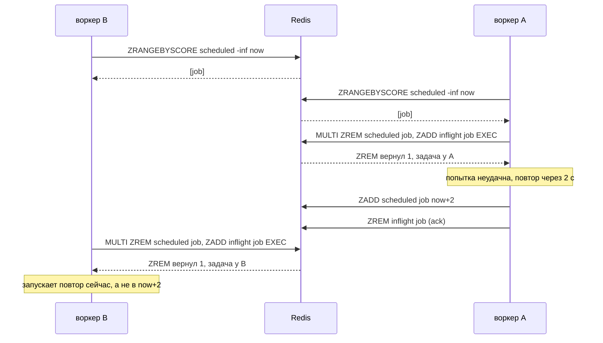

# Очередь на Redis атомарно забирала задачи и всё равно отдавала одну и ту же двум воркерам

[English](relay-queue-races.md) · **Русский**

Репозиторий: [sinnercode228/integration-hub](https://github.com/sinnercode228/integration-hub) · Ссылки на код ведут на коммит [`01dc632`](https://github.com/sinnercode228/integration-hub/tree/01dc6324195eb894dbc3f84437f6afc607381e3e) (до исправления) и [`b0ae35c`](https://github.com/sinnercode228/integration-hub/tree/b0ae35c14d753930be6c89155cdc75d31b861ff6) (исправление)

Два процесса-воркера на одном Redis могли забрать одну и ту же задачу, хотя каждый захват в очереди Relay шёл через `MULTI`. Docstring модуля очереди обещал обратное:

```python
Claiming uses ``MULTI``: ``ZREM scheduled`` + ``ZADD inflight`` run atomically and a worker
only processes a job when *its own* ``ZREM`` removed it, so several worker processes can
share one Redis without double-processing.
```

[`queue/redis.py#L9-L11`](https://github.com/sinnercode228/integration-hub/blob/01dc6324195eb894dbc3f84437f6afc607381e3e/backend/src/relay/queue/redis.py#L9-L11)

Последняя часть фразы была неправдой. `MULTI` делал атомарной запись, но решение о записи принималось по чтению на один сетевой запрос раньше. К началу транзакции это чтение никто не перепроверял. Теперь два теста при каждом запуске заставляют старую очередь отдать одну задачу двум воркерам. С одним Lua-скриптом на операцию оба проходят.

Relay принимает вебхук от Tilda, amoCRM или Bitrix24, отвечает `202` и оставляет каждую доставку воркеру. С очередью на Redis воркер берёт задачи из двух sorted set. В `scheduled` score — время, когда задача станет готовой, в `inflight` — срок аренды (lease). Relay — демо-проект, заявки в нём выдуманы; код и тесты настоящие.

## Чтение в одном запросе, захват в следующем

```python
    async def reserve(self, *, limit: int, lease_seconds: float) -> list[Job]:
        now = self._clock()
        members: list[Any] = await self._redis.zrangebyscore(
            self._scheduled, "-inf", now, start=0, num=limit
        )
        claimed: list[Job] = []
        for member in members:
            async with self._redis.pipeline(transaction=True) as pipe:
                pipe.zrem(self._scheduled, member)
                pipe.zadd(self._inflight, {member: now + lease_seconds})
                removed, _ = await pipe.execute()
            if removed:
                claimed.append(Job.decode(member))
        return claimed
```

[`queue/redis.py#L43-L56`](https://github.com/sinnercode228/integration-hub/blob/01dc6324195eb894dbc3f84437f6afc607381e3e/backend/src/relay/queue/redis.py#L43-L56)

`ZRANGEBYSCORE` возвращает готовые задачи. Затем на каждую идёт отдельная транзакция: убрать из `scheduled` и положить в `inflight` со score, равным сроку аренды. Проверка `removed` действительно разводит двух воркеров, которые одновременно хватают одну задачу: `ZREM` вернёт 1 только одному из них. Но она ничего не знает о том, что было с задачей между чтением и `MULTI`. `ZREM` удаляет элемент при любом score. Для него задача, готовая на момент чтения, и задача, которая станет готовой через две секунды, ничем не отличаются.

## Повтор, захваченный раньше паузы

Если попытка не удалась, воркер сначала снова ставит задачу в очередь и только потом делает ack. `enqueue` — это обычный `ZADD` в `scheduled`, так что повтор — тот же элемент с более поздним score:

```python
        if delivery.status is DeliveryStatus.RETRYING:
            assert attempt.retry_in_seconds is not None
            await self.queue.enqueue(job, delay=attempt.retry_in_seconds)
        elif delivery.status is DeliveryStatus.DEAD:
            await self.queue.dead_letter(job, delivery.last_error or "failed")
        await self.queue.ack(job)
```

[`worker.py#L189-L194`](https://github.com/sinnercode228/integration-hub/blob/b0ae35c14d753930be6c89155cdc75d31b861ff6/backend/src/relay/worker.py#L189-L194)

Пусть на одном Redis работают два воркера, и A успевает пройти весь цикл, пока B находится между чтением и `MULTI`:



Когда доходит до транзакции B, его чтение уже устарело. Задача снова лежит в `scheduled`, только с будущим score, поэтому `ZREM` у B возвращает 1, и B считает захват честным. Двухсекундная пауза пропадает. Так же пропадёт любая задержка, в том числе взятая из HTTP-заголовка `Retry-After` или из `retry_after` у Telegram. Задача уходит к получателю, который только что попросил Relay подождать.

## Свежая аренда, которую забрали обратно

`requeue_expired` был устроен так же: одним запросом прочитать из `inflight` элементы с истёкшей арендой, потом на каждый `MULTI { ZREM inflight; ZADD scheduled NX }` ([`queue/redis.py#L61-L71`](https://github.com/sinnercode228/integration-hub/blob/01dc6324195eb894dbc3f84437f6afc607381e3e/backend/src/relay/queue/redis.py#L61-L71)). Здесь последствия хуже.

1. Воркер x держит задачу и падает. Его аренда истекает.
2. Воркер B читает элемент с истёкшей арендой.
3. Воркер C возвращает тот же элемент в очередь и забирает его с новой арендой на 120 секунд. C начинает отправку.
4. Выполняется транзакция B. `ZREM` в ней удаляет новую аренду C и возвращает 1, а `ZADD NX` снова делает задачу готовой.
5. Четвёртый воркер d забирает задачу, пока C её ещё отправляет.

Одна доставка уходит дважды параллельно. Аренда C должна была как раз это предотвратить, но её уже нет.

## Как воспроизвести гонку без sleep

Обеим гонкам нужно, чтобы второй воркер уложился в промежуток длиной в один сетевой запрос. С `sleep` и потоками тест попадал бы в него лишь иногда. Мне нужно было попадание при каждом запуске, поэтому тест оборачивает `execute_command` у одного клиента:

```python
class AfterFirstRoundTrip:
    """Runs ``action`` once, right after the client's next command returns."""

    def __init__(self, client: Any, action: Callable[[], Awaitable[None]]) -> None:
        self._execute = client.execute_command
        self._action = action
        self.fired = False
        client.execute_command = self._wrapped

    async def _wrapped(self, *args: Any, **kwargs: Any) -> Any:
        result = await self._execute(*args, **kwargs)
        if not self.fired:
            self.fired = True
            await self._action()
        return result
```

[`tests/test_queue_races.py#L31-L45`](https://github.com/sinnercode228/integration-hub/blob/b0ae35c14d753930be6c89155cdc75d31b861ff6/backend/tests/test_queue_races.py#L31-L45)

У каждой очереди в тесте своё соединение с одним и тем же сервером. Хук ставится на проверяемого воркера. Сразу после того, как вернулась его первая команда, ещё внутри его вызова, хук выполняет действия второго воркера, а те идут по своему соединению. Всё работает в одном event loop, и действие ожидается на месте, поэтому порядок задаёт код, а не планировщик. В старом коде первая команда — чтение `ZRANGEBYSCORE`, и второй воркер всегда оказывается между чтением и `MULTI`.

```python
async def test_a_retry_is_not_claimed_before_its_backoff(workers: Workers) -> None:
    clients, (a, b) = workers(2)
    job = Job("d1", "e1")
    await a.enqueue(job)
    claims: list[str] = []

    async def worker_a_fails_once() -> None:
        taken = await a.reserve(limit=1, lease_seconds=LEASE)
        claims.extend("a" for _ in taken)
        for j in taken:
            await a.enqueue(j, delay=2)
            await a.ack(j)

    hook = AfterFirstRoundTrip(clients[1], worker_a_fails_once)
    claims.extend("b" for _ in await b.reserve(limit=1, lease_seconds=LEASE))

    assert hook.fired
    assert len(claims) == 1, f"one due job, claimed by {claims}"
    depth = await a.depth()
    if claims == ["a"]:
        # A's retry waits out its 2 s backoff in `scheduled`, nobody holds it.
        assert (depth.ready, depth.scheduled, depth.in_flight) == (0, 1, 0)
    else:
        assert (depth.ready, depth.scheduled, depth.in_flight) == (0, 0, 1)
```

[`tests/test_queue_races.py#L74-L97`](https://github.com/sinnercode228/integration-hub/blob/b0ae35c14d753930be6c89155cdc75d31b861ff6/backend/tests/test_queue_races.py#L74-L97)

Проверки в тесте не говорят, кто должен выиграть. Правильная очередь может отдать задачу и A, и B: это зависит от того, выполнились действия A до захвата B или после. При любом порядке должно выполняться другое. Одна готовая задача захвачена один раз, и состояние очереди соответствует победителю. Если выиграл A, повтор ждёт свою паузу в `scheduled`. Если B, задача в работе.

Второй тест устроен так же. B вызывает `requeue_expired` с хуком, а C внутри этого промежутка возвращает задачу в очередь и забирает её. Потом тест проверяет, что задача у C и что d ничего не получает, пока действует аренда C ([`#L100-L120`](https://github.com/sinnercode228/integration-hub/blob/b0ae35c14d753930be6c89155cdc75d31b861ff6/backend/tests/test_queue_races.py#L100-L120)).

На настоящем Redis 7.0.15 старый код проваливает оба теста (строки `AssertionError` и сводка из этого прогона):

```
E       AssertionError: one due job, claimed by ['a', 'b']
E       AssertionError: assert [Job(delivery...vent_id='e1')] == []
FAILED tests/test_queue_races.py::test_a_retry_is_not_claimed_before_its_backoff
FAILED tests/test_queue_races.py::test_requeue_does_not_take_back_a_fresh_lease
```

Первая строка — первая гонка в чистом виде: одна готовая задача, два захвата. Вторая — проверка, что d ничего не получит, а d получил задачу.

## По скрипту на каждое решение

Исправление переносит чтение в тот же атомарный шаг, что и запись. Пока Redis выполняет Lua-скрипт, команды других клиентов не вклиниваются, поэтому скрипт двигает ровно те элементы, которые прочитал:

```python
# KEYS: scheduled, inflight. ARGV: now, lease deadline, limit.
_RESERVE = """
local due = redis.call('ZRANGEBYSCORE', KEYS[1], '-inf', ARGV[1], 'LIMIT', 0, ARGV[3])
for _, member in ipairs(due) do
  redis.call('ZREM', KEYS[1], member)
  redis.call('ZADD', KEYS[2], ARGV[2], member)
end
return due
"""

# KEYS: inflight, scheduled. ARGV: now. NX keeps a later due time set by a retry.
_REQUEUE_EXPIRED = """
local expired = redis.call('ZRANGEBYSCORE', KEYS[1], '-inf', ARGV[1])
for _, member in ipairs(expired) do
  redis.call('ZREM', KEYS[1], member)
  redis.call('ZADD', KEYS[2], 'NX', ARGV[1], member)
end
return #expired
"""
```

[`queue/redis.py#L29-L47`](https://github.com/sinnercode228/integration-hub/blob/b0ae35c14d753930be6c89155cdc75d31b861ff6/backend/src/relay/queue/redis.py#L29-L47)

```python
    async def reserve(self, *, limit: int, lease_seconds: float) -> list[Job]:
        now = self._clock()
        members: list[Any] = await self._reserve(
            keys=[self._scheduled, self._inflight],
            args=[repr(now), repr(now + lease_seconds), limit],
        )
        return [Job.decode(member) for member in members]
```

[`queue/redis.py#L69-L75`](https://github.com/sinnercode228/integration-hub/blob/b0ae35c14d753930be6c89155cdc75d31b861ff6/backend/src/relay/queue/redis.py#L69-L75)

Повтор, отложенный на две секунды, в момент чтения лежит вне `-inf..now` и остаётся на месте. Аренда, которую C только что взял, кончается через 120 секунд, поэтому `_REQUEUE_EXPIRED` её не видит. Проверка `removed` из Python ушла: всё, что скрипт вернул, он уже перенёс.

Другой вариант — оптимистичная блокировка: `WATCH scheduled`, чтение, `MULTI`, запись, `EXEC` и всё сначала, если `EXEC` отменился. Я от него отказался, потому что `WATCH` следит за ключом целиком, а не за отдельными элементами. Каждый принятый вебхук делает `ZADD` в `scheduled` на каждую свою доставку, и каждый повтор тоже. Любая новая задача между чтением и `EXEC` отменяла бы захват и отправляла воркера на новый круг, даже если она никак не связана с захваченными. Скрипту такой цикл не нужен.

Сетевых запросов тоже стало меньше. Старый `reserve` делал 1 + N запросов на N готовых задач: одно чтение и по `MULTI`-пайплайну на каждую. Новый делает один вызов скрипта. Когда сервер видит скрипт впервые, `EVALSHA` получает `NOSCRIPT`, а redis-py отправляет `SCRIPT LOAD` и повторяет вызов. Дальше это один запрос. Как это сказалось на пропускной способности, я не мерил, поэтому говорю только про число запросов.

После исправления хук срабатывает после той команды, которая вернётся первой. `EVALSHA`, получивший `NOSCRIPT`, ничего не возвращает, а бросает исключение. Остаются два случая. Если скрипт уже лежит в кеше сервера, первой вернётся `EVALSHA`, и скрипт к этому моменту уже отработал. Если нет, первой вернётся `SCRIPT LOAD`, и скрипт ещё не запускался. В обоих случаях второй воркер видит состояние до всего шага или после него, но не в середине. Две ветки первого теста покрывают как раз эти два порядка, и срабатывают обе. На fakeredis каждый тест начинается с пустого сервера, и задача достаётся A. А на Redis, где скрипт лежит в кеше с прошлого прогона, она достаётся B.

## Одни и те же тесты на fakeredis и на Redis 7

Фикстура `workers` создаёт n очередей на отдельных соединениях к одному серверу и даёт каждому тесту случайный префикс ключей. По умолчанию сервер — `fakeredis.FakeServer`. В dev-зависимостях теперь `fakeredis[lua]>=2.26`, она выполняет Lua-скрипты через lupa (у меня стоит fakeredis 2.39.0). Если задан `RELAY_TEST_REDIS_URL`, те же тесты подключаются к этому Redis.

fakeredis — это реализация Redis на Python, и исправление бага с атомарностью, которое проходит только на ней, доказывает меньше, чем мне нужно. Поэтому я прогнал оба теста и на настоящем Redis 7.0.15: на [`01dc632`](https://github.com/sinnercode228/integration-hub/tree/01dc6324195eb894dbc3f84437f6afc607381e3e) оба падают, на [`b0ae35c`](https://github.com/sinnercode228/integration-hub/tree/b0ae35c14d753930be6c89155cdc75d31b861ff6) оба проходят. В CI они тоже идут на Redis 7. Задание backend поднимает service-контейнер `redis:7-alpine` и задаёт `RELAY_TEST_REDIS_URL` на Python 3.12, 3.13 и 3.14 ([`ci.yml#L14-L27`](https://github.com/sinnercode228/integration-hub/blob/b0ae35c14d753930be6c89155cdc75d31b861ff6/.github/workflows/ci.yml#L14-L27)). Первый прогон с контейнером, на коммите с исправлением, прошёл на всех трёх версиях; в логе сервиса — Redis 7.4.11.

На практике Compose-файл запускает один процесс `relay worker`. Один процесс не попадёт ни в одну из гонок: его цикл вызывает `requeue_expired`, `reserve` и обработку пачки по очереди. Обоим багам нужны два или больше процессов-воркеров на одном Redis. Ничего нигде не ломалось. Баг ждал первого, кто запустит второй воркер, а docstring как раз обещал, что так можно.

## Что осталось: поздний ack

`ack` по-прежнему простой `ZREM` в `inflight` и не проверяет, чью аренду удаляет. Аренда по умолчанию длится 120 секунд. Таймаут попытки задаётся для каждого получателя: по умолчанию это 20 секунд, но от `timeout_seconds` в конфиге требуется только, чтобы он был больше нуля. Значит, получателю можно поставить и больше 120. Тогда возможна такая последовательность:

1. Попытка воркера x длится дольше его аренды.
2. Воркер y возвращает задачу в очередь и забирает её с новой арендой.
3. x заканчивает и делает ack. Его `ZREM` удаляет аренду y.
4. y падает, не успев сделать ack или поставить повтор.

Задачу больше не покрывает ничья аренда, и `requeue_expired` нечего возвращать. Если попытка x закончилась повтором, x перед ack вернул задачу в `scheduled`, и ничего не теряется. Если же x закончил с финальным статусом, а y перед падением успел записать в хранилище повтор, доставка так и висит в статусе `retrying` без задачи в очереди. У очереди в памяти та же дыра. Тест фиксирует её на обоих бэкендах:

```python
@pytest.mark.parametrize("backend", ["memory", "redis"])
@pytest.mark.xfail(
    strict=True,
    reason="ack is not fenced by the lease: a worker whose lease ran out removes the lease "
    "of the worker that took the job over",
)
```

[`tests/test_queue_races.py#L123-L128`](https://github.com/sinnercode228/integration-hub/blob/b0ae35c14d753930be6c89155cdc75d31b861ff6/backend/tests/test_queue_races.py#L123-L128)

`strict=True` значит, что прогон упадёт, как только тест начнёт проходить, так что вместе с исправлением придётся снять и маркер. Для исправления нужен fencing token. Токеном может быть сам срок аренды: `reserve` отдаёт его вместе с задачей, а `ack` и `enqueue` для повтора становятся Lua-шагами «сравнить и удалить». Они срабатывают, только если `ZSCORE inflight` всё ещё равен токену. Второй путь — продлевать аренду, пока идёт попытка, чтобы живой воркер её не терял. Ни того, ни другого я пока не сделал.

## Правило, которое я отсюда вынес

Решение о захвате должно приниматься там же, где он записывается. `MULTI` гарантирует, что команды внутри выполнятся вместе, но не перепроверяет ничего из прочитанного до него. Если условие взято из более раннего чтения, его нужно перенести в тот же атомарный шаг, или запись должна сверяться с токеном из этого чтения. Тесты на гонки теперь проверяют это для `reserve` и `requeue_expired`, а strict xfail отмечает `ack`, где этого пока нет.

Исправление: [`b0ae35c` Claim and requeue jobs atomically with Lua scripts](https://github.com/sinnercode228/integration-hub/commit/b0ae35c14d753930be6c89155cdc75d31b861ff6) · Тесты: [`backend/tests/test_queue_races.py`](https://github.com/sinnercode228/integration-hub/blob/b0ae35c14d753930be6c89155cdc75d31b861ff6/backend/tests/test_queue_races.py)
