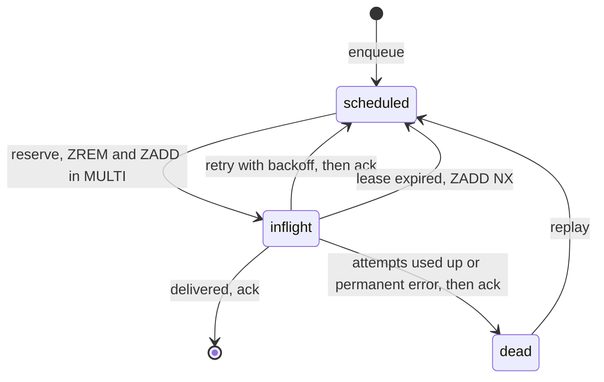

# Relay's delivery queue on two Redis sorted sets with a 120-second lease

**English** · [Русский](relay-redis-lease-queue.ru.md)

Repository: [sinnercode228/integration-hub](https://github.com/sinnercode228/integration-hub) · Demo: [sinnercode228.github.io/integration-hub](https://sinnercode228.github.io/integration-hub/) (the dashboard on a simulated backend) · Code links point to commit [`46390a3`](https://github.com/sinnercode228/integration-hub/tree/46390a36ab7558ed42f2626898db79db40debc1b)

Relay answers a webhook from Tilda, amoCRM or Bitrix24 with `202` before it has sent anything anywhere. From then on every delivery to Telegram, Google Sheets, amoCRM or SMTP is a job that has to outlive a destination that is down for minutes and a worker process killed in the middle of a request. A worker that pops a job and dies takes the lead with it. Relay's Redis queue never pops: a worker leases a job for 120 seconds, and the job leaves the queue only when a worker acks it.

Relay is a demo project with invented leads; the code and tests are real.

## Keys and members

Two sorted sets hold the jobs. In `relay:q:scheduled` the score is the unix time when a job becomes due, in `relay:q:inflight` it is the lease deadline. Dead letters go to a hash, `relay:q:dead`, keyed by delivery id.

A job is two ids, serialized as `json.dumps({"d": self.delivery_id, "e": self.event_id}, sort_keys=True)` ([`queue/base.py#L23-L24`](https://github.com/sinnercode228/integration-hub/blob/46390a36ab7558ed42f2626898db79db40debc1b/backend/src/relay/queue/base.py#L23-L24)), so one delivery always maps to the same member string. `enqueue` is a single `ZADD` with the score `self._clock() + max(0.0, delay)` ([`queue/redis.py#L40-L41`](https://github.com/sinnercode228/integration-hub/blob/46390a36ab7558ed42f2626898db79db40debc1b/backend/src/relay/queue/redis.py#L40-L41)). Enqueueing a scheduled job again only moves its due time, and a delayed retry is the same `ZADD` with a later score.

## Claiming a job

```python
    async def reserve(self, *, limit: int, lease_seconds: float) -> list[Job]:
        now = self._clock()
        members: list[Any] = await self._redis.zrangebyscore(
            self._scheduled, "-inf", now, start=0, num=limit
        )
        claimed: list[Job] = []
        for member in members:
            async with self._redis.pipeline(transaction=True) as pipe:
                pipe.zrem(self._scheduled, member)
                pipe.zadd(self._inflight, {member: now + lease_seconds})
                removed, _ = await pipe.execute()
            if removed:
                claimed.append(Job.decode(member))
        return claimed
```

[`queue/redis.py#L43-L56`](https://github.com/sinnercode228/integration-hub/blob/46390a36ab7558ed42f2626898db79db40debc1b/backend/src/relay/queue/redis.py#L43-L56)

`process_due` asks for up to `concurrency * 2` due members, 8 by default ([`worker.py#L98-L105`](https://github.com/sinnercode228/integration-hub/blob/46390a36ab7558ed42f2626898db79db40debc1b/backend/src/relay/worker.py#L98-L105)). Each claim is a `MULTI` with `ZREM` from `scheduled` and `ZADD` into `inflight`; there is no Lua in this file. Both commands always execute, and a worker keeps the job only if its own `ZREM` returned 1.

The lease is `RELAY_LEASE_SECONDS`, 120 by default ([`settings.py#L35`](https://github.com/sinnercode228/integration-hub/blob/46390a36ab7558ed42f2626898db79db40debc1b/backend/src/relay/settings.py#L35)), and nothing renews it. `asyncio.wait_for` caps an attempt at the destination's `timeout_seconds` or at `max(settings.http_timeout_seconds * 2, 5.0)`, 20 s by default ([`container.py#L182`](https://github.com/sinnercode228/integration-hub/blob/46390a36ab7558ed42f2626898db79db40debc1b/backend/src/relay/container.py#L182)). `timeout_seconds` only has to be positive ([`config.py#L51`](https://github.com/sinnercode228/integration-hub/blob/46390a36ab7558ed42f2626898db79db40debc1b/backend/src/relay/config.py#L51)), so a destination set to 150 s outlives its lease, and another worker process can take the job while the first one is still waiting.



## When a worker dies holding a job

Each pass of the worker loop calls `requeue_expired` first:

```python
    async def requeue_expired(self) -> int:
        now = self._clock()
        expired: list[Any] = await self._redis.zrangebyscore(self._inflight, "-inf", now)
        moved = 0
        for member in expired:
            async with self._redis.pipeline(transaction=True) as pipe:
                pipe.zrem(self._inflight, member)
                pipe.zadd(self._scheduled, {member: now}, nx=True)
                removed, _ = await pipe.execute()
            moved += int(bool(removed))
        return moved
```

[`queue/redis.py#L61-L71`](https://github.com/sinnercode228/integration-hub/blob/46390a36ab7558ed42f2626898db79db40debc1b/backend/src/relay/queue/redis.py#L61-L71)

A job whose lease has passed goes back to `scheduled` with the score `now`. That covers a killed process and an exception escaping `process()`, which `_guarded` logs as `worker.job_crashed`, leaving the job in `inflight` ([`worker.py#L107-L113`](https://github.com/sinnercode228/integration-hub/blob/46390a36ab7558ed42f2626898db79db40debc1b/backend/src/relay/worker.py#L107-L113)). Either way the job is due again 120 s after the claim, whenever the crash happened. That is at-least-once delivery. `nx=True` is there for one crash in particular, described next.

## Retry, dead letter, then ack

```python
        delivery.attempts.append(attempt)
        delivery.updated_at = now
        await self.store.save_delivery(delivery)

        if delivery.status is DeliveryStatus.RETRYING:
            assert attempt.retry_in_seconds is not None
            await self.queue.enqueue(job, delay=attempt.retry_in_seconds)
        elif delivery.status is DeliveryStatus.DEAD:
            await self.queue.dead_letter(job, delivery.last_error or "failed")
        await self.queue.ack(job)
```

[`worker.py#L185-L194`](https://github.com/sinnercode228/integration-hub/blob/46390a36ab7558ed42f2626898db79db40debc1b/backend/src/relay/worker.py#L185-L194)

The attempt is saved to SQLite first, then the retry goes into `scheduled` or the job into the dead hash, and the ack comes last. If the process dies between `enqueue` and `ack`, the job is in both sets. If the retry is still waiting in `scheduled` when the lease runs out, `requeue_expired` removes the job from `inflight`, and `ZADD NX` keeps the later score, so the retry keeps its backoff. If the retry comes due first, `reserve` claims it and overwrites the old lease with a new one. With `ack` first, a crash in that gap would leave the job in neither set while the delivery says `retrying`.

The delay is `min(3600, 2 * 2 ** (attempt - 1))` times `1 - 0.2 * random()`, so jitter only shortens a pause ([`worker.py#L43-L48`](https://github.com/sinnercode228/integration-hub/blob/46390a36ab7558ed42f2626898db79db40debc1b/backend/src/relay/worker.py#L43-L48)). A `Retry-After`, or Telegram's `parameters.retry_after`, raises it to `max(delay, min(retry_after, 3600))` ([`worker.py#L173-L176`](https://github.com/sinnercode228/integration-hub/blob/46390a36ab7558ed42f2626898db79db40debc1b/backend/src/relay/worker.py#L173-L176)). The default 8 attempts give pauses of about 2, 4, 8, 16, 32, 64 and 128 s. Errors raised with `retryable=False`, such as template errors and most `4xx` answers, dead-letter on the first attempt.

A job can also come back for a delivery that already finished, after a crash between `save_delivery` and `ack`. `process()` acks a `delivered` or `dead` delivery without sending ([`worker.py#L117-L121`](https://github.com/sinnercode228/integration-hub/blob/46390a36ab7558ed42f2626898db79db40debc1b/backend/src/relay/worker.py#L117-L121)). A crash after the connector call and before `save_delivery` is different: the store still says `pending` or `retrying`, and the destination gets a second request. Only the outbound webhook connector sends a stable `Idempotency-Key`, the delivery id, so that the receiver can drop it ([`webhook.py#L55`](https://github.com/sinnercode228/integration-hub/blob/46390a36ab7558ed42f2626898db79db40debc1b/backend/src/relay/connectors/outbound/webhook.py#L55)).

## Dead letters and replay

`dead_letter` writes `{"job", "reason", "at"}` into the hash under the delivery id. The dashboard does not read it: `GET /admin/api/dead-letters` lists `dead` deliveries from SQLite ([`api/admin.py#L101-L115`](https://github.com/sinnercode228/integration-hub/blob/46390a36ab7558ed42f2626898db79db40debc1b/backend/src/relay/api/admin.py#L101-L115)). The hash only feeds the `dead` count (`HLEN` in `depth()`) in `/admin/api/stats` and in `relay_queue_jobs{state="dead"}`.

Replay ([`worker.py#L238-L250`](https://github.com/sinnercode228/integration-hub/blob/46390a36ab7558ed42f2626898db79db40debc1b/backend/src/relay/worker.py#L238-L250)) sets the delivery to `pending` and stores `attempt_base = len(delivery.attempts)`, so the attempt budget starts over and the old attempts stay in the history. It increments `replays`, deletes the hash entry and enqueues the job with no delay. The payload is rendered again from the stored event with the current template. Only final deliveries can be replayed: the single-delivery endpoint answers `409` otherwise ([`api/admin.py#L96-L97`](https://github.com/sinnercode228/integration-hub/blob/46390a36ab7558ed42f2626898db79db40debc1b/backend/src/relay/api/admin.py#L96-L97)), and the per-event one skips them.

## Where the idempotency key comes from

Inside the queue, one delivery is one member. Duplicate webhooks are stopped earlier, at intake, by `derive_key` ([`idempotency.py#L86-L92`](https://github.com/sinnercode228/integration-hub/blob/46390a36ab7558ed42f2626898db79db40debc1b/backend/src/relay/idempotency.py#L86-L92)). It takes the `Idempotency-Key` header if the sender set one (`<source>:hdr:<key>`, up to 200 characters), otherwise the id the source reports (`<source>:ext:<type>:<external_id>`, for example Tilda's `tranid` or Bitrix24's `event:id:ts`), and as a last resort a SHA-256 of the raw body. The key is claimed with `SET NX EX` for 7 days, with the new event's id as the value ([`idempotency.py#L56-L64`](https://github.com/sinnercode228/integration-hub/blob/46390a36ab7558ed42f2626898db79db40debc1b/backend/src/relay/idempotency.py#L56-L64)). A second claim gets that id back, and the sender gets `200`.

## The gap at intake

The key is claimed before anything is stored and released in one case only:

```python
            try:
                await self.store.add_event(record)
            except Exception:
                await self.idempotency.release(key)
                raise
            for delivery in record.deliveries:
                await self.queue.enqueue(Job(delivery_id=delivery.id, event_id=event_id))
```

[`ingest.py#L124-L130`](https://github.com/sinnercode228/integration-hub/blob/46390a36ab7558ed42f2626898db79db40debc1b/backend/src/relay/ingest.py#L124-L130)

If `add_event` fails, the key is released and the sender's retry is accepted. If an `enqueue` in the loop fails, say because the Redis connection dropped after the claim, the exception leaves `ingest` and the sender gets `500`. By then the event and all its deliveries are in SQLite as `pending`, and none or only some of them have a job. The retry hits the claimed key and gets `200` as a duplicate. Nothing picks those deliveries up later: startup does not look for deliveries without a job ([`api/app.py#L36-L63`](https://github.com/sinnercode228/integration-hub/blob/46390a36ab7558ed42f2626898db79db40debc1b/backend/src/relay/api/app.py#L36-L63)), and replay refuses anything that is not final. This is [issue #1](https://github.com/sinnercode228/integration-hub/issues/1). It proposes releasing the key and marking the event failed when `enqueue` raises, plus a startup sweep for deliveries stuck in `pending` or `retrying` longer than a lease; neither exists yet. The memory queue orphans deliveries the same way on every restart, since its jobs live in the process.

## Two races between a read and a transaction

Both transactions act on members read in an earlier round trip, and neither checks that the score is still the same. With several worker processes on one Redis it shows up twice.

In `reserve`, worker B reads a due member. Before B's transaction for it runs, worker A claims the same job, fails an attempt, schedules a retry 2 s ahead and acks. B's `ZREM` then removes the future-dated retry and returns 1, so B runs the attempt now instead of after the backoff. Had A delivered, B's `ZADD` still runs and parks the finished job in `inflight` for 120 s, after which the final-status check acks it.

In `requeue_expired` the outcome is worse. Workers B and C both see the same expired lease. C moves the job to `scheduled` and claims it with a fresh lease. Then B's transaction runs: its `ZREM` removes C's new lease and returns 1, and `ZADD NX` makes the job due again. The next `reserve` hands it to another loop while C is still sending, and the same delivery goes out twice in parallel.

Both windows are short, since the other worker has to finish its steps between B's read and B's transaction. One worker process cannot hit them: `process_due` runs `requeue_expired`, `reserve` and the batch in turn. The Compose file runs one `relay worker` and the API with `RELAY_RUN_WORKER=false`, so the default layout has a single worker. The fix I would make is a Lua script per claim that compares `ZSCORE` with `now` before the `ZREM` and writes to the other set only when the `ZREM` removed something.

## Tests on fakeredis and the memory queue

[`tests/test_infra.py`](https://github.com/sinnercode228/integration-hub/blob/46390a36ab7558ed42f2626898db79db40debc1b/backend/tests/test_infra.py#L31-L92) runs one contract against `InMemoryQueue` and `RedisQueue` on `fakeredis.FakeAsyncRedis`. `TestQueue::test_delay_reserve_ack` checks that a job enqueued with `delay=10` stays invisible until the clock moves 10 s. `test_expired_lease_is_requeued` reserves with a 5 s lease and expects `requeue_expired()` to return 0 at once and 1 after 6 s. `test_enqueue_twice_only_moves_due_time` enqueues with `delay=100`, then with none, and gets the job immediately.

[`tests/test_pipeline.py`](https://github.com/sinnercode228/integration-hub/blob/46390a36ab7558ed42f2626898db79db40debc1b/backend/tests/test_pipeline.py#L139-L220) goes from an HTTP request to a mocked destination on the memory queue, with jitter off. In `TestRetries::test_backoff_then_success` the destination answers `503`, then `200`: nothing is due at +1 s, the retry runs at +2 s and carries `X-Relay-Attempt: 2` and the delivery id as `Idempotency-Key`. `test_dead_letter_and_replay` expects `retry_in_seconds` of `[2.0, 4.0, None]` for `max_attempts: 3`, a `dead` count that drops from 1 to 0 on replay, and a fourth attempt that delivers. `test_retry_after_hint_and_secret_redaction` checks that Telegram's `retry_after: 40` becomes a 40 s delay.

No test kills a worker between `enqueue` and `ack`, runs two workers on one Redis or makes `enqueue` fail inside `ingest`; issue #1 sketches the last one.

Code: [github.com/sinnercode228/integration-hub](https://github.com/sinnercode228/integration-hub)
