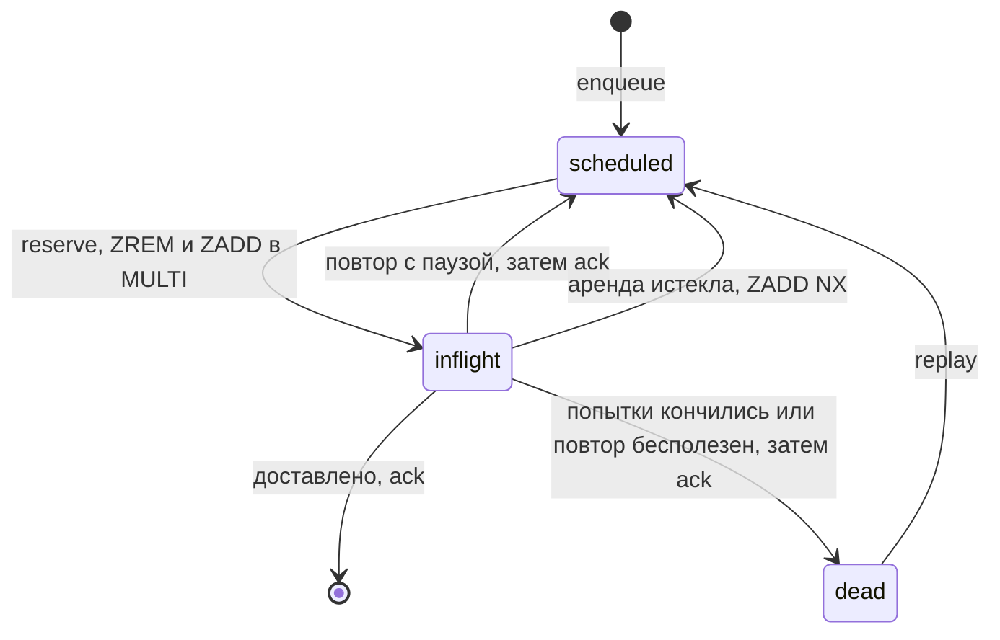

# Очередь доставок Relay на двух sorted set в Redis с арендой задачи на 120 секунд

[English](relay-redis-lease-queue.md) · **Русский**

Репозиторий: [sinnercode228/integration-hub](https://github.com/sinnercode228/integration-hub) · Демо: [sinnercode228.github.io/integration-hub](https://sinnercode228.github.io/integration-hub/) (дашборд на симуляции бэкенда) · Ссылки на код ведут на коммит [`46390a3`](https://github.com/sinnercode228/integration-hub/tree/46390a36ab7558ed42f2626898db79db40debc1b)

Relay отвечает на вебхук от Tilda, amoCRM или Bitrix24 кодом `202` ещё до того, как что-то куда-то отправил. Дальше каждая доставка в Telegram, Google Sheets, amoCRM или SMTP становится задачей, которой нужно пережить получателя, лежащего несколько минут, и воркер, убитый посреди запроса. Если воркер снимет задачу с очереди и упадёт, заявка пропадёт вместе с ним. Очередь в Redis задачи вообще не снимает: воркер берёт задачу в аренду (lease) на 120 секунд, а из очереди она уходит только после ack.

Relay — демо-проект, заявки в нём выдуманы; код и тесты настоящие.

## Ключи и элементы

Задачи лежат в двух sorted set. В `relay:q:scheduled` score — это unix-время, когда задача становится готовой, в `relay:q:inflight` — срок аренды. Dead letters хранятся в хеше `relay:q:dead`, ключ — id доставки.

Задача — это два id, сериализованные как `json.dumps({"d": self.delivery_id, "e": self.event_id}, sort_keys=True)` ([`queue/base.py#L23-L24`](https://github.com/sinnercode228/integration-hub/blob/46390a36ab7558ed42f2626898db79db40debc1b/backend/src/relay/queue/base.py#L23-L24)), поэтому одной доставке всегда соответствует одна и та же строка-элемент. `enqueue` — один `ZADD` со score `self._clock() + max(0.0, delay)` ([`queue/redis.py#L40-L41`](https://github.com/sinnercode228/integration-hub/blob/46390a36ab7558ed42f2626898db79db40debc1b/backend/src/relay/queue/redis.py#L40-L41)). Повторный `enqueue` той же задачи только сдвигает её время, а отложенный повтор — тот же `ZADD` с более поздним score.

## Как воркер забирает задачу

```python
    async def reserve(self, *, limit: int, lease_seconds: float) -> list[Job]:
        now = self._clock()
        members: list[Any] = await self._redis.zrangebyscore(
            self._scheduled, "-inf", now, start=0, num=limit
        )
        claimed: list[Job] = []
        for member in members:
            async with self._redis.pipeline(transaction=True) as pipe:
                pipe.zrem(self._scheduled, member)
                pipe.zadd(self._inflight, {member: now + lease_seconds})
                removed, _ = await pipe.execute()
            if removed:
                claimed.append(Job.decode(member))
        return claimed
```

[`queue/redis.py#L43-L56`](https://github.com/sinnercode228/integration-hub/blob/46390a36ab7558ed42f2626898db79db40debc1b/backend/src/relay/queue/redis.py#L43-L56)

`process_due` запрашивает до `concurrency * 2` готовых элементов, по умолчанию 8 ([`worker.py#L98-L105`](https://github.com/sinnercode228/integration-hub/blob/46390a36ab7558ed42f2626898db79db40debc1b/backend/src/relay/worker.py#L98-L105)). Каждый захват — транзакция `MULTI`: `ZREM` из `scheduled` и `ZADD` в `inflight`; Lua в этом файле нет. Обе команды выполняются всегда, а воркер оставляет задачу себе, только если его собственный `ZREM` вернул 1.

Аренду задаёт `RELAY_LEASE_SECONDS`, по умолчанию 120 секунд ([`settings.py#L35`](https://github.com/sinnercode228/integration-hub/blob/46390a36ab7558ed42f2626898db79db40debc1b/backend/src/relay/settings.py#L35)), и её никто не продлевает. `asyncio.wait_for` обрезает попытку по `timeout_seconds` получателя или по `max(settings.http_timeout_seconds * 2, 5.0)`, что по умолчанию даёт 20 с ([`container.py#L182`](https://github.com/sinnercode228/integration-hub/blob/46390a36ab7558ed42f2626898db79db40debc1b/backend/src/relay/container.py#L182)). Для `timeout_seconds` проверяется только, что он больше нуля ([`config.py#L51`](https://github.com/sinnercode228/integration-hub/blob/46390a36ab7558ed42f2626898db79db40debc1b/backend/src/relay/config.py#L51)). Получатель с таймаутом 150 с переживёт свою аренду, и другой процесс-воркер заберёт задачу, пока первый ещё ждёт ответа.



## Воркер умер, не отпустив задачу

Каждый проход цикла воркера начинается с `requeue_expired`:

```python
    async def requeue_expired(self) -> int:
        now = self._clock()
        expired: list[Any] = await self._redis.zrangebyscore(self._inflight, "-inf", now)
        moved = 0
        for member in expired:
            async with self._redis.pipeline(transaction=True) as pipe:
                pipe.zrem(self._inflight, member)
                pipe.zadd(self._scheduled, {member: now}, nx=True)
                removed, _ = await pipe.execute()
            moved += int(bool(removed))
        return moved
```

[`queue/redis.py#L61-L71`](https://github.com/sinnercode228/integration-hub/blob/46390a36ab7558ed42f2626898db79db40debc1b/backend/src/relay/queue/redis.py#L61-L71)

Задача с истёкшей арендой возвращается в `scheduled` со score `now`. Так обрабатывается и убитый процесс, и исключение, вылетевшее из `process()`: `_guarded` пишет в лог `worker.job_crashed` и оставляет задачу в `inflight` ([`worker.py#L107-L113`](https://github.com/sinnercode228/integration-hub/blob/46390a36ab7558ed42f2626898db79db40debc1b/backend/src/relay/worker.py#L107-L113)). В обоих случаях задача снова станет готовой через 120 с после захвата, когда бы ни случилось падение. Это и есть доставка at-least-once. `nx=True` нужен для одного конкретного падения, о нём в следующем разделе.

## Сначала повтор или dead letter, потом ack

```python
        delivery.attempts.append(attempt)
        delivery.updated_at = now
        await self.store.save_delivery(delivery)

        if delivery.status is DeliveryStatus.RETRYING:
            assert attempt.retry_in_seconds is not None
            await self.queue.enqueue(job, delay=attempt.retry_in_seconds)
        elif delivery.status is DeliveryStatus.DEAD:
            await self.queue.dead_letter(job, delivery.last_error or "failed")
        await self.queue.ack(job)
```

[`worker.py#L185-L194`](https://github.com/sinnercode228/integration-hub/blob/46390a36ab7558ed42f2626898db79db40debc1b/backend/src/relay/worker.py#L185-L194)

Сначала попытка сохраняется в SQLite, потом повтор уходит в `scheduled` или задача в хеш dead letters, и только в конце ack. Если процесс умрёт между `enqueue` и `ack`, задача окажется в обоих множествах. Если повтор ещё ждёт в `scheduled`, когда аренда истекает, `requeue_expired` уберёт задачу из `inflight`, а `ZADD NX` оставит более поздний score, и повтор сохранит свою паузу. Если повтор наступит раньше, его заберёт `reserve` и перезапишет старую аренду новой. Будь `ack` первым, падение в том же месте оставило бы задачу вне обоих множеств, а доставка так и числилась бы `retrying`.

Пауза считается как `min(3600, 2 * 2 ** (attempt - 1))`, умноженное на `1 - 0.2 * random()`, так что джиттер её только укорачивает ([`worker.py#L43-L48`](https://github.com/sinnercode228/integration-hub/blob/46390a36ab7558ed42f2626898db79db40debc1b/backend/src/relay/worker.py#L43-L48)). `Retry-After` или `parameters.retry_after` от Telegram поднимают её до `max(delay, min(retry_after, 3600))` ([`worker.py#L173-L176`](https://github.com/sinnercode228/integration-hub/blob/46390a36ab7558ed42f2626898db79db40debc1b/backend/src/relay/worker.py#L173-L176)). При 8 попытках по умолчанию паузы примерно такие: 2, 4, 8, 16, 32, 64 и 128 с. Ошибки с `retryable=False`, например ошибка шаблона и большинство ответов `4xx`, уходят в dead letters с первой попытки.

Задача может вернуться и для уже завершённой доставки, если процесс упал между `save_delivery` и `ack`. Тогда `process()` видит статус `delivered` или `dead` и делает ack без отправки ([`worker.py#L117-L121`](https://github.com/sinnercode228/integration-hub/blob/46390a36ab7558ed42f2626898db79db40debc1b/backend/src/relay/worker.py#L117-L121)). Падение после вызова коннектора и до `save_delivery` — другое дело: в хранилище доставка всё ещё `pending` или `retrying`, и получатель получит второй запрос. Стабильный `Idempotency-Key` с id доставки, по которому получатель может отбросить повтор, шлёт только исходящий webhook-коннектор ([`webhook.py#L55`](https://github.com/sinnercode228/integration-hub/blob/46390a36ab7558ed42f2626898db79db40debc1b/backend/src/relay/connectors/outbound/webhook.py#L55)).

## Dead letters и replay

`dead_letter` пишет `{"job", "reason", "at"}` в хеш под id доставки. Дашборд этот хеш не читает: `GET /admin/api/dead-letters` берёт доставки со статусом `dead` из SQLite ([`api/admin.py#L101-L115`](https://github.com/sinnercode228/integration-hub/blob/46390a36ab7558ed42f2626898db79db40debc1b/backend/src/relay/api/admin.py#L101-L115)). Хеш нужен только для счётчика `dead` (`HLEN` в `depth()`) в `/admin/api/stats` и в `relay_queue_jobs{state="dead"}`.

Replay ([`worker.py#L238-L250`](https://github.com/sinnercode228/integration-hub/blob/46390a36ab7558ed42f2626898db79db40debc1b/backend/src/relay/worker.py#L238-L250)) переводит доставку в `pending` и записывает `attempt_base = len(delivery.attempts)`: счёт попыток начинается заново, а старые попытки остаются в истории. Ещё он увеличивает `replays`, удаляет запись из хеша и ставит задачу в очередь без паузы. Содержимое для получателя заново собирается из сохранённого события по текущему шаблону. Переотправить можно только завершённую доставку: эндпоинт для одной доставки в остальных случаях отвечает `409` ([`api/admin.py#L96-L97`](https://github.com/sinnercode228/integration-hub/blob/46390a36ab7558ed42f2626898db79db40debc1b/backend/src/relay/api/admin.py#L96-L97)), а эндпоинт для события такие доставки пропускает.

## Откуда берётся ключ идемпотентности

Внутри очереди одна доставка — один элемент. Повторные вебхуки отсекаются раньше, на приёме, ключом из `derive_key` ([`idempotency.py#L86-L92`](https://github.com/sinnercode228/integration-hub/blob/46390a36ab7558ed42f2626898db79db40debc1b/backend/src/relay/idempotency.py#L86-L92)). Он берёт заголовок `Idempotency-Key`, если отправитель его прислал (`<source>:hdr:<key>`, не длиннее 200 символов), иначе id, который сообщает сам источник (`<source>:ext:<type>:<external_id>`, например `tranid` у Tilda или `event:id:ts` у Bitrix24), а в крайнем случае SHA-256 сырого тела. Ключ захватывается через `SET NX EX` на 7 дней, значение — id нового события ([`idempotency.py#L56-L64`](https://github.com/sinnercode228/integration-hub/blob/46390a36ab7558ed42f2626898db79db40debc1b/backend/src/relay/idempotency.py#L56-L64)). Повторный захват возвращает этот id, и отправитель получает `200`.

## Где событие теряется на приёме

Ключ захватывается до того, как что-либо сохранено, а освобождается только в одном случае:

```python
            try:
                await self.store.add_event(record)
            except Exception:
                await self.idempotency.release(key)
                raise
            for delivery in record.deliveries:
                await self.queue.enqueue(Job(delivery_id=delivery.id, event_id=event_id))
```

[`ingest.py#L124-L130`](https://github.com/sinnercode228/integration-hub/blob/46390a36ab7558ed42f2626898db79db40debc1b/backend/src/relay/ingest.py#L124-L130)

Если упал `add_event`, ключ освобождается, и повтор от отправителя примут. Если упал `enqueue` в цикле, например из-за того, что соединение с Redis оборвалось уже после захвата ключа, исключение выходит из `ingest`, и отправитель получает `500`. К этому моменту событие и все его доставки уже лежат в SQLite как `pending`, а задача есть у части из них или ни у одной. Повтор упирается в занятый ключ и получает `200` как дубликат. Потом эти доставки никто не подберёт: при старте приложение не ищет доставки без задачи ([`api/app.py#L36-L63`](https://github.com/sinnercode228/integration-hub/blob/46390a36ab7558ed42f2626898db79db40debc1b/backend/src/relay/api/app.py#L36-L63)), а replay отказывает всему, что не завершено. Это [issue #1](https://github.com/sinnercode228/integration-hub/issues/1). Там предложено при ошибке `enqueue` освобождать ключ и помечать событие как failed, а при старте искать доставки, застрявшие в `pending` или `retrying` дольше аренды; ни того, ни другого в коде пока нет. Очередь в памяти оставляет доставки без задач так же при каждом перезапуске, потому что её задачи живут в процессе.

## Две гонки между чтением и транзакцией

Обе транзакции работают с элементами, прочитанными предыдущим запросом к Redis, и ни одна не проверяет, что score остался прежним. Когда на одном Redis работают несколько процессов-воркеров, это проявляется в двух местах.

В `reserve` воркер B читает готовый элемент. Пока транзакция B для него ещё не выполнилась, воркер A забирает ту же задачу, проваливает попытку, ставит повтор через 2 с и делает ack. Тогда `ZREM` у B удаляет повтор с будущим временем и возвращает 1, и B выполняет попытку сразу, без паузы. Если бы A доставил успешно, `ZADD` у B всё равно выполнился бы и положил завершённую задачу в `inflight` на 120 с, после чего проверка финального статуса сделала бы ack без отправки.

В `requeue_expired` последствия хуже. Воркеры B и C видят одну и ту же истёкшую аренду. C переносит задачу в `scheduled` и забирает её с новой арендой. Затем выполняется транзакция B: её `ZREM` удаляет новую аренду C и возвращает 1, а `ZADD NX` снова делает задачу готовой. Следующий `reserve` отдаёт её другому циклу, пока C ещё отправляет, и одна доставка уходит дважды параллельно.

Оба окна короткие: другой воркер должен успеть сделать свои шаги между чтением и транзакцией B. Один процесс-воркер в них не попадает, потому что `process_due` выполняет `requeue_expired`, `reserve` и пачку задач по очереди. В `docker-compose.yml` запущен один `relay worker`, а API работает с `RELAY_RUN_WORKER=false`, так что в раскладке по умолчанию воркер один. Я бы исправил это Lua-скриптом на каждый захват: он сравнивает `ZSCORE` с `now` перед `ZREM` и пишет в другое множество, только если `ZREM` что-то удалил.

## Тесты на fakeredis и очереди в памяти

[`tests/test_infra.py`](https://github.com/sinnercode228/integration-hub/blob/46390a36ab7558ed42f2626898db79db40debc1b/backend/tests/test_infra.py#L31-L92) гоняет один и тот же контракт на `InMemoryQueue` и на `RedisQueue` поверх `fakeredis.FakeAsyncRedis`. `TestQueue::test_delay_reserve_ack` проверяет, что задача с `delay=10` не видна, пока часы не сдвинутся на 10 с. `test_expired_lease_is_requeued` берёт задачу с арендой 5 с и ждёт от `requeue_expired()` 0 сразу и 1 через 6 с. `test_enqueue_twice_only_moves_due_time` ставит задачу с `delay=100`, потом без паузы, и сразу её получает.

[`tests/test_pipeline.py`](https://github.com/sinnercode228/integration-hub/blob/46390a36ab7558ed42f2626898db79db40debc1b/backend/tests/test_pipeline.py#L139-L220) проходит путь от HTTP-запроса до замоканного получателя на очереди в памяти и без джиттера. В `TestRetries::test_backoff_then_success` получатель отвечает `503`, потом `200`: через 1 с ещё ничего не готово, через 2 с уходит повтор с `X-Relay-Attempt: 2` и id доставки в `Idempotency-Key`. `test_dead_letter_and_replay` при `max_attempts: 3` ждёт `retry_in_seconds`, равные `[2.0, 4.0, None]`, счётчик `dead`, который после replay падает с 1 до 0, и четвёртую попытку, которая доставляет. `test_retry_after_hint_and_secret_redaction` проверяет, что `retry_after: 40` от Telegram превращается в паузу 40 с.

Ни один тест не убивает воркер между `enqueue` и `ack`, не запускает два воркера на одном Redis и не роняет `enqueue` внутри `ingest`; как написать последний, описано в issue #1.

Код: [github.com/sinnercode228/integration-hub](https://github.com/sinnercode228/integration-hub)
