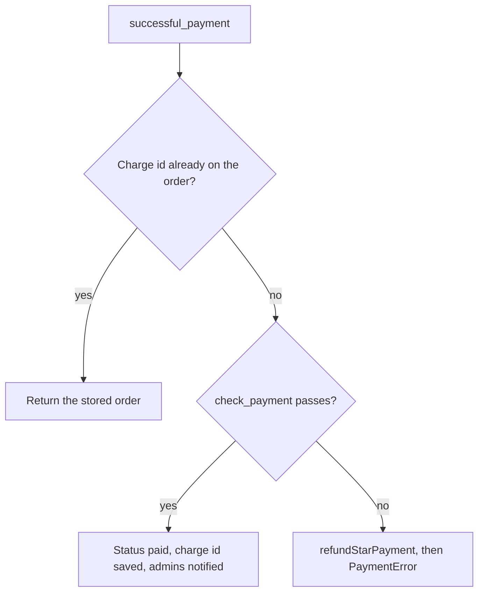

# How Zernolist prices an order on the server and accepts each Telegram Stars charge once

**English** · [Русский](zernolist-stars-payments.ru.md)

Repository: [sinnercode228/tg-shop-miniapp](https://github.com/sinnercode228/tg-shop-miniapp) · Demo: [sinnercode228.github.io/tg-shop-miniapp](https://sinnercode228.github.io/tg-shop-miniapp/) (mock API in the browser, no real payments) · Code links point to commit [`54cb076`](https://github.com/sinnercode228/tg-shop-miniapp/tree/54cb076af58b99b8e693ff301d43ea20a9dc1d91)

Zernolist is a Telegram Mini App shop that takes payment in Telegram Stars. The Mini App creates the order over HTTP from the customer's device, but the money moves later, in two bot updates that never pass through the HTTP API: `pre_checkout_query` and `successful_payment`. That leaves the server three jobs: fix the amount on its own, tie each payment back to one order and one payer, and mark the order paid once even if the same `successful_payment` reaches the handler twice. The shop, its catalog and its prices are made up, but the code and tests are real.

## The customer id comes from signed initData

Order endpoints take the customer from the `Authorization: tma <initData>` header. `get_init_data` passes the string to `validate_init_data` and turns any `InitDataError` into a 401 ([`api/deps.py#L29-L48`](https://github.com/sinnercode228/tg-shop-miniapp/blob/54cb076af58b99b8e693ff301d43ea20a9dc1d91/bot/tgshop/api/deps.py#L29-L48)). The check follows the Telegram docs: the secret is `HMAC_SHA256(key="WebAppData", msg=bot_token)`, the message is the sorted `key=value` lines without `hash`, and the hex digest is compared with `hmac.compare_digest` ([`security/init_data.py#L73-L83`](https://github.com/sinnercode228/tg-shop-miniapp/blob/54cb076af58b99b8e693ff301d43ea20a9dc1d91/bot/tgshop/security/init_data.py#L73-L83), [`#L117-L122`](https://github.com/sinnercode228/tg-shop-miniapp/blob/54cb076af58b99b8e693ff301d43ea20a9dc1d91/bot/tgshop/security/init_data.py#L117-L122)). After the signature, an `auth_date` more than 60 s ahead of the server clock is rejected, and so is one older than `INIT_DATA_TTL`, which defaults to 24 hours and refuses values under 60 s ([`#L124-L133`](https://github.com/sinnercode228/tg-shop-miniapp/blob/54cb076af58b99b8e693ff301d43ea20a9dc1d91/bot/tgshop/security/init_data.py#L124-L133), [`config.py#L39`](https://github.com/sinnercode228/tg-shop-miniapp/blob/54cb076af58b99b8e693ff301d43ea20a9dc1d91/bot/tgshop/config.py#L39)).

For payments only `user.id` matters: it becomes `Customer.user_id`, goes into the order, and is later compared with the id of whoever pays the invoice. The Ed25519 `signature` field from Bot API 8.0 stays in the HMAC input, but the code does not verify it.

## No price field in the cart

The cart line the Mini App sends has four fields, and none of them is a price:

```python
class CartItemIn(CamelModel):
    product_id: Annotated[str, StringConstraints(max_length=64)]
    variant_id: Annotated[str, StringConstraints(max_length=32)]
    grind: Annotated[str, StringConstraints(max_length=32)] | None = None
    quantity: int = Field(ge=1, le=99)
```

[`bot/tgshop/domain/schemas.py#L29-L33`](https://github.com/sinnercode228/tg-shop-miniapp/blob/54cb076af58b99b8e693ff301d43ea20a9dc1d91/bot/tgshop/domain/schemas.py#L29-L33)

`CamelModel` does not set `extra`, so pydantic drops unknown keys such as `price` or `total` without an error. `OrderService._resolve` looks up each product and variant in `shared/catalog.json`, takes `unit_price=variant.price` from there, rejects out-of-stock products and grinds that don't apply, and merges lines with the same product, variant and grind ([`services/orders.py#L76-L100`](https://github.com/sinnercode228/tg-shop-miniapp/blob/54cb076af58b99b8e693ff301d43ea20a9dc1d91/bot/tgshop/services/orders.py#L76-L100)).

All money is integer kopecks. `calculate_quote` rounds a percent discount down to whole roubles with `subtotal * promo.value // 100 // 100 * 100` ([`domain/pricing.py#L120-L125`](https://github.com/sinnercode228/tg-shop-miniapp/blob/54cb076af58b99b8e693ff301d43ea20a9dc1d91/bot/tgshop/domain/pricing.py#L120-L125)). `to_stars` converts kopecks to Stars with `-(-amount // rules.kopecks_per_star)`, a ceiling division that never touches a float ([`#L88-L90`](https://github.com/sinnercode228/tg-shop-miniapp/blob/54cb076af58b99b8e693ff301d43ea20a9dc1d91/bot/tgshop/domain/pricing.py#L88-L90)). `kopecksPerStar` is 150 in [`shared/pricing.json`](https://github.com/sinnercode228/tg-shop-miniapp/blob/54cb076af58b99b8e693ff301d43ea20a9dc1d91/shared/pricing.json#L8). The test order of 2 720 ₽ gives 272 000 / 150 = 1 813.33, billed as 1 814 Stars.

`create_order` saves that number as `stars_amount` and puts a Stars order in `awaiting_payment` ([`services/orders.py#L155`](https://github.com/sinnercode228/tg-shop-miniapp/blob/54cb076af58b99b8e693ff301d43ea20a9dc1d91/bot/tgshop/services/orders.py#L155), [`#L170`](https://github.com/sinnercode228/tg-shop-miniapp/blob/54cb076af58b99b8e693ff301d43ea20a9dc1d91/bot/tgshop/services/orders.py#L170)). Nothing recomputes the price after this: the invoice and both payment checks compare against this column, so a later edit to `catalog.json` does not change what an open order costs. Admins don't hear about a Stars order yet: `create_order` notifies them only when the new status is `new` ([`#L177-L178`](https://github.com/sinnercode228/tg-shop-miniapp/blob/54cb076af58b99b8e693ff301d43ea20a9dc1d91/bot/tgshop/services/orders.py#L177-L178)).

## One id in the invoice payload

`build_invoice` takes the amount from `order.stars_amount` and sets the payload to `make_payload(order.id)`, the string `order:<id>` ([`payments/stars.py#L28-L50`](https://github.com/sinnercode228/tg-shop-miniapp/blob/54cb076af58b99b8e693ff301d43ea20a9dc1d91/bot/tgshop/payments/stars.py#L28-L50)). `TelegramStarsGateway.create_invoice_link` sends it with currency `XTR` and no provider token ([`#L84-L91`](https://github.com/sinnercode228/tg-shop-miniapp/blob/54cb076af58b99b8e693ff301d43ea20a9dc1d91/bot/tgshop/payments/stars.py#L84-L91)). On the way back `parse_payload` accepts only `order:` followed by decimal digits and returns `None` for anything else ([`#L32-L36`](https://github.com/sinnercode228/tg-shop-miniapp/blob/54cb076af58b99b8e693ff301d43ea20a9dc1d91/bot/tgshop/payments/stars.py#L32-L36)).

The payload carries only the order id; the amount and the owner come from the database row at every step. While an order awaits payment, `POST /api/orders/{id}/invoice` can issue a fresh link for it ([`api/routes/orders.py#L33-L36`](https://github.com/sinnercode228/tg-shop-miniapp/blob/54cb076af58b99b8e693ff301d43ea20a9dc1d91/bot/tgshop/api/routes/orders.py#L33-L36)); any other status gets a 409 `not_payable` ([`services/orders.py#L194-L198`](https://github.com/sinnercode228/tg-shop-miniapp/blob/54cb076af58b99b8e693ff301d43ea20a9dc1d91/bot/tgshop/services/orders.py#L194-L198)).

## The same five checks, run twice

`check_payment` is a plain function over the order DTO:

```python
def check_payment(
    order: OrderOut | None,
    *,
    currency: str,
    total_amount: int,
    payer_id: int,
) -> str | None:
    """Validate a pre-checkout query / successful payment. Returns an error text or ``None``."""
    if order is None:
        return "Заказ не найден"
    if currency != STARS_CURRENCY:
        return "Неподдерживаемая валюта"
    if order.user_id != payer_id:
        return "Этот заказ оформлен другим пользователем"
    if order.status is not OrderStatus.AWAITING_PAYMENT:
        return "Заказ уже оплачен или отменён"
    if order.stars_amount != total_amount:
        return "Сумма счёта устарела — оформите заказ заново"
    return None
```

[`bot/tgshop/payments/stars.py#L53-L71`](https://github.com/sinnercode228/tg-shop-miniapp/blob/54cb076af58b99b8e693ff301d43ea20a9dc1d91/bot/tgshop/payments/stars.py#L53-L71)

The error strings are in Russian because they go straight to the customer: the `pre_checkout_query` handler answers with `ok=error is None, error_message=error` ([`bot/handlers/payments.py#L16-L24`](https://github.com/sinnercode228/tg-shop-miniapp/blob/54cb076af58b99b8e693ff301d43ea20a9dc1d91/bot/tgshop/bot/handlers/payments.py#L16-L24)). Telegram waits up to 10 seconds for that answer, and I register the payments router first in the dispatcher ([`bot/factory.py#L34-L40`](https://github.com/sinnercode228/tg-shop-miniapp/blob/54cb076af58b99b8e693ff301d43ea20a9dc1d91/bot/tgshop/bot/factory.py#L34-L40)).

`mark_paid` runs the same function again on `successful_payment`. The order can change while the customer has the Stars sheet open: an admin can cancel it with `/status <id> cancelled`, which the status graph allows for an unpaid Stars order ([`domain/status.py#L21-L31`](https://github.com/sinnercode228/tg-shop-miniapp/blob/54cb076af58b99b8e693ff301d43ea20a9dc1d91/bot/tgshop/domain/status.py#L21-L31)).

## Recording the payment once

`successful_payment` carries `telegram_payment_charge_id`, Telegram's id for the charge. `mark_paid` uses it as the idempotency key:

```python
        async with self._sessions() as session, session.begin():
            order = await OrderRepository(session).get(order_id, for_update=True)
            if order is not None and order.telegram_payment_charge_id == charge_id:
                return _to_dto(order)  # duplicated update — already processed
            error = check_payment(
                _to_dto(order) if order else None,
                currency=currency,
                total_amount=total_amount,
                payer_id=payer_id,
            )
            if error is None and order is not None:
                previous = order.status
                order.telegram_payment_charge_id = charge_id
                order.set_status(OrderStatus.PAID)
                await session.flush()
                dto = _to_dto(order)
```

[`bot/tgshop/services/orders.py#L262-L277`](https://github.com/sinnercode228/tg-shop-miniapp/blob/54cb076af58b99b8e693ff301d43ea20a9dc1d91/bot/tgshop/services/orders.py#L262-L277)

When the same update arrives again, the order already holds that charge id. The function returns the stored order from inside the transaction: no status change, no new `OrderEvent`, no admin notification, no refund. This also works after the order has moved on to `confirmed` or `refunded`, because the charge id stays on the row.

The comparison also keeps the refund branch below away from the real charge. After the first payment the order is `paid`, so for a redelivered update `check_payment` returns "Заказ уже оплачен или отменён". Without the comparison, that error would send the code into the refund branch with `charge_id`, the charge that paid the order. The order would stay `paid` and the customer would get the Stars back. Delete those two lines and exactly one test fails, `test_full_stars_payment_flow`, with `refunding orphan payment charge-1 for order 1` in the log.

Any error that gets past the charge-id check means Telegram has already taken Stars for an order that cannot accept them:

```python
        if error is not None or order is None:
            # Money was taken but the order can't accept it (e.g. cancelled meanwhile):
            # give the Stars back immediately instead of leaving it for manual support.
            log.warning("refunding orphan payment %s for order %s: %s", charge_id, order_id, error)
            await self._gateway().refund(payer_id, charge_id)
            raise PaymentError(error or "Order not found")
```

[`bot/tgshop/services/orders.py#L279-L284`](https://github.com/sinnercode228/tg-shop-miniapp/blob/54cb076af58b99b8e693ff301d43ea20a9dc1d91/bot/tgshop/services/orders.py#L279-L284)

The handler catches `PaymentError` and tells the customer the payment was not accepted and the Stars went back ([`bot/handlers/payments.py#L39-L42`](https://github.com/sinnercode228/tg-shop-miniapp/blob/54cb076af58b99b8e693ff301d43ea20a9dc1d91/bot/tgshop/bot/handlers/payments.py#L39-L42)). The same branch refunds a second charge with a different id for an order that is already paid. That happens when two payments for one order both pass pre-checkout and the second `successful_payment` is handled after the first one has committed: the early return does not fire, and `check_payment` fails on the status.



Notifications go out after the transaction has committed: `order_placed` to every admin, then `status_changed` to the customer ([`services/orders.py#L286-L287`](https://github.com/sinnercode228/tg-shop-miniapp/blob/54cb076af58b99b8e693ff301d43ea20a9dc1d91/bot/tgshop/services/orders.py#L286-L287)). `TelegramNotifier` catches `TelegramAPIError` around each send and logs it ([`bot/notifier.py#L28-L40`](https://github.com/sinnercode228/tg-shop-miniapp/blob/54cb076af58b99b8e693ff301d43ea20a9dc1d91/bot/tgshop/bot/notifier.py#L28-L40)). An admin who blocked the bot misses that one message; the other admins, the customer's status message and the handler's "Оплата получена" reply still go out.

## Refunds by hand

An admin refunds with `/refund <id>` or the inline button under the order. Both end in `OrderService.refund` ([`bot/handlers/admin.py#L87-L97`](https://github.com/sinnercode228/tg-shop-miniapp/blob/54cb076af58b99b8e693ff301d43ea20a9dc1d91/bot/tgshop/bot/handlers/admin.py#L87-L97), [`services/orders.py#L290-L309`](https://github.com/sinnercode228/tg-shop-miniapp/blob/54cb076af58b99b8e693ff301d43ea20a9dc1d91/bot/tgshop/services/orders.py#L290-L309)), which runs `ensure_transition` first. A Stars order reaches `refunded` only from `paid` or `confirmed`. Once paid, it can no longer be cancelled. A pay-on-receipt order can't be refunded at all, and no one sets `paid` by hand ([`domain/status.py#L34-L49`](https://github.com/sinnercode228/tg-shop-miniapp/blob/54cb076af58b99b8e693ff301d43ea20a9dc1d91/bot/tgshop/domain/status.py#L34-L49)). Then `refund` requires a stored charge id and calls `refundStarPayment` with the order's `user_id` and that id.

## What the tests pin down

Service tests replace Telegram with `FakePayments`, which records invoice links and refunds ([`tests/conftest.py#L42-L56`](https://github.com/sinnercode228/tg-shop-miniapp/blob/54cb076af58b99b8e693ff301d43ea20a9dc1d91/bot/tests/conftest.py#L42-L56)).

- `test_full_stars_payment_flow` ([`tests/test_order_service.py#L144-L203`](https://github.com/sinnercode228/tg-shop-miniapp/blob/54cb076af58b99b8e693ff301d43ea20a9dc1d91/bot/tests/test_order_service.py#L144-L203)): `pre_checkout_error` returns `None` for the right amount and payer, and an error for an amount of 1, for another user and for the payload `"garbage"`. `mark_paid` with `charge-1` makes the order `paid` and notifies admins once. A second `mark_paid` with the same charge id returns a `paid` order, and the admin list still has one entry. The refund at the end leaves exactly `[(USER_ID, "charge-1")]` in `payments.refunds`.
- `test_payment_for_cancelled_order_is_refunded_automatically` ([`#L206-L220`](https://github.com/sinnercode228/tg-shop-miniapp/blob/54cb076af58b99b8e693ff301d43ea20a9dc1d91/bot/tests/test_order_service.py#L206-L220)) cancels a Stars order and then pays it: `mark_paid` raises `PaymentError` and `late-charge` is refunded.
- `test_stars_order_awaits_payment_and_gets_invoice` ([`#L115-L126`](https://github.com/sinnercode228/tg-shop-miniapp/blob/54cb076af58b99b8e693ff301d43ea20a9dc1d91/bot/tests/test_order_service.py#L115-L126)) checks the 1 814 Stars, the `order:<id>` payload and that admins hear nothing yet.
- In [`tests/test_bot.py`](https://github.com/sinnercode228/tg-shop-miniapp/blob/54cb076af58b99b8e693ff301d43ea20a9dc1d91/bot/tests/test_bot.py), `test_pre_checkout_is_validated` pushes two real `pre_checkout_query` updates through the real `Dispatcher` and reads the `AnswerPreCheckoutQuery` calls a `RecordingSession` captured: one `ok`, one rejected with an error message. `test_successful_payment_marks_order_paid` sends a `successful_payment` message the same way and checks for `paid`.
- [`tests/test_api.py`](https://github.com/sinnercode228/tg-shop-miniapp/blob/54cb076af58b99b8e693ff301d43ea20a9dc1d91/bot/tests/test_api.py) has `test_client_supplied_prices_are_ignored` (a gaiwan posted with `"price": 1` is stored at the catalog's 129 000 kopecks), `test_stars_order_returns_invoice_link` and `test_invoice_for_cash_order_is_conflict`.
- [`tests/test_init_data.py`](https://github.com/sinnercode228/tg-shop-miniapp/blob/54cb076af58b99b8e693ff301d43ea20a9dc1d91/bot/tests/test_init_data.py) rebuilds the hash from the docs in `test_algorithm_matches_telegram_docs_step_by_step` and rejects a tampered user, an expired payload and a future `auth_date`.

## Where it is thin

- On SQLite the charge-id check and the write are not atomic. `get(..., for_update=True)` calls `with_for_update()` ([`db/repository.py#L24-L28`](https://github.com/sinnercode228/tg-shop-miniapp/blob/54cb076af58b99b8e693ff301d43ea20a9dc1d91/bot/tgshop/db/repository.py#L24-L28)). SQLAlchemy compiles that to `FOR UPDATE` on PostgreSQL and to a plain `SELECT` on SQLite, the default `DATABASE_URL`. aiogram's `start_polling` runs each update as its own task by default, so two `successful_payment` handlers for one order can overlap and both pass the check before either writes. Two concurrent `mark_paid` calls against a file-backed SQLite database both return `paid`, and the order gets two `paid` events. With the same charge id, admins get two notifications. With two different ids, neither charge is refunded and only one id stays on the row, so the other charge is recorded nowhere in the database and `/refund` cannot reach it. `unique=True` on `telegram_payment_charge_id` ([`db/models.py#L82`](https://github.com/sinnercode228/tg-shop-miniapp/blob/54cb076af58b99b8e693ff301d43ea20a9dc1d91/bot/tgshop/db/models.py#L82)) stops one charge from landing on two orders; it does nothing about two writes to the same row. The `postgres` extra is declared, but no test runs against PostgreSQL.
- The automatic refund is one attempt. If `refundStarPayment` raises `TelegramAPIError`, the handler lets it through, since it catches only `PaymentError`. The Stars stay charged, nothing retries, and the only trace is the log.
- `refund()` calls Telegram inside the open transaction ([`services/orders.py#L304`](https://github.com/sinnercode228/tg-shop-miniapp/blob/54cb076af58b99b8e693ff301d43ea20a9dc1d91/bot/tgshop/services/orders.py#L304)). If the commit fails after Telegram has answered, the customer has the Stars back and the order keeps its old status.
- Nothing reconciles orders with Telegram's side: the code never calls `getStarTransactions`. If a `successful_payment` update is never processed, the order stays in `awaiting_payment` with the Stars taken, and nothing expires unpaid orders.
- On a redelivered update `mark_paid` returns the stored order, and the handler then sends the customer "Оплата получена" a second time ([`bot/handlers/payments.py#L43`](https://github.com/sinnercode228/tg-shop-miniapp/blob/54cb076af58b99b8e693ff301d43ea20a9dc1d91/bot/tgshop/bot/handlers/payments.py#L43)). Admins get one notification; the customer gets two confirmations.

Code: [github.com/sinnercode228/tg-shop-miniapp](https://github.com/sinnercode228/tg-shop-miniapp)
