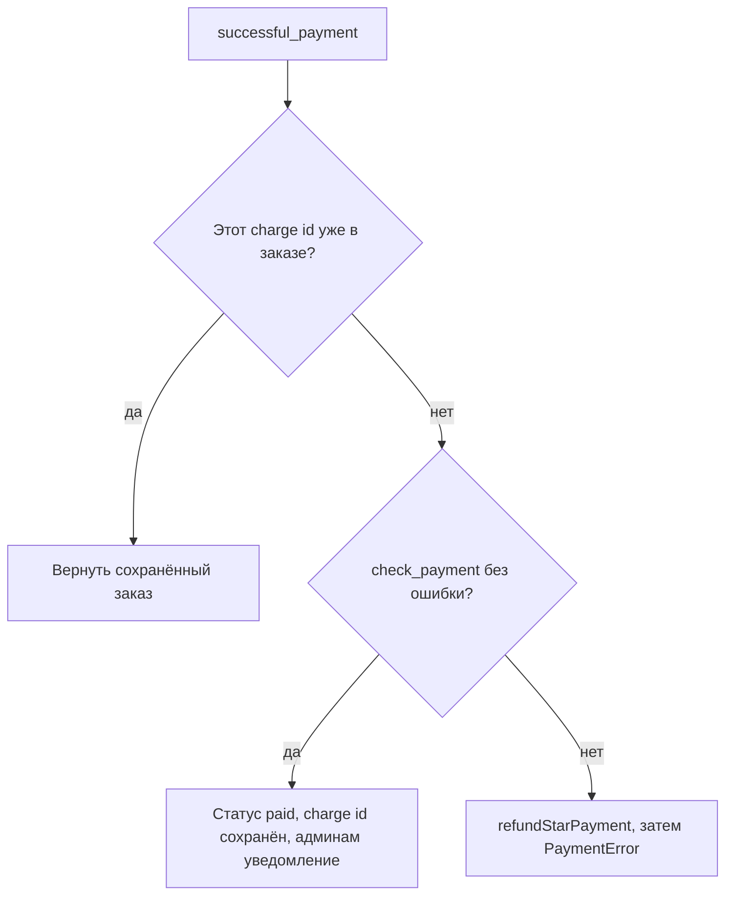

# Как Zernolist считает цену заказа на сервере и принимает каждый платёж в Telegram Stars один раз

[English](zernolist-stars-payments.md) · **Русский**

Репозиторий: [sinnercode228/tg-shop-miniapp](https://github.com/sinnercode228/tg-shop-miniapp) · Демо: [sinnercode228.github.io/tg-shop-miniapp](https://sinnercode228.github.io/tg-shop-miniapp/) (демо-API в браузере, настоящих платежей нет) · Ссылки на код ведут на коммит [`54cb076`](https://github.com/sinnercode228/tg-shop-miniapp/tree/54cb076af58b99b8e693ff301d43ea20a9dc1d91)

Zernolist — магазин в Telegram Mini App с оплатой звёздами (Telegram Stars). Заказ создаёт Mini App по HTTP с устройства покупателя, а оплата проходит позже, в двух апдейтах бота, которые через HTTP API не проходят: `pre_checkout_query` и `successful_payment`. Отсюда три задачи для сервера: самому зафиксировать сумму, привязать каждый платёж к одному заказу и одному плательщику и отметить заказ оплаченным один раз, даже если тот же `successful_payment` дойдёт до хендлера дважды. Магазин, каталог и цены выдуманы, а код и тесты настоящие.

## Покупателя определяет подписанная initData

Эндпоинты заказов берут покупателя из заголовка `Authorization: tma <initData>`. `get_init_data` отдаёт строку в `validate_init_data` и превращает любую `InitDataError` в 401 ([`api/deps.py#L29-L48`](https://github.com/sinnercode228/tg-shop-miniapp/blob/54cb076af58b99b8e693ff301d43ea20a9dc1d91/bot/tgshop/api/deps.py#L29-L48)). Проверка сделана по документации Telegram: секрет — `HMAC_SHA256(key="WebAppData", msg=bot_token)`, сообщение — отсортированные строки `key=value` без `hash`, hex-дайджест сравнивается через `hmac.compare_digest` ([`security/init_data.py#L73-L83`](https://github.com/sinnercode228/tg-shop-miniapp/blob/54cb076af58b99b8e693ff301d43ea20a9dc1d91/bot/tgshop/security/init_data.py#L73-L83), [`#L117-L122`](https://github.com/sinnercode228/tg-shop-miniapp/blob/54cb076af58b99b8e693ff301d43ea20a9dc1d91/bot/tgshop/security/init_data.py#L117-L122)). После подписи проверяется время. `auth_date`, который больше чем на 60 секунд опережает часы сервера, отклоняется, как и `auth_date` старше `INIT_DATA_TTL`: по умолчанию это сутки, а меньше 60 секунд настройка не примет ([`#L124-L133`](https://github.com/sinnercode228/tg-shop-miniapp/blob/54cb076af58b99b8e693ff301d43ea20a9dc1d91/bot/tgshop/security/init_data.py#L124-L133), [`config.py#L39`](https://github.com/sinnercode228/tg-shop-miniapp/blob/54cb076af58b99b8e693ff301d43ea20a9dc1d91/bot/tgshop/config.py#L39)).

Для оплаты из всего этого нужен только `user.id`: он становится `Customer.user_id`, записывается в заказ и потом сравнивается с id того, кто платит по счёту. Поле `signature` с подписью Ed25519 из Bot API 8.0 входит в строку для HMAC, но саму подпись код не проверяет.

## В позиции корзины нет цены

Позиция корзины, которую присылает Mini App, состоит из четырёх полей, и цены среди них нет:

```python
class CartItemIn(CamelModel):
    product_id: Annotated[str, StringConstraints(max_length=64)]
    variant_id: Annotated[str, StringConstraints(max_length=32)]
    grind: Annotated[str, StringConstraints(max_length=32)] | None = None
    quantity: int = Field(ge=1, le=99)
```

[`bot/tgshop/domain/schemas.py#L29-L33`](https://github.com/sinnercode228/tg-shop-miniapp/blob/54cb076af58b99b8e693ff301d43ea20a9dc1d91/bot/tgshop/domain/schemas.py#L29-L33)

`CamelModel` не задаёт `extra`, поэтому pydantic молча выбрасывает незнакомые ключи вроде `price` или `total`. `OrderService._resolve` находит товар и вариант в `shared/catalog.json`, берёт оттуда `unit_price=variant.price`, отклоняет товары не в наличии и неподходящий помол и склеивает строки с одинаковыми товаром, вариантом и помолом ([`services/orders.py#L76-L100`](https://github.com/sinnercode228/tg-shop-miniapp/blob/54cb076af58b99b8e693ff301d43ea20a9dc1d91/bot/tgshop/services/orders.py#L76-L100)).

Все деньги — целые копейки. `calculate_quote` округляет процентную скидку вниз до целого рубля выражением `subtotal * promo.value // 100 // 100 * 100` ([`domain/pricing.py#L120-L125`](https://github.com/sinnercode228/tg-shop-miniapp/blob/54cb076af58b99b8e693ff301d43ea20a9dc1d91/bot/tgshop/domain/pricing.py#L120-L125)). `to_stars` переводит копейки в звёзды через `-(-amount // rules.kopecks_per_star)`: это деление с округлением вверх, и float в нём не появляется ([`#L88-L90`](https://github.com/sinnercode228/tg-shop-miniapp/blob/54cb076af58b99b8e693ff301d43ea20a9dc1d91/bot/tgshop/domain/pricing.py#L88-L90)). `kopecksPerStar` в [`shared/pricing.json`](https://github.com/sinnercode228/tg-shop-miniapp/blob/54cb076af58b99b8e693ff301d43ea20a9dc1d91/shared/pricing.json#L8) равен 150. Тестовый заказ на 2 720 ₽ даёт 272 000 / 150 = 1 813,33, в счёт идёт 1 814 звёзд.

`create_order` сохраняет это число в `stars_amount` и ставит Stars-заказу статус `awaiting_payment` ([`services/orders.py#L155`](https://github.com/sinnercode228/tg-shop-miniapp/blob/54cb076af58b99b8e693ff301d43ea20a9dc1d91/bot/tgshop/services/orders.py#L155), [`#L170`](https://github.com/sinnercode228/tg-shop-miniapp/blob/54cb076af58b99b8e693ff301d43ea20a9dc1d91/bot/tgshop/services/orders.py#L170)). Дальше цену никто не пересчитывает: счёт и обе проверки платежа сравнивают с этой колонкой, так что правка `catalog.json` не меняет стоимость уже открытого заказа. Админы о Stars-заказе пока не знают: `create_order` уведомляет их, только если новый статус — `new` ([`#L177-L178`](https://github.com/sinnercode228/tg-shop-miniapp/blob/54cb076af58b99b8e693ff301d43ea20a9dc1d91/bot/tgshop/services/orders.py#L177-L178)).

## В payload счёта только id заказа

`build_invoice` берёт сумму из `order.stars_amount`, а payload — из `make_payload(order.id)`, то есть строку `order:<id>` ([`payments/stars.py#L28-L50`](https://github.com/sinnercode228/tg-shop-miniapp/blob/54cb076af58b99b8e693ff301d43ea20a9dc1d91/bot/tgshop/payments/stars.py#L28-L50)). `TelegramStarsGateway.create_invoice_link` отправляет счёт с валютой `XTR` и без provider token ([`#L84-L91`](https://github.com/sinnercode228/tg-shop-miniapp/blob/54cb076af58b99b8e693ff301d43ea20a9dc1d91/bot/tgshop/payments/stars.py#L84-L91)). На обратном пути `parse_payload` принимает только `order:` с десятичными цифрами после него и на всё остальное возвращает `None` ([`#L32-L36`](https://github.com/sinnercode228/tg-shop-miniapp/blob/54cb076af58b99b8e693ff301d43ea20a9dc1d91/bot/tgshop/payments/stars.py#L32-L36)).

Кроме id заказа, в payload ничего нет; сумму и владельца код на каждом шаге читает из строки в базе. Пока заказ ждёт оплаты, `POST /api/orders/{id}/invoice` выдаёт для него новую ссылку ([`api/routes/orders.py#L33-L36`](https://github.com/sinnercode228/tg-shop-miniapp/blob/54cb076af58b99b8e693ff301d43ea20a9dc1d91/bot/tgshop/api/routes/orders.py#L33-L36)); при любом другом статусе ответ — 409 `not_payable` ([`services/orders.py#L194-L198`](https://github.com/sinnercode228/tg-shop-miniapp/blob/54cb076af58b99b8e693ff301d43ea20a9dc1d91/bot/tgshop/services/orders.py#L194-L198)).

## Одни и те же пять проверок, дважды

`check_payment` — обычная функция над DTO заказа:

```python
def check_payment(
    order: OrderOut | None,
    *,
    currency: str,
    total_amount: int,
    payer_id: int,
) -> str | None:
    """Validate a pre-checkout query / successful payment. Returns an error text or ``None``."""
    if order is None:
        return "Заказ не найден"
    if currency != STARS_CURRENCY:
        return "Неподдерживаемая валюта"
    if order.user_id != payer_id:
        return "Этот заказ оформлен другим пользователем"
    if order.status is not OrderStatus.AWAITING_PAYMENT:
        return "Заказ уже оплачен или отменён"
    if order.stars_amount != total_amount:
        return "Сумма счёта устарела — оформите заказ заново"
    return None
```

[`bot/tgshop/payments/stars.py#L53-L71`](https://github.com/sinnercode228/tg-shop-miniapp/blob/54cb076af58b99b8e693ff301d43ea20a9dc1d91/bot/tgshop/payments/stars.py#L53-L71)

Тексты ошибок написаны по-русски, потому что уходят прямо покупателю: хендлер `pre_checkout_query` отвечает `ok=error is None, error_message=error` ([`bot/handlers/payments.py#L16-L24`](https://github.com/sinnercode228/tg-shop-miniapp/blob/54cb076af58b99b8e693ff301d43ea20a9dc1d91/bot/tgshop/bot/handlers/payments.py#L16-L24)). На этот ответ Telegram даёт до 10 секунд, и роутер платежей я подключаю в диспетчер первым ([`bot/factory.py#L34-L40`](https://github.com/sinnercode228/tg-shop-miniapp/blob/54cb076af58b99b8e693ff301d43ea20a9dc1d91/bot/tgshop/bot/factory.py#L34-L40)).

Когда приходит `successful_payment`, `mark_paid` вызывает ту же функцию ещё раз. Пока у покупателя открыто окно оплаты, заказ может измениться: админ может отменить его командой `/status <id> cancelled`, и граф статусов разрешает это для неоплаченного Stars-заказа ([`domain/status.py#L21-L31`](https://github.com/sinnercode228/tg-shop-miniapp/blob/54cb076af58b99b8e693ff301d43ea20a9dc1d91/bot/tgshop/domain/status.py#L21-L31)).

## Платёж записывается один раз

В `successful_payment` приходит `telegram_payment_charge_id`, id списания на стороне Telegram. `mark_paid` использует его как ключ идемпотентности:

```python
        async with self._sessions() as session, session.begin():
            order = await OrderRepository(session).get(order_id, for_update=True)
            if order is not None and order.telegram_payment_charge_id == charge_id:
                return _to_dto(order)  # duplicated update — already processed
            error = check_payment(
                _to_dto(order) if order else None,
                currency=currency,
                total_amount=total_amount,
                payer_id=payer_id,
            )
            if error is None and order is not None:
                previous = order.status
                order.telegram_payment_charge_id = charge_id
                order.set_status(OrderStatus.PAID)
                await session.flush()
                dto = _to_dto(order)
```

[`bot/tgshop/services/orders.py#L262-L277`](https://github.com/sinnercode228/tg-shop-miniapp/blob/54cb076af58b99b8e693ff301d43ea20a9dc1d91/bot/tgshop/services/orders.py#L262-L277)

Если тот же апдейт придёт ещё раз, в заказе уже лежит этот charge id. Функция возвращает сохранённый заказ прямо из транзакции: статус не меняется, нового `OrderEvent` нет, уведомления админам нет, возврата нет. Это работает и после того, как заказ ушёл в `confirmed` или `refunded`, потому что charge id остаётся в строке.

Ещё это сравнение не подпускает ветку возврата ниже к настоящему платежу. После первой оплаты заказ в статусе `paid`, и на повторный апдейт `check_payment` вернёт «Заказ уже оплачен или отменён». Без сравнения эта ошибка отправила бы код в ветку возврата с `charge_id`, то есть с тем самым платежом, которым заказ оплачен. Заказ остался бы `paid`, а звёзды вернулись бы покупателю. Если удалить эти две строки, падает ровно один тест, `test_full_stars_payment_flow`, а в логе появляется `refunding orphan payment charge-1 for order 1`.

Любая ошибка после проверки charge id означает, что Telegram уже списал звёзды за заказ, который не может их принять:

```python
        if error is not None or order is None:
            # Money was taken but the order can't accept it (e.g. cancelled meanwhile):
            # give the Stars back immediately instead of leaving it for manual support.
            log.warning("refunding orphan payment %s for order %s: %s", charge_id, order_id, error)
            await self._gateway().refund(payer_id, charge_id)
            raise PaymentError(error or "Order not found")
```

[`bot/tgshop/services/orders.py#L279-L284`](https://github.com/sinnercode228/tg-shop-miniapp/blob/54cb076af58b99b8e693ff301d43ea20a9dc1d91/bot/tgshop/services/orders.py#L279-L284)

Хендлер ловит `PaymentError` и пишет покупателю, что платёж не принят и звёзды возвращены ([`bot/handlers/payments.py#L39-L42`](https://github.com/sinnercode228/tg-shop-miniapp/blob/54cb076af58b99b8e693ff301d43ea20a9dc1d91/bot/tgshop/bot/handlers/payments.py#L39-L42)). Та же ветка возвращает и второе списание с другим id за уже оплаченный заказ. Так бывает, если два платежа за один заказ прошли pre-checkout, а второй `successful_payment` обрабатывается уже после коммита первого: ранний выход не срабатывает, а `check_payment` отказывает по статусу.



Уведомления уходят после коммита транзакции: `order_placed` всем админам, затем `status_changed` покупателю ([`services/orders.py#L286-L287`](https://github.com/sinnercode228/tg-shop-miniapp/blob/54cb076af58b99b8e693ff301d43ea20a9dc1d91/bot/tgshop/services/orders.py#L286-L287)). `TelegramNotifier` ловит `TelegramAPIError` вокруг каждой отправки и пишет его в лог ([`bot/notifier.py#L28-L40`](https://github.com/sinnercode228/tg-shop-miniapp/blob/54cb076af58b99b8e693ff301d43ea20a9dc1d91/bot/tgshop/bot/notifier.py#L28-L40)). Админ, заблокировавший бота, не получит только своё сообщение; остальные админы, сообщение о статусе покупателю и ответ хендлера «Оплата получена» всё равно уйдут.

## Ручной возврат

Админ делает возврат командой `/refund <id>` или inline-кнопкой под заказом. Оба пути приходят в `OrderService.refund` ([`bot/handlers/admin.py#L87-L97`](https://github.com/sinnercode228/tg-shop-miniapp/blob/54cb076af58b99b8e693ff301d43ea20a9dc1d91/bot/tgshop/bot/handlers/admin.py#L87-L97), [`services/orders.py#L290-L309`](https://github.com/sinnercode228/tg-shop-miniapp/blob/54cb076af58b99b8e693ff301d43ea20a9dc1d91/bot/tgshop/services/orders.py#L290-L309)), а он первым делом вызывает `ensure_transition`. В `refunded` Stars-заказ попадает только из `paid` или `confirmed`. Оплаченный заказ отменить уже нельзя. Заказ с оплатой при получении нельзя вернуть вообще, а `paid` руками не ставит никто ([`domain/status.py#L34-L49`](https://github.com/sinnercode228/tg-shop-miniapp/blob/54cb076af58b99b8e693ff301d43ea20a9dc1d91/bot/tgshop/domain/status.py#L34-L49)). Дальше `refund` требует сохранённый charge id и вызывает `refundStarPayment` с `user_id` заказа и этим id.

## Что закрепляют тесты

В тестах сервиса вместо Telegram стоит `FakePayments`, который записывает ссылки на счета и возвраты ([`tests/conftest.py#L42-L56`](https://github.com/sinnercode228/tg-shop-miniapp/blob/54cb076af58b99b8e693ff301d43ea20a9dc1d91/bot/tests/conftest.py#L42-L56)).

- `test_full_stars_payment_flow` ([`tests/test_order_service.py#L144-L203`](https://github.com/sinnercode228/tg-shop-miniapp/blob/54cb076af58b99b8e693ff301d43ea20a9dc1d91/bot/tests/test_order_service.py#L144-L203)): `pre_checkout_error` возвращает `None` для правильной суммы и плательщика и ошибку для суммы 1, для другого пользователя и для payload `"garbage"`. `mark_paid` с `charge-1` переводит заказ в `paid`, админы получают одно уведомление. Второй `mark_paid` с тем же charge id возвращает `paid`, а уведомление админам в списке по-прежнему одно. После возврата в конце в `payments.refunds` лежит ровно `[(USER_ID, "charge-1")]`.
- `test_payment_for_cancelled_order_is_refunded_automatically` ([`#L206-L220`](https://github.com/sinnercode228/tg-shop-miniapp/blob/54cb076af58b99b8e693ff301d43ea20a9dc1d91/bot/tests/test_order_service.py#L206-L220)) отменяет Stars-заказ, а потом оплачивает его: `mark_paid` бросает `PaymentError`, `late-charge` уходит в возврат.
- `test_stars_order_awaits_payment_and_gets_invoice` ([`#L115-L126`](https://github.com/sinnercode228/tg-shop-miniapp/blob/54cb076af58b99b8e693ff301d43ea20a9dc1d91/bot/tests/test_order_service.py#L115-L126)) проверяет 1 814 звёзд, payload `order:<id>` и то, что админам пока ничего не пришло.
- В [`tests/test_bot.py`](https://github.com/sinnercode228/tg-shop-miniapp/blob/54cb076af58b99b8e693ff301d43ea20a9dc1d91/bot/tests/test_bot.py) `test_pre_checkout_is_validated` прогоняет два настоящих апдейта `pre_checkout_query` через настоящий `Dispatcher` и читает вызовы `AnswerPreCheckoutQuery`, которые записала `RecordingSession`: первый с `ok`, второй отклонён с текстом ошибки. `test_successful_payment_marks_order_paid` так же отправляет сообщение с `successful_payment` и проверяет статус `paid`.
- В [`tests/test_api.py`](https://github.com/sinnercode228/tg-shop-miniapp/blob/54cb076af58b99b8e693ff301d43ea20a9dc1d91/bot/tests/test_api.py) есть `test_client_supplied_prices_are_ignored` (гайвань с `"price": 1` сохраняется по каталожным 129 000 копеек), `test_stars_order_returns_invoice_link` и `test_invoice_for_cash_order_is_conflict`.
- В [`tests/test_init_data.py`](https://github.com/sinnercode228/tg-shop-miniapp/blob/54cb076af58b99b8e693ff301d43ea20a9dc1d91/bot/tests/test_init_data.py) `test_algorithm_matches_telegram_docs_step_by_step` заново считает хеш по шагам документации, а соседние тесты отклоняют подменённого пользователя, просроченные данные и `auth_date` из будущего.

## Где тонко

- На SQLite проверка charge id и запись не атомарны. `get(..., for_update=True)` вызывает `with_for_update()` ([`db/repository.py#L24-L28`](https://github.com/sinnercode228/tg-shop-miniapp/blob/54cb076af58b99b8e693ff301d43ea20a9dc1d91/bot/tgshop/db/repository.py#L24-L28)). SQLAlchemy превращает это в `FOR UPDATE` на PostgreSQL и в обычный `SELECT` на SQLite, а SQLite и стоит в `DATABASE_URL` по умолчанию. `start_polling` в aiogram по умолчанию обрабатывает каждый апдейт отдельной задачей, поэтому два хендлера `successful_payment` для одного заказа могут пересечься и оба пройти проверку раньше, чем кто-то из них запишет результат. Два одновременных вызова `mark_paid` на файловой базе SQLite оба возвращают `paid`, а у заказа появляются два события `paid`. С одним и тем же charge id админы получают два уведомления. С двумя разными id ни одно списание не возвращается, а в строке остаётся только один id, так что другое списание нигде в базе не записано и `/refund` до него не дотянется. `unique=True` у `telegram_payment_charge_id` ([`db/models.py#L82`](https://github.com/sinnercode228/tg-shop-miniapp/blob/54cb076af58b99b8e693ff301d43ea20a9dc1d91/bot/tgshop/db/models.py#L82)) не даёт записать одно списание на два заказа, но от двух записей в одну строку не спасает. Extra `postgres` объявлен, а тестов против PostgreSQL нет.
- Автоматический возврат делается одной попыткой. Если `refundStarPayment` бросит `TelegramAPIError`, хендлер его не поймает, потому что ловит только `PaymentError`. Звёзды остаются списанными, повторной попытки нет, след остаётся только в логе.
- `refund()` вызывает Telegram внутри открытой транзакции ([`services/orders.py#L304`](https://github.com/sinnercode228/tg-shop-miniapp/blob/54cb076af58b99b8e693ff301d43ea20a9dc1d91/bot/tgshop/services/orders.py#L304)). Если коммит упадёт после ответа Telegram, звёзды покупателю уже вернутся, а статус заказа останется прежним.
- Сверки с Telegram нет: код нигде не вызывает `getStarTransactions`. Если апдейт `successful_payment` так и не обработан, заказ остаётся в `awaiting_payment` со списанными звёздами, а неоплаченные заказы ничто не закрывает по сроку.
- На повторный апдейт `mark_paid` возвращает сохранённый заказ, и хендлер ещё раз пишет покупателю «Оплата получена» ([`bot/handlers/payments.py#L43`](https://github.com/sinnercode228/tg-shop-miniapp/blob/54cb076af58b99b8e693ff301d43ea20a9dc1d91/bot/tgshop/bot/handlers/payments.py#L43)). Админы получают одно уведомление, покупатель — два подтверждения.

Код: [github.com/sinnercode228/tg-shop-miniapp](https://github.com/sinnercode228/tg-shop-miniapp)
